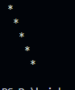

# 2-D Array

- Two dimensional array is commonly known as array of arrays. It is very useful in mathematics while working with matrix or grid. 

## Creating a 2D Array in JavaScript
A 2D array is created by nesting arrays within another array. Each nested array represents a `row`,  and each element within a row represents a `column`.

```js

    const arr = [
        [1,2,3,4],
        [1,2,3,4],
        [1,2,3,4],
        [1,2,3,4],
    ]

```

## How to Access Elements

```js
console.log(arr[0][1]);//2
console.log(arr[3][3]);//4
```


## How to iterate All Elements

```js

for(let i =0;i<arr.length;i++){
    for(j=0;j<arr[i].length;j++){
       console.log(arr[i][j]);
       
    }
}
```

## Star Pattern Using Matrix

```js
let str = ''
for(let i=0;i<5;i++){
    for(let j=0;j<5;j++){
        str+=' * '
    }
    str+='\n'
}

console.log(str);
```


```js
let str = ''
for(let i=0;i<5;i++){
    for(let j=0;j<5;j++){
        str+=' * '
    }
    str+='<br/>'
}

document.write(str);
```


# Upper left angle
```js
let str = ''
for(let i=0;i<5;i++){
    for(let j=i;j<5;j++){
        str+=' * '
    }
    str+='\n'
}

console.log(str);
```


# Right Angle


```js
let str = ''
for(let i=0;i<5;i++){
    for(let j=0;j<i;j++){
        str+=' * '
    }
    str+='\n'
}


console.log(str);
```


## Diagonals   

```js


let str = ''

for(let i=0;i<5;i++){
    for(let j=0;j<5;j++){
        if(i==j){
        str+=' * '

        }
        str+=' '


    }
    str+='\n'

}
console.log(str);

```



```js

let str = ''

for(let i=0;i<5;i++){
    for(let j=0;j<5;j++){
        if( j==5-i-1){
        str+=' * '

        }
        str+=' '


    }
    str+='\n'

}
console.log(str);


```


## Cross Pattern

```js

let str = ''
let n =5
for(let i=0;i<n;i++){
    for(let j=0;j<n;j++){
        if(i==j || j==n-i-1){
            str+='*'
        }else{
            str+=' '
        }
    }
    str+=' \n'
}
console.log(str);

```


## Square Pattern

```js

let str = ''
let n = 4
for(let i=0;i<n;i++){
    for(let j=0;j<n;j++){
        //j==0 ||  left
        //i==0 || upper
        //j==n-1 || right 
        //i==n-1 bottom
        if(j==0 || i==0 || j==n-1 || i==n-1){
            str+=`${i}${j}`
        }
        str+="  "
        
    }
    str+="\n "

}
console.log(str);


```


# Interview Question

## 1. Traverse a 2D Array
Write a function to traverse and print all elements of a 2D array in row-major order.

```javascript
function traverse2DArray(array) {
  for (let i = 0; i < array.length; i++) {
    for (let j = 0; j < array[i].length; j++) {
      console.log(array[i][j]);
    }
  }
}
```
## 2. Transpose a 2D Matrix
Implement a function to transpose a 2D matrix.

```js

function transpose(matrix) {
  let result = [];
  for (let i = 0; i < matrix[0].length; i++) {
    result[i] = [];
    for (let j = 0; j < matrix.length; j++) {
      result[i][j] = matrix[j][i];
    }
  }
  return result;
}
```

## 3. Rotate a Matrix 90 Degrees

- Write a function to rotate a matrix 90 degrees clockwise.

```js
function rotateMatrix(matrix) {
  const n = matrix.length;
  const result = [];
  for (let i = 0; i < n; i++) {
    result[i] = [];
    for (let j = 0; j < n; j++) {
      result[i][j] = matrix[n - j - 1][i];
    }
  }
  return result;
}
```
## 4. Search in a 2D Matrix
- Given a matrix sorted row-wise and column-wise, implement a function to search for a target value.
```js
function searchMatrix(matrix, target) {
  let row = 0;
  let col = matrix[0].length - 1;
  while (row < matrix.length && col >= 0) {
    if (matrix[row][col] === target) return true;
    else if (matrix[row][col] > target) col--;
    else row++;
  }
  return false;
}
```

## 5. Find the Maximum Value in Each Row

- Write a function to return the maximum value in each row of a 2D array.

```js
function maxInEachRow(matrix) {
  return matrix.map(row => Math.max(...row));
}
```

## 6. Spiral Traversal
- Traverse a 2D array in spiral order.

```js
function spiralOrder(matrix) {
  let result = [];
  while (matrix.length) {
    result = result.concat(matrix.shift());
    matrix = matrix[0] ? matrix.map(row => row.pop()).filter(x => x) : [];
    matrix.reverse();
    matrix = matrix.map(row => row.reverse());
  }
  return result;
}

```

## 7. Sum of Diagonals
Find the sum of the primary and secondary diagonals of a square matrix.

```js
function diagonalSum(matrix) {
  let primary = 0, secondary = 0;
  for (let i = 0; i < matrix.length; i++) {
    primary += matrix[i][i];
    secondary += matrix[i][matrix.length - i - 1];
  }
  return { primary, secondary };
}
```

## 8. Flatten a 2D Array

```js
function flatten(matrix) {
  return matrix.flat();
}
```

# Practice Questions

## 1. Traverse and Print Elements
Write a function to traverse and print all elements of a 2D array in **row-major order** and **column-major order**.

---

## 2. Find the Sum of Each Row and Column
Write a function to calculate the sum of elements in each row and each column of a 2D array.

---

## 3. Check for Symmetric Matrix
Implement a function to check if a given 2D array is a symmetric matrix (i.e., the matrix is equal to its transpose).

---

## 4. Diagonal Difference
Find the absolute difference between the sums of the primary diagonal and the secondary diagonal of a square matrix.

---

## 5. Count Zeros and Ones
In a 2D grid containing only 0s and 1s, write a function to count the number of 0s and 1s.

---

## 6. Find Maximum in Each Column
Write a function to return the maximum value in each column of a 2D array.

---

## 7. Boundary Traversal
Implement a function to print the boundary elements of a 2D array in a clockwise manner.

---

## 8. Rotate Matrix by 90 Degrees (Both Directions)
Write functions to rotate a matrix 90 degrees clockwise and counterclockwise.

---

## 9. Search in a Row-Column Sorted Matrix
Given a 2D matrix sorted row-wise and column-wise, implement a function to search for a target value efficiently.

---
 

## 10. Multiply Two Matrices
Write a function to multiply two matrices. Ensure that the dimensions are valid for multiplication.

---

## 11. Check if a Matrix is Sparse
A matrix is sparse if most of its elements are zero. Write a function to check if a given matrix is sparse.

---

 
 
## 13. Validate Sudoku Board
Given a partially filled 9x9 Sudoku board, write a function to determine if it is a valid Sudoku configuration.

-----

```js

--krishna
```