# Array

- An array is a data structure that stores multiple pieces of data of the same type in a systematic arrangement. 
- Arrays are used to organize data in computer programming, and are one of the oldest and most important data structures. 
- Each item in an array is stored in a memory location, or "box", and all the items share the same name. The items are numbered, starting at 0, and each item is identified by at least one array index or key.
- Arrays are useful because the element indices can be computed at run time.

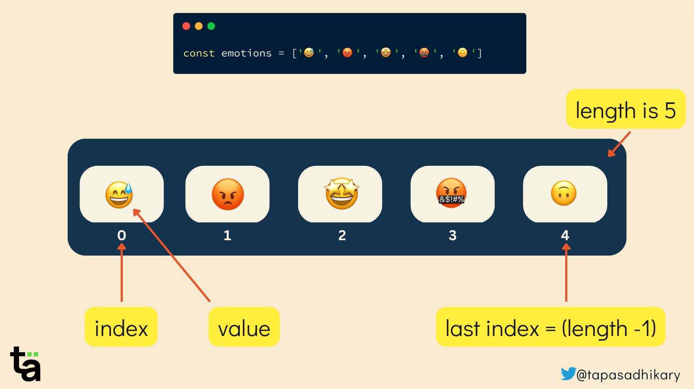

## Example:
-  if you want to store ten scores in a game, you could use an array called "score" to store all the scores in one place. 


## Types of Array 

- ### 1D Array
  A 1D (One-Dimensional) array is a list of elements arranged in a single row or column. It is a linear data structure where each element is accessed by a single index.

  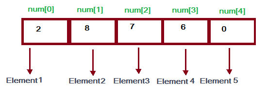

- ### 2D Array
  A 2D (Two-Dimensional) array is an array of arrays. It can be visualized as a matrix with rows and columns, where elements are accessed by two indices.
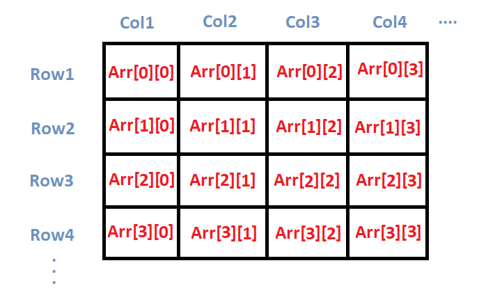
- ### ND Array
  An ND (N-Dimensional) array is an array with multiple dimensions. It generalizes 1D and 2D arrays to N dimensions, where elements can be accessed by N indices. The most common types are 3D arrays, 4D arrays, etc.
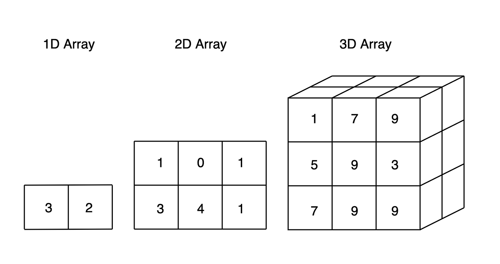
## How to Create Array ( Using Square Brackets )


```js

        const arr = [1,2,3,4,5,6]
        console.log(arr)// [1,2,3,4,5,6]
        console.log(typeof(arr))// Object


```
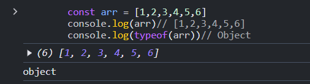
--------
# **1 D Array**

## How to Create Empty Sized Array

```js

const arr = Array(10)
console.log(arr);
console.log(arr.length);
```

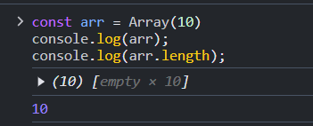
## How to Create Array ( Using Array Constructor )


```js
        const arr = Array(1,2,3,4,5,6)
        console.log(arr)// [1,2,3,4,5,6]
        console.log(typeof(arr))// Object

```

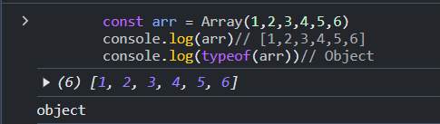

## How to Add Element in Array 

- insert element from last `(using Push Method)`

```js
        const arr = [1,2]
        arr.push(10)
        console.log(arr)//[1,2,10]
```
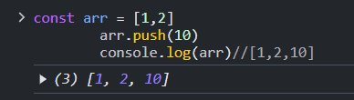

- insert element from start `(using un shift Method)`

```js
        const arr = [1,2]
        arr.unshift(10)
        console.log(arr)//[1,2,10]
```
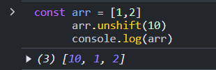


## How to Remove Element in Array 

- remove element from last `(using Pop Method)`

```js
        const arr = [1,2]
        arr.pop()
        console.log(arr)//[1]
```
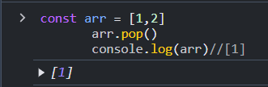

- remove element from start `(using shift Method)`

```js
        const arr = [1,2]
        arr.shift()
        console.log(arr)//[2]
```
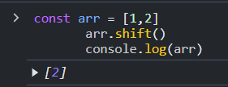
## How to access elements (Using Index)


```js
        const arr = [1,2,3,4,5,6]
        console.log(arr[0])// [1]
        console.log(arr[1])// [2]
```

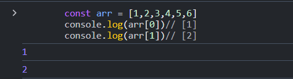
## Count How Many Elements

```js

    const arr = [1,2,3,4,5,6]
    console.log(arr.length)//6

```

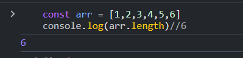

## How to iterate elements (using for loop)


```js

        const arr = [1,2,3,4,5,6]

        for(let i=0;i<arr.length;i++){
            console.log(arr[i])
        }
        //1 2 3 4 5 6

```


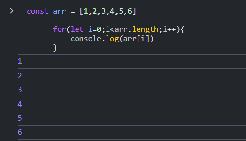

## How to iterate elements (using while loop)


```js
        let i = 0
        const arr = [1,2,3,4,5,6]

        while(i<arr.length){
            console.log(arr[i])
            i++;
        }
        //1 2 3 4 5 6

```

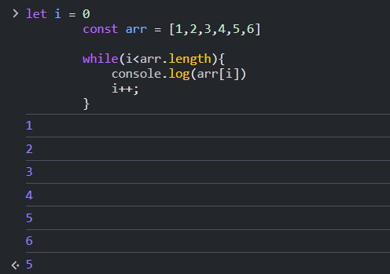


## How to change value with index


```js
        let i = 0
        const arr = [1,2,3,4,5,6]
        arr[3]= 13

        while(i<arr.length){
            console.log(arr[i])
            i++;
        }
        //1 2 3 13 5 6

```

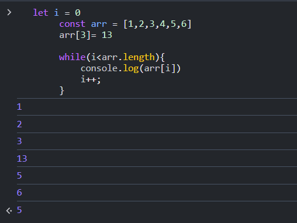


## How to delete value with index


```js
        let i = 0
        const arr = [1,2,3,4,5,6]
        delete arr[3]

        while(i<arr.length){
            console.log(arr[i])
            i++;
        }
        //1 2 3 5 6

```
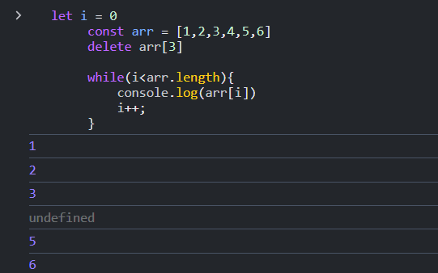

##   add Array with Another Array

```js
const arr = Array(1,2,3,4,5,6)
const arr1 = Array(1,2,3,4,5,6)

console.log(arr+arr1)


```
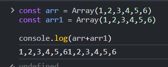

## Copy Array into Another Array

```js
const arr = Array(1,2,3,4,5,6)
const arr1 = arr

console.log(arr)
console.log(arr1)


```
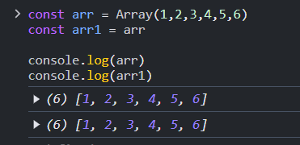


## Copy Each Element in Another Array

```js
const arr = Array(1,2,3,4,5,6)
const arr1 = [...arr]

console.log(arr)
console.log(arr1)

```
 
 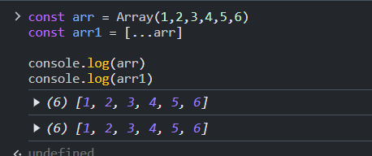

# Array Properties

```js
// to get array length
console.log(arr.length)

```

# Array Methods

```js

const arr =[1,2,3,4,5]
// get value with index 
console.log(arr.at(2));//3

// iterate all items in array
arr.forEach(function(value,index,array){
        console.log(value)
})

// get index from value
console.log(arr.indexOf(2))// 1

// check element is include or not 

console.log(arr.includes(2));//true
console.log(arr.includes(20));//false

// find element with condition

console.log(arr.find(function(c){
        return c===2;
}));


// check some element with condition
arr.some(function(cur){
        return cur >0;
})// true


// get slice of an array 
console.log(arr.slice(1,3));//[2,3]

// concat another array 
console.log(arr.concat([1,3]));// [1,2,3,4,5,1,3]

// splice method
// - Removes elements from an array and, if necessary, inserts new elements in their place, returning the deleted elements.
 arr.splice(2,3)// delete the 3 element from index 2 
 console.log(arr); //[1,2,6]

arr.splice(2,3,1)// delete the 3 element from index 2 and insert 1
console.log(arr); // [1,2,1,6]


// sort
arr.sort() // ascending

console.log(arr);//[1,2,3,4,5,6]


arr.sort((a,b)=>b-a) // descending
console.log(arr); //[6,5,4,3,2,1]


// reverse array
arr.reverse()
console.log(arr);// [6,5,4,3,2,1]

```
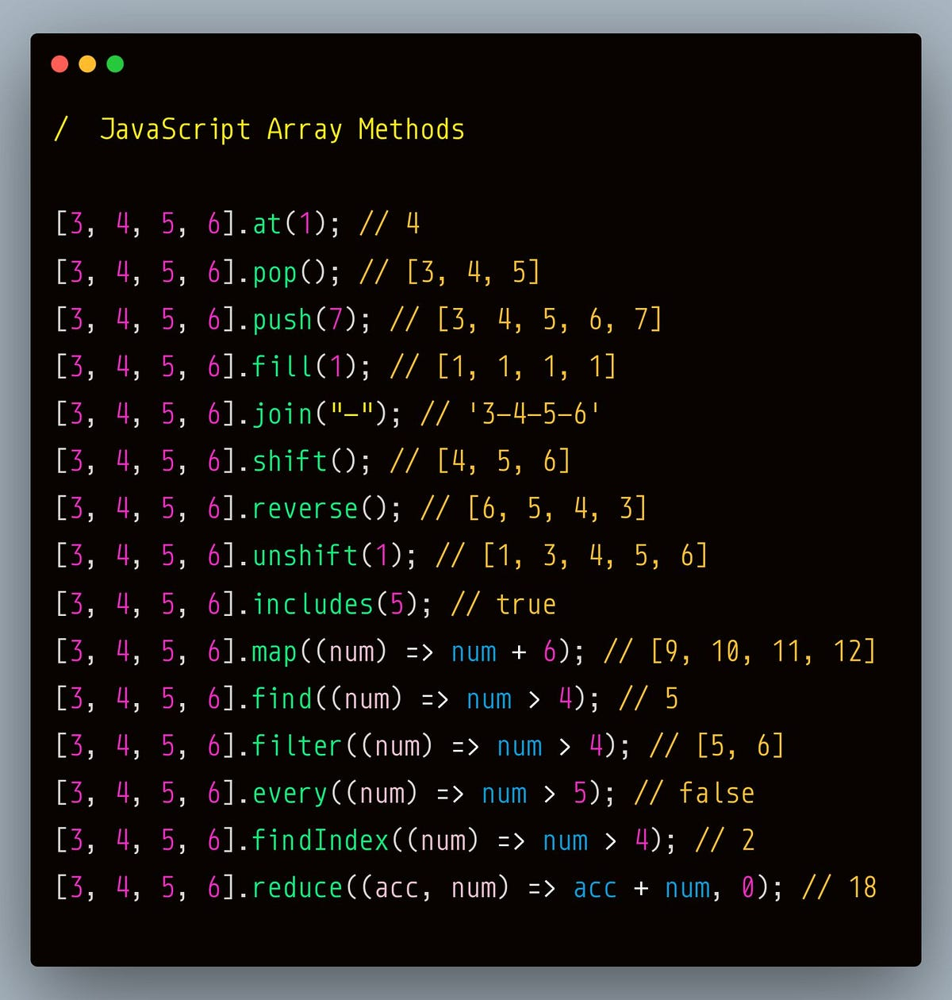


## Map Method 

- The map() method of Array instances creates a new array populated with the results of calling a provided function on every element in the calling array.


```js

//syntax : arr.map(function(currunt_Element,index,array){})

const arr = [1,2,3,4,5,6]

// square of each element

const square_array = arr.map(function(cur,i,array){
        return cur*cur;
})

console.log(square_array) // [1,4,9,16,25,36]

```
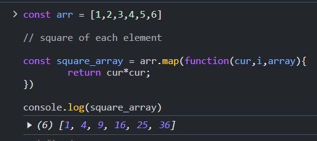


## Filter Method 

- A function to execute for each element in the array. It should return a truthy value to keep the element in the resulting array, and a falsy value otherwise. 

- The filter() method skips empty elements and does not change the original array.
- It returns an array of elements that pass the test and an empty array if no elements pass the test. 


```js

//syntax : arr.filter(function(currunt_Element,index,array){})

const arr = [1,2,3,4,5,6]

// get those element which is even

const even_array = arr.filter(function(cur,i,array){
        return cur%2===0;
})

console.log(even_array) // [2,4,6]

```
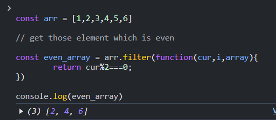


## Reduce Method 

- The reduce() method executes a reducer function for array element. The reduce() method returns a single value: the function's accumulated result.

- The reduce() method of Array instances executes a user-supplied "reducer" callback function on each element of the array, in order, passing in the return value from the calculation on the preceding element. The final result of running the reducer across all elements of the array is a single value.


```js

//syntax : arr.reduce(function(accumulated,currunt_Element,index,array){},initial_value)

const arr = [1,2,3,4,5,6]

// find the sum of elements

const result = arr.reduce(function(ac,cur,i,array){
        return ac+cur;
},0)

console.log(result) // 21

```
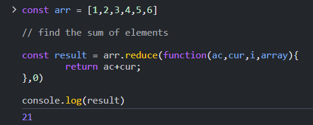

```js

//syntax : arr.reduce(function(accumulated,currunt_Element,index,array){},initial_value)

const arr = [1,2,3,4,5,6]

// find the sum of elements

const result = arr.reduce(function(ac,cur,i,array){
        return ac+cur;
},2)

console.log(result) // 23

```
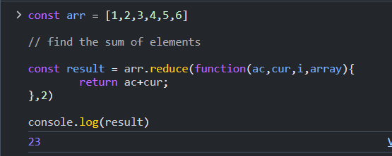


# Interview Questions

### 1. What is the purpose of the `push()` method in JavaScript arrays?
- The `push()` method adds one or more elements to the end of an array and returns the new array length.

```javascript
let arr = [1, 2];
arr.push(3); // arr becomes [1, 2, 3]

```

### 2. What does the pop() method do?
-  The pop() method removes the last element from an array and returns that element.

```js

let arr = [1, 2, 3];
arr.pop(); // returns 3, arr becomes [1, 2]
```


### 3.How does the shift() method work?
- The shift() method removes the first element from an array and returns that element.

```js
let arr = [1, 2, 3];
arr.shift(); // returns 1, arr becomes [2, 3]
```


### 4. What is the purpose of the unshift() method?
-  The unshift() method adds one or more elements to the beginning of an array and returns the new array length.

```js
let arr = [1, 2];
arr.unshift(0); // arr becomes [0, 1, 2]
```

### 5. What does the concat() method do?
- The concat() method merges two or more arrays and returns a new array.

```js
let arr1 = [1, 2];
let arr2 = [3, 4];
let arr3 = arr1.concat(arr2); // arr3 becomes [1, 2, 3, 4]
```

### 6. Explain the slice() method in JavaScript.
- The slice() method returns a shallow copy of a portion of an array from a start index to an end index.

```js
let arr = [1, 2, 3, 4];
let newArr = arr.slice(1, 3); // newArr becomes [2, 3]
```


### 7. What is the purpose of the splice() method?
- The splice() method changes the contents of an array by removing, replacing, or adding elements.

```js
let arr = [1, 2, 3, 4];
arr.splice(1, 2, 5, 6); // arr becomes [1, 5, 6, 4]
```
### 8. What is the difference between slice() and splice()?
- slice() returns a shallow copy of a part of an array, while splice() modifies the original array by removing or adding elements


### 9. How does the forEach() method work?
- The forEach() method executes a provided function once for each array element.
```js
let arr = [1, 2, 3];
arr.forEach(num => console.log(num)); // logs 1, 2, 3
```

### 10. What is the map() method used for?
-  The map() method creates a new array populated with the results of calling a provided function on every element in the array.
```js
let arr = [1, 2, 3];
let newArr = arr.map(x => x * 2); // newArr becomes [2, 4, 6]
```

### 11. Explain the filter() method.
- The filter() method creates a new array with all elements that pass the test implemented by the provided function.
```js
let arr = [1, 2, 3, 4];
let newArr = arr.filter(x => x > 2); // newArr becomes [3, 4]
```

### 12. What does the reduce() method do?

- The reduce() method applies a function to each element of the array (from left to right) to reduce it to a single value.
```js

let arr = [1, 2, 3, 4];
let sum = arr.reduce((acc, curr) => acc + curr, 0); // sum becomes 10
```

### 13. How does the reduceRight() method work?

- The reduceRight() method works like reduce(), but processes the array from right to left.

```js
let arr = [1, 2, 3, 4];
let sum = arr.reduceRight((acc, curr) => acc + curr, 0); // sum becomes 10
```

### 14. What is the purpose of the indexOf() method?

- The indexOf() method returns the first index at which a specified element is found in an array, or -1 if it is not found.

```js
let arr = [1, 2, 3];
let index = arr.indexOf(2); // index becomes 1
```

### 15. How does the includes() method work?

- The includes() method checks if an array contains a specific element and returns true or false.

```js
let arr = [1, 2, 3];
let result = arr.includes(2); // result becomes true
```


### 16. What does the find() method do?

-  The find() method returns the first element in an array that satisfies the provided testing function.

```js
let arr = [5, 12, 8];
let result = arr.find(x => x > 10); // result becomes 12
```

### 17. Explain the findIndex() method.
-  The findIndex() method returns the index of the first element in an array that satisfies the provided testing function.

```js
        let arr = [5, 12, 8];
let index = arr.findIndex(x => x > 10); // index becomes 1
```

### 18. What is the sort() method used for?
-  The sort() method sorts the elements of an array in place and returns the sorted array.

```js
let arr = [3, 1, 4, 2];
arr.sort(); // arr becomes [1, 2, 3, 4]
arr.sort((a,b)=>a-b); // arr becomes [1, 2, 3, 4]
arr.sort((a,b)=>b-a); // arr becomes [4,3,2,1]
```


### 19. How does the reverse() method work?
-  The reverse() method reverses the order of the elements in an array.

```js
let arr = [1, 2, 3];
arr.reverse(); // arr becomes [3, 2, 1]
```


### 20. What is the join() method used for?
-   The join() method joins all the elements of an array into a string, with a specified separator.

```js
let arr = ['Hello', 'world'];
let str = arr.join(' '); // str becomes "Hello world"
```

### 21. How does the concat() method differ from push()?
-  `concat()` merges arrays without modifying the original array, while `push()` adds elements to the end of an array and modifies it.


### 22. What does the some() method do?
-  The `some()` method checks if at least one element in the array satisfies the provided testing function.

```js
let arr = [1, 2, 3];
let result = arr.some(x => x > 2); // result becomes true
```

### 23. How does the every() method work?

- The `every()` method checks if all elements in an array satisfy the provided testing function.

```js
let arr = [1, 2, 3];
let result = arr.every(x => x > 0); // result becomes true
```

### 24. What is the fill() method used for?

- The `fill()` method fills all elements in an array with a static value, from a start index to an end index.

```js
let arr = [1, 2, 3];
arr.fill(0); // arr becomes [0, 0, 0]
```

### 25. Explain the from() method.

- The `from()` method creates a new array from an iterable object or a string.

```js
let arr = Array.from('Hello'); // arr becomes ['H', 'e', 'l', 'l', 'o']
```

### 26. What does the copyWithin() method do?

-  The `copyWithin()` method shallow copies a part of an array to another location in the same array.
```js
let arr = [1, 2, 3, 4];
arr.copyWithin(0, 2); // arr becomes [3, 4, 3, 4]


let arr = [1, 2, 3, 4];
arr.copyWithin(0, 1); // arr becomes [2,3, 4, 4] 
```


### 27. What is the purpose of the at() method?

-  The at() method returns the element at the specified index, allowing negative indexes.
```js
let arr = [1, 2, 3];
let element = arr.at(-1); // element becomes 3
```


### 28. How does the flat() method work?

-  The `flat()` method flattens a nested array into a single array.
```js
let arr = [1, [2, 3], [4, 5]];
let flatArr = arr.flat(); // flatArr becomes [1, 2, 3, 4, 5]
```


### 29. What is the flatMap() method used for?

- The `flatMap()` method first maps each element using a mapping function, then flattens the result into a new array.
```js
let arr = [1, 2, 3];
let flatMapArr = arr.flatMap(x => [x, x * 2]); // flatMapArr becomes [1, 2, 2, 4, 3, 6]
```

### 30. How does the keys() method work?

- The `keys()` method returns a new Array Iterator object that contains the keys (indexes) of the array.

```js
let arr = ['a', 'b', 'c'];
let iterator = arr.keys();
for (let key of iterator) {
    console.log(key); // logs 0, 1, 2
}
```

# Practice Questions

## 1. Write a function that reverses an array in place without using the `reverse()` method.

## 2. Given an array of integers, write a function to find the second largest element in the array.

## 3. Write a function that removes all duplicates from an array and returns a new array with unique elements.

## 4. Write a function that finds the largest sum of two elements in an array.

## 5. Given an array of numbers, write a function to check if all elements are even.

## 6. Write a function that removes the last element from an array and returns it, but without using the `pop()` method.

## 7. Write a function to check if an array is a palindrome (i.e., it reads the same forward and backward).

## 8. Given an array of numbers, write a function to find the average of all elements in the array.

## 9. Write a function that returns the index of the first occurrence of a specific element in an array. If the element is not found, return -1.

## 10. Write a function that moves all zeros in an array to the end, while maintaining the order of non-zero elements.

## 11. Given an array of integers, write a function that returns the array sorted in ascending order without using the `sort()` method.

## 12. Write a function that counts the number of occurrences of a specific element in an array.

## 13. Write a function that takes two arrays and returns a new array with the elements that are common to both arrays.

## 14. Write a function that rotates an array to the right by a given number of steps.

## 15. Write a function that finds the first non-repeating element in an array.

------

```krishna


आज ठंड बहुत है, सोचा कि कॉफी पी जाए,
सोचा फिर, अगर तुम साथ हो तो, कॉफी के साथ 2-4 बातें फ्यूचर की हो जाएं।
```