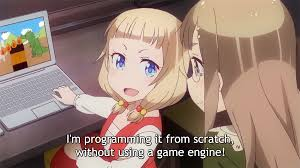
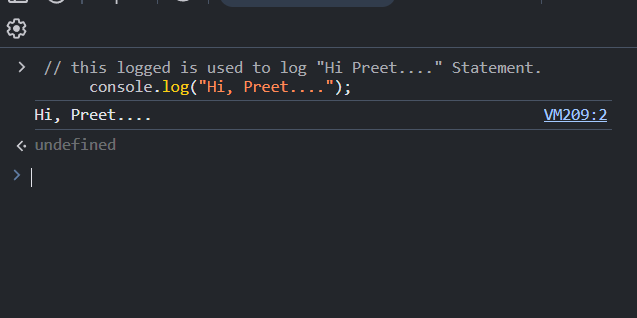
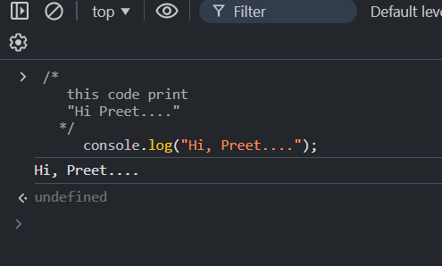
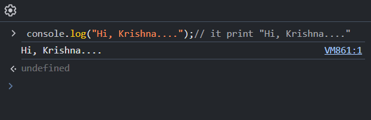
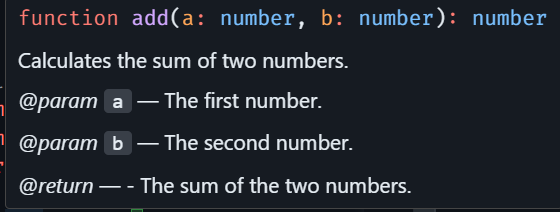

# Comments in JavaScript

-   Comments are used to define the pseudo definition of any line or code. They make the code readable and easy to understand.Comments are completely ignored by the browser or Node.js engine. They do not affect the code execution.

- Comments are not a part of the programming language or specific code. They are simply a way for us to provide direction or describe how the code or workflow functions, often in our own words or native language, to make it more understandable.
 
- Generally, comments are of four types:

    - Single-Line Comment
    - Multi-Line Comment
    - Same-Line Comment
    - Suggestion Comment


## It is Compulsory To Use ?

- No, it is not compulsory, but if your code is very complex or logic-heavy, I suggest using comments to make the code clean, readable, and easier to understand. This also helps other team members working on the same code to understand it better.



## What is Pseudo Code ?
- A pseudo code or pseudo string is a way to describe the logic or flow of a program in a human-readable format without using the syntax of a specific programming language. It is not part of any programming language; it is simply used to create or test logic in our own words or native language. 


##### Example
```sql
Start  
Take two numbers as input  
Add the numbers  
Display the result  
End  

```
- In pseudo code, the way of expression can include elements like eye contact, finger pointing, or body gestures to explain logic or flow more effectively.


## Single Line Comments

- Single-line comments in JavaScript are represented using `//` (double slash). They are used before the pseudo string or at the start of the code line.

##### Syntax

```js
    // pseudo string
    //  code

```


##### Example

```js
    // this logged is used to log "Hi Preet...." Statement.
      console.log("Hi, Preet....");

```

#### Output




## Multi Line Comments

- Multi-line comments in JavaScript are written by starting with `/*` and ending with `*/`.

##### Syntax

```js
  /*
        pseudo String 
  */

```


##### Example

```js
   /*
    this code print 
    "Hi Preet...."
   */
      console.log("Hi, Preet....");

```

#### Output




## Same-Line Comments

- Same-line comments are added at the end of a line of code.

##### Syntax

```js
  <javascript code>// pseudo String 

```


##### Example

```js
      console.log("Hi, Krishna....");// it print "Hi, Krishna...."

```

#### Output




## Suggestion Comments

- Suggestion comments are used to suggest parameters or return values with multi-line comments.

- They use the @param and @return decorators.

- They are generally used in functions or classes.

##### Syntax

```js
  
  /*
    @params {Datatype} prameter-name
    @return {Datatype}
  */

```


##### Example

```js
 

/**
 * Calculates the sum of two numbers.
 * @param {number} a - The first number.
 * @param {number} b - The second number.
 * @return {number} - The sum of the two numbers.
 */
function add(a, b) {
    return a + b;
}
     
```

#### Output




#### Recap

| **Type of Comment**   | **Syntax**                     | **Description**                                                                            | **Example**                                              |
|-----------------------|--------------------------------|--------------------------------------------------------------------------------------------|----------------------------------------------------------|
| **Single-Line Comment**| `//`                           | Used for short comments on a single line.                                                   | `// This is a single-line comment`                        |
| **Multi-Line Comment** | `/* */`                        | Used for commenting multiple lines of code or detailed explanations.                       | `/* This is a multi-line comment. It can span multiple lines. */` |
| **Same-Line Comment**  | `//` after the code            | Placed after a line of code to add a brief comment on that line.                           | `let x = 10; // This is a same-line comment`              |
| **Suggestion Comment** | `/* @param`, `@return`         | Used to suggest parameters and return values, often in functions or classes.               | `/* @param {number} a - The first number */`             |


# Interview Question

## 1. What is the difference between single-line and multi-line comments in JavaScript?

- Single-line comments use `//`, and multi-line comments use `/* */`. Single-line comments are for brief explanations or annotations, while multi-line comments are used for more detailed descriptions or to comment out multiple lines of code.

## 2. How are same-line comments used in JavaScript?

Same-line comments are placed after the code on the same line, using `//`. They are useful for adding short explanations or clarifications next to specific code on that line.

## 3. Can you provide an example of a multi-line comment and explain its use case?

- Multi-line comments are used to comment out multiple lines of code or add detailed explanations.

```js
/* This function handles user authentication 
   and checks if the credentials are valid. */
function authenticateUser() { ... }
```

## 4. What is the purpose of suggestion comments in JavaScript, and how do they work?

- Suggestion comments are used to provide additional information, such as suggesting parameters or return values. They often use the `@param` and `@return` decorators in comments for functions and classes.


## 5. How would you use suggestion comments with decorators like @param and @return in JavaScript?

- Suggestion comments using decorators help to document parameters and return values of a function or class method, making the code more understandable. 
```js
/**
 * Calculates the sum of two numbers.
 * @param {number} a - The first number.
 * @param {number} b - The second number.
 * @return {number} - The sum of the two numbers.
 */
function add(a, b) {
    return a + b;
}
```


> # Practice Question

1. How would you write a single-line comment in JavaScript?
2. Explain the use of multi-line comments in JavaScript with an example.
3. What is the purpose of using same-line comments, and how are they different from single-line comments?
4. How do you document parameters and return values in JavaScript using suggestion comments?
5. Can you comment out a block of code temporarily using multi-line comments? Provide an example.


-------
<!-- 
```krishna
  तुमने जो किया मुझे नजरअंदाज, मैं समझ नहीं पाया,
  बाद में पता चला कि तुमने तो मेरे ससुर से मिलवाने के लिए
  JavaScript में मल्टी-लाइन कमेंट लगाया।
  
  --krishna

``` -->