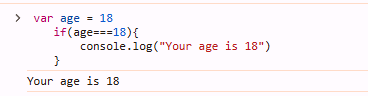
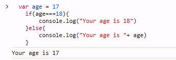
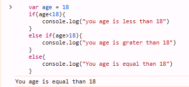
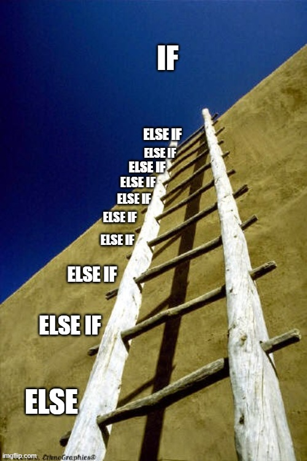
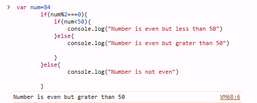
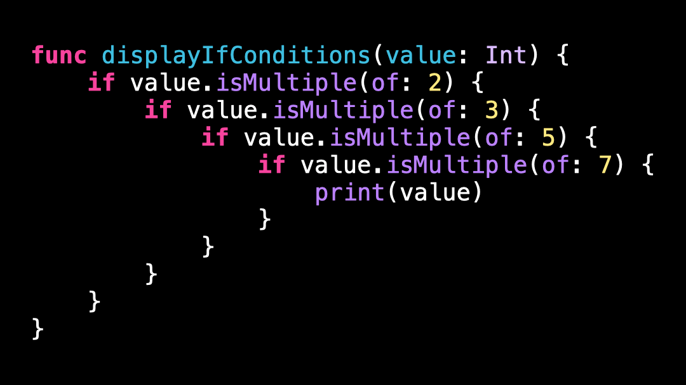
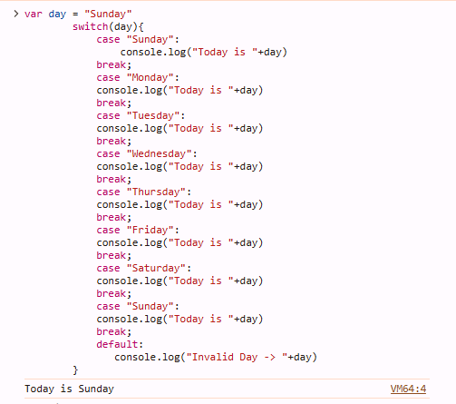
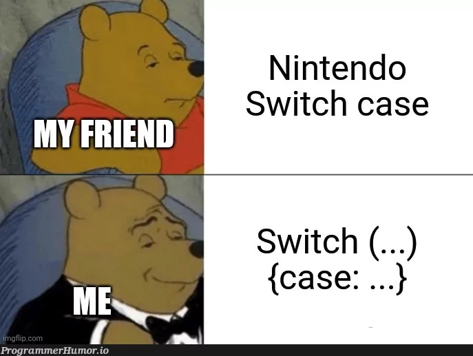

# Conditional Statement

- In JavaScript Conditional Statements are used to perform conditional based  task.

## Types of Conditional Statements 
- ### If Statement 
- ### If-else Statement 
- ### If elseif else Statement 
- ### Nested If Statement 
- ### Switch Case Statement 

## **If Statement** 
- in the   JavaScript `if` block executes  when the condition is `true`.

#### What is True Statement? 
- the water of formula H2o ✅ 
- Krishna is a good boy.✅ 

### Syntax:
```js
        if(condition){
            // code
        }
```

### Example

```js
    var age = 18
    if(age===18){
        console.log("Your age is 18")
    }
```


## **If Else Statement** 
- in the JavaScript  `if` block executes when the condition is `true`.But the `else` block executes the `false` condition.

#### What is False Statement?
- Pooja says, I am Beautiful ❌ 
- Chilli is red ❌ 

### Syntax:
```js
        if(condition){
            // true code
        }else{
            // false code
        }
```

### Example

```js
    var age = 17
    if(age===18){
        console.log("Your age is 18")
    }else{
        console.log("Your age is "+ age)
    }
```




## **If Elseif Statement** 
- in JavaScript code , when we need to check multiple conditions then we can use if elseif statements.

#### What is Multiple Statement?
- if i am boy and if i married then i see all girl as a second mother daughter otherwise i see all girls as my best friends.
- if my age is 18 and if i 10th pass then i want become a `Army` officer,other wise i take best in my 10 boards.

### Syntax:
```js
        if(condition1){
            // true code
        }else if(condition2){
            // true code
        }
        else if(condition3){
            // true code
        }
        ...
        else{
            // false code
        }
```

### Example

```js
    var age = 18
    if(age<18){
        console.log("you age is less than 18")
    }
    else if(age>18){
        console.log("you age is grater than 18")
    }
    else{
        console.log("You age is equal than 18")
    }
```



## **Nested If Statement** 
- nested if statement are used to check condition under condition. or we say multiple condition .
### **Syntax**
```js

        if(condition){
            if(condition){
                    // true code
            }else{
                // false code
            }
        }else{
            // false block
        }

```

### **Example:**

```js

        var num=84
        if(num%2===0){
            if(num<50){
                console.log("Number is even but less than 50")
            }else{
                console.log("Number is even but grater than 50")

            }
        }else{
                console.log("Number is not even")

        }

```





## **Switch Case Statements**

- when we need check multiple static condition we use switch case statements.
- in switch case statement we check condition by the help of `case <static condition> :` keyword and end with `break` keyword.

- to make a `default` or `else` statement we use `default :` keyword.

### What is Static Condition?
- day ==="sunday"
- day ==="monday"

### **Syntax**

```js
        switch(conditions){
            case condition1:
                // code
            break;
            case condition2:
                // code
            break;
            default:
                // else code
        }
```

### **Example**

```js
        var day = "Sunday"
        switch(day){
            case "Sunday":
                console.log("Today is "+day)
            break;
            case "Monday":
            console.log("Today is "+day)
            break;
            case "Tuesday":
            console.log("Today is "+day)
            break;
            case "Wednesday":
            console.log("Today is "+day)
            break;
            case "Thursday":
            console.log("Today is "+day)
            break;
            case "Friday":
            console.log("Today is "+day)
            break;
            case "Saturday":
            console.log("Today is "+day)
            break;
            case "Sunday":
            console.log("Today is "+day)
            break;
            default:
               console.log("Invalid Day -> "+day)
        }
```







## Summary of Key Differences (switch & if-else):
 

| Feature                  | `switch` Statement                              | `if-else` Statement                              |
|--------------------------|-------------------------------------------------|--------------------------------------------------|
| **Condition Type**        | Compares a single value against multiple values  | Can evaluate any condition, including ranges     |
| **Use Case**              | Ideal for simple equality checks with multiple values | Ideal for complex conditions and logical comparisons |
| **Performance**           | More efficient for many conditions on the same expression | May be slower with many conditions                |
| **Flexibility**           | Less flexible (only equality checks)            | More flexible (supports all types of comparisons) |


# Interview Questions

## 1. What is an if statement in programming?
- In JavaScript, an `if` statement is used to evaluate a condition, and if the condition evaluates to `true`, the block of code inside the `if` statement is executed. If the condition is `false`, the block of code is skipped.


## 2. What is the difference between an `if` and `if-else` statement?

- In JavaScript, both `if` and `if-else` statements are used to execute code based on a condition, but they behave differently when the condition is false.


## 3. What is an `if-else if-else` statement?

An `if-else if-else` statement in JavaScript is used to check multiple conditions sequentially. It allows you to evaluate more than one condition. If the first condition is false, the next `else if` condition is checked. If none of the conditions are true, the `else` block (if provided) will be executed.

### Syntax:

```javascript
if (condition1) {
    // Code to be executed if condition1 is true
} else if (condition2) {
    // Code to be executed if condition2 is true
} else {
    // Code to be executed if none of the conditions are true
}

```

## 4. How does a nested if statement work?

- A nested `if` statement occurs when an `if` statement is placed inside another `if` statement. This allows you to evaluate multiple conditions, where the second condition is checked only if the first condition is true.

```js

let age = 25;
let hasID = true;

if (age >= 18) {
    if (hasID) {
        console.log("You can enter the club.");
    } else {
        console.log("You cannot enter the club without an ID.");
    }
} else {
    console.log("You are too young to enter the club.");
}
```

## 5. What is the purpose of the switch-case statement?

- The `switch-case` statement in JavaScript is used to evaluate a single expression against multiple possible values. It provides an efficient way to perform different actions based on different conditions, and is typically used when you have multiple `if-else` conditions that check for equality against a single variable or expression.

```js
let day = 2;
let dayName;

switch (day) {
    case 1:
        dayName = "Monday";
        break;
    case 2:
        dayName = "Tuesday";
        break;
    case 3:
        dayName = "Wednesday";
        break;
    case 4:
        dayName = "Thursday";
        break;
    case 5:
        dayName = "Friday";
        break;
    case 6:
        dayName = "Saturday";
        break;
    case 7:
        dayName = "Sunday";
        break;
    default:
        dayName = "Invalid day";
}

console.log(dayName);


```

## 6. How do you handle multiple conditions in a switch-case statement?

- In JavaScript, to handle multiple conditions in a `switch-case` statement, you can group multiple `case` values together. This allows the same block of code to be executed for different values of the expression being evaluated.

```js
let fruit = "apple";

switch (fruit) {
    case "apple":
    case "banana":
    case "cherry":
        console.log("This is a fruit.");
        break;
    case "carrot":
    case "broccoli":
        console.log("This is a vegetable.");
        break;
    default:
        console.log("Unknown item.");
}


```

## 7. What is the difference between a `switch` statement and an `if-else` statement?

In JavaScript, both `switch` and `if-else` statements are used to execute different blocks of code based on conditions, but they differ in syntax, use cases, and how they evaluate conditions.

### 1. **Syntax and Structure:**

- **`switch` statement**:
  - The `switch` statement evaluates an expression once and compares it against multiple `case` values. If a match is found, the corresponding block of code is executed.
  - The syntax is cleaner when you need to compare a single variable or expression against multiple values.
- **`if-else` statement**:
    - The `if-else` statement evaluates multiple conditions sequentially. Each `if` or `else if` condition is evaluated in order until one is `true`.
    - It is more flexible as it can evaluate complex conditions (not just equality) and handle multiple types of comparisons (greater than, less than, etc.).


## 8. Can an `if` statement contain another `if` statement? If yes, what is it called?

- Yes, an `if` statement can contain another `if` statement in JavaScript. This is called a **nested `if` statement**.

- A **nested `if` statement** occurs when one `if` statement is placed inside another `if` statement. This allows you to evaluate additional conditions only if the outer condition is true.


## 9. How do you exit from a switch-case block in most programming languages?

- In JavaScript, you exit from a `switch-case` block using the `break` statement. The `break` statement terminates the `switch` block and prevents the code from "falling through" to the next `case`. Without the `break`, the program will continue executing the subsequent `case` statements even if they don't match the expression.

- **Note**: To exit a switch-case block and prevent "fall-through," always include a break statement after each case.

## 10. Can a switch-case statement be used for string values?

- Yes, a `switch-case` statement can be used for string values in JavaScript. The `switch` statement compares the expression against the `case` values using strict equality (`===`), so you can match string values in the `case` statements.

```js
let fruit = "banana";

switch (fruit) {
    case "apple":
        console.log("It's an apple.");
        break;
    case "banana":
        console.log("It's a banana.");
        break;
    case "cherry":
        console.log("It's a cherry.");
        break;
    default:
        console.log("Unknown fruit.");
}


```

# Practice Question

1. **If Statement:**  
   Write a JavaScript program that checks if a number is positive. If it is, print `"The number is positive"`. If not, print nothing.

2. **If-else Statement:**  
   Write a JavaScript program that checks whether a number is even or odd. Print `"Even"` if the number is even, and `"Odd"` if it is odd.

3. **If-else Statement:**  
   Write a JavaScript program that checks if a user is eligible to vote. A person is eligible to vote if their age is 18 or greater. Print `"Eligible to vote"` if they are eligible, and `"Not eligible to vote"` otherwise.

4. **Else-if Statement:**  
   Write a JavaScript program that checks the grade of a student based on their score. The program should print:
   - `"A"` for scores greater than or equal to 90.
   - `"B"` for scores between 80 and 89.
   - `"C"` for scores between 70 and 79.
   - `"F"` for scores below 70.

5. **Nested If Statement:**  
   Write a JavaScript program that checks if a number is positive or negative. If it's positive, check whether the number is greater than 100. Print:
   - `"Positive and greater than 100"`
   - `"Positive and less than or equal to 100"`
   If the number is negative, print `"Negative number"`.

6. **Switch-case Statement:**  
   Write a JavaScript program that takes a day number (1-7) and prints the corresponding weekday name. For example:
   - 1 -> `"Monday"`
   - 2 -> `"Tuesday"`
   - 3 -> `"Wednesday"`
   - etc.

7. **Switch-case with Default:**  
   Write a JavaScript program that takes a month number (1-12) and prints the corresponding month name. If the number is out of range, print `"Invalid month"`.

8. **Switch-case with Multiple Cases:**  
   Write a JavaScript program that checks the type of a fruit. If the fruit is either `"apple"`, `"banana"`, or `"cherry"`, print `"This is a fruit"`. For any other input, print `"Unknown item"`.

9. **If-else Statement (Age Check):**  
   Write a JavaScript program that checks if a person is a child (age < 13), a teenager (age between 13-19), or an adult (age 20+). Print the appropriate message based on the age input.

10. **If-else Statement (Temperature Check):**  
    Write a JavaScript program that checks the temperature and prints:
    - `"It's freezing"` if the temperature is below 32°F.
    - `"It's cold"` if the temperature is between 32°F and 50°F.
    - `"It's warm"` if the temperature is between 51°F and 80°F.
    - `"It's hot"` if the temperature is above 80°F.

11. **Else-if with Multiple Conditions:**  
    Write a JavaScript program that takes an age as input and prints whether the person is:
    - `"Toddler"` if age is between 1 and 4,
    - `"Child"` if age is between 5 and 12,
    - `"Teenager"` if age is between 13 and 17,
    - `"Adult"` if age is 18 or older.

12. **Switch-case (Season Check):**  
    Write a JavaScript program that takes a month number and prints the corresponding season:
    - `"Winter"` for December, January, and February.
    - `"Spring"` for March, April, and May.
    - `"Summer"` for June, July, and August.
    - `"Fall"` for September, October, and November.

13. **Nested If-else Statement:**  
    Write a JavaScript program that checks if a person is eligible for a senior citizen discount. The person must be 65 years or older, and the discount is only available if the person is a member. Print:
    - `"Eligible for senior citizen discount"` if both conditions are true.
    - `"Not eligible for senior citizen discount"` otherwise.

14. **Switch-case (Day of the Week):**  
    Write a JavaScript program that takes the name of the day (like `"Monday"`, `"Tuesday"`, etc.) and prints the type of day:
    - `"Weekday"` for Monday through Friday.
    - `"Weekend"` for Saturday and Sunday.

15. **If-else with Logical Operators:**  
    Write a JavaScript program that checks if a number is between 10 and 20 (inclusive). Print `"In range"` if it is, and `"Out of range"` otherwise.

-----

```krishna


```