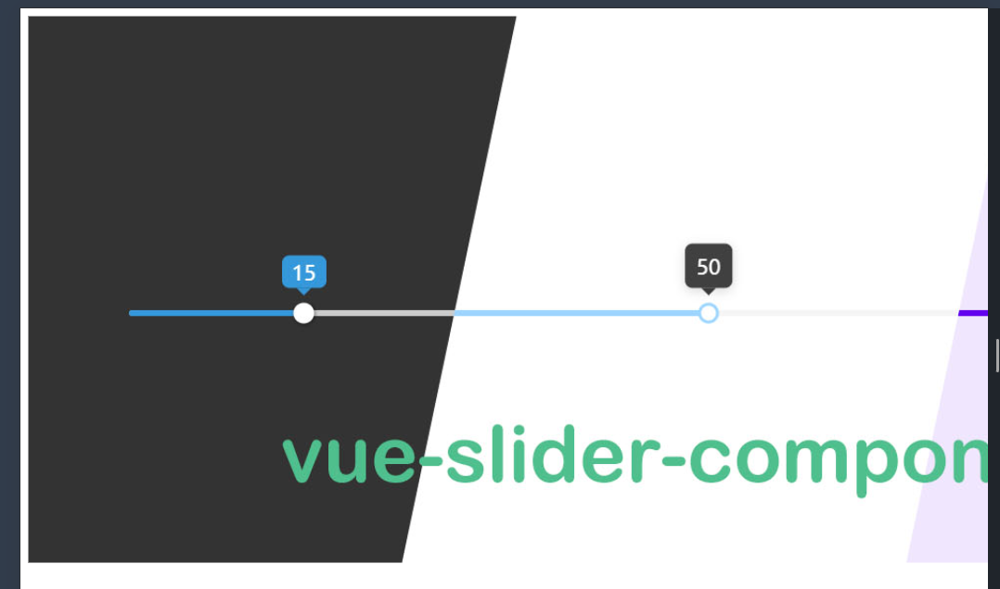

# DOM
- DOM stands for Document Object Model, which is a programming interface that represents a document as a tree structure. 
-  It represents the page so that programs can change the document structure, style, and content. The DOM represents the document as nodes and objects; that way, programming languages can interact with the page.


## How to Access DOM (HTML) Elements

### Select DOM by Tag

```html

<h1>My Name is Krishna</h1>
<script>
    const H1_Heading = document.getElementsByTagName("h1");
    console.log(H1_Heading)
</script>

```


- It returns all H1 headings present on the web page as an array. If you want to access the first heading from the array, you can use the 0th index.

- If there are no H1 elements in the document, headings[0] will return undefined. Always check its existence before accessing its properties.
```html

<h1>My Name is Krishna</h1>
<script>
    const H1_Heading = document.getElementsByTagName("h1");
    console.log(H1_Heading[0])
</script>

```


### Select DOM by ID

- Generally, we already know that an ID is a unique selector, and it is defined only once on a page.

```html
<h1 id="heading">My Name is Krishna</h1>
<script>
    const H1_Heading = document.getElementById("heading"); 
     console.log(H1_Heading)
</script>


```


### Select DOM by Class
- In HTML, a class is a common selector that can be used with multiple elements. When accessed through the DOM using JavaScript, it returns all matching elements as an array-like structure.
- Accessing by Index: Since the returned NodeList is array-like, you can use an index (starting from 0) to access individual elements.

```html
<h1 class="class-1">My Name is Krishna</h1>
<h1 class="class-1">My Name is Radha</h1>
<h1 class="class-1">My Name is RadhaKrishan</h1>
<script>
    const H1_Headings = document.getElementsByClassName("class-1"); 
     console.log(H1_Headings)
</script>


```


```html
<h1 class="class-1">My Name is Krishna</h1>
<h2 class="class-1">My Name is Radha</h2>
<h3 class="class-1">My Name is RadhaKrishan</h3>
<script>
    const H1_Headings = document.getElementsByClassName("class-1"); 
     console.log(H1_Headings)
</script>


```


### Select DOM by  Query Selector
- In CSS, when we need to select an ID, we use `#`. To select a class element, we use a `.` (dot). If we need to select an HTML element, we write the tag name. The same concept is used when selecting elements in JavaScript.

```html
<h1 class="class-1">My Name is Krishna</h1>
<h2 class="class-1">My Name is Radha</h2>
<h3 class="class-1">My Name is RadhaKrishan</h3>
<h3 id="id-1">Is my name Harish?</h3>

<script>
    // This method allows selecting all elements that have the class "class-1"
    const elementsWithClass = document.querySelectorAll(".class-1"); 

    // This method allows selecting only one element by its ID, which is unique
    const elementById = document.querySelector("#id-1"); 

    console.log(elementsWithClass); // Logs all elements with the class "class-1"
    console.log(elementById);      // Logs the element with ID "id-1"
</script>

```


```html
<p>Harish is a good boy</p>
<script>

    const para = document.querySelector("p");
    console.log(para);
</script>

```


### Nested DOM by Query Selector

- To access nested DOM elements in JavaScript, we use a combination of selectors, similar to how it is done in CSS.
- `querySelector` : Selects the first matching element based on the provided selector.


```html

<div class="card">
    <div class="card-heading">
        <h1>Harish is a good boy</h1>
    </div>
</div>

<script>
    // access card heading
    const card_heading = document.querySelector(".card .card-heading");
    console.log(card_heading);

    // access  heading
    const heading = document.querySelector(".card .card-heading h1");
    console.log(heading);
    
    
    
</script>

```


# Access HTML element Attributes

```html


<button id="btn" class="btn"  value="Submit Button">Button</button>


<script>
    //#  by tag
    const btn_tag = document.getElementsByTagName("button")[0]
    console.log(btn_tag);
    console.log(btn_tag.value);// access value attribute


     //#  by id
     const btn_id = document.getElementById("btn")
    console.log(btn_id);
    console.log(btn_id.value);// access value attribute

    //#  by class
    const btn_class = document.getElementsByClassName("btn")[0]
    console.log(btn_class);
    console.log(btn_class.value);// access value attribute
    
</script>


```


# Set HTML Element Attributes

- To set any HTML element attribute using JavaScript, we can directly assign a value or use the `setAttribute` method.


```html

 

 <script>
  const image=  document.getElementsByTagName("img")[0]
  image.src = "https://raw.githubusercontent.com/NightCatSama/vue-slider-component/master/.github/banner.jpg"

  
 </script>

```
 

```html


<script>
    // Set attributes directly
    const element = document.getElementById("example");
    element.src = "image.jpg"; // Set the 'src' attribute
    element.alt = "Example Image"; // Set the 'alt' attribute

    // Set attributes using setAttribute
    element.setAttribute("width", "300"); // Set the 'width' attribute
    element.setAttribute("height", "200"); // Set the 'height' attribute
</script>

```


-----
# Add Content in Html Element
-  to Add content in html element in JavaScript we use `<element>.innerHTML` or `<element>.innerText` property.

```html

<div id="example"></div>

<script>
// Add content using innerHTML
const element = document.getElementById("example");
element.innerHTML = "<h1>Hello, World!</h1>"; // Adds HTML content

// Add content using innerText
element.innerText = "This is plain text."; // Adds plain text
</script>
```

1. ## `innerHTML`:

Used to set or get HTML content inside an element. It allows you to insert HTML tags.
Example: `<h1>Hello, World!</h1>` will render as an H1 heading.

2. ## `innerText`:

Used to set or get the plain text content of an element. It doesn't interpret HTML tags; they are treated as plain text.
Example: `"This is plain text."` will display the text exactly as written.


## Style HTML elements

```html
<h1>Hello World !</h1>
<script>
    const heading = document.getElementsByTagName("h1")[0]

    heading.style.color="red";
    heading.style.backgroundColor="black";
</script>
```


## Change Page Title 

```html
<h1>My Home Page</h1>
<script>
document.title = "My Portfolio"
</script>
```


## Change HTML Body Style

```html
<body>
    <h1>Hello Krishna !</h1>
</body>
<script>
    document.body.style.color="green";
    document.body.style.backgroundColor="black";
</script>

```


## Create A New HTML Element
## Remove A HTML Element
## This and Global This Keyword