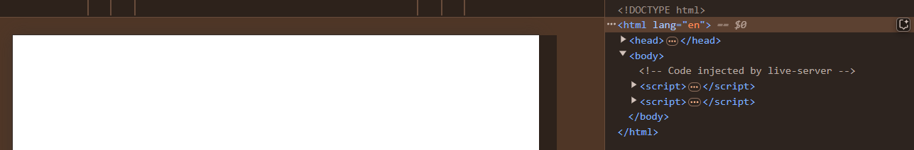

# DOM
- DOM stands for Document Object Model, which is a programming interface that represents a document as a tree structure. 
-  It represents the page so that programs can change the document structure, style, and content. The DOM represents the document as nodes and objects; that way, programming languages can interact with the page.


## How to Access DOM (HTML) Elements

### Select DOM by Tag

```html

<h1>My Name is Krishna</h1>
<script>
    const H1_Heading = document.getElementsByTagName("h1");
    console.log(H1_Heading)
</script>

```


- It returns all H1 headings present on the web page as an array. If you want to access the first heading from the array, you can use the 0th index.

- If there are no H1 elements in the document, headings[0] will return undefined. Always check its existence before accessing its properties.
```html

<h1>My Name is Krishna</h1>
<script>
    const H1_Heading = document.getElementsByTagName("h1");
    console.log(H1_Heading[0])
</script>

```


### Select DOM by ID

- Generally, we already know that an ID is a unique selector, and it is defined only once on a page.

```html
<h1 id="heading">My Name is Krishna</h1>
<script>
    const H1_Heading = document.getElementById("heading"); 
     console.log(H1_Heading)
</script>


```


### Select DOM by Class
- In HTML, a class is a common selector that can be used with multiple elements. When accessed through the DOM using JavaScript, it returns all matching elements as an array-like structure.
- Accessing by Index: Since the returned NodeList is array-like, you can use an index (starting from 0) to access individual elements.

```html
<h1 class="class-1">My Name is Krishna</h1>
<h1 class="class-1">My Name is Radha</h1>
<h1 class="class-1">My Name is RadhaKrishan</h1>
<script>
    const H1_Headings = document.getElementsByClassName("class-1"); 
     console.log(H1_Headings)
</script>


```


```html
<h1 class="class-1">My Name is Krishna</h1>
<h2 class="class-1">My Name is Radha</h2>
<h3 class="class-1">My Name is RadhaKrishan</h3>
<script>
    const H1_Headings = document.getElementsByClassName("class-1"); 
     console.log(H1_Headings)
</script>


```


### Select DOM by  Query Selector
- In CSS, when we need to select an ID, we use `#`. To select a class element, we use a `.` (dot). If we need to select an HTML element, we write the tag name. The same concept is used when selecting elements in JavaScript.

```html
<h1 class="class-1">My Name is Krishna</h1>
<h2 class="class-1">My Name is Radha</h2>
<h3 class="class-1">My Name is RadhaKrishan</h3>
<h3 id="id-1">Is my name Harish?</h3>

<script>
    // This method allows selecting all elements that have the class "class-1"
    const elementsWithClass = document.querySelectorAll(".class-1"); 

    // This method allows selecting only one element by its ID, which is unique
    const elementById = document.querySelector("#id-1"); 

    console.log(elementsWithClass); // Logs all elements with the class "class-1"
    console.log(elementById);      // Logs the element with ID "id-1"
</script>

```


```html
<p>Harish is a good boy</p>
<script>

    const para = document.querySelector("p");
    console.log(para);
</script>

```


### Nested DOM by Query Selector

- To access nested DOM elements in JavaScript, we use a combination of selectors, similar to how it is done in CSS.
- `querySelector` : Selects the first matching element based on the provided selector.


```html

<div class="card">
    <div class="card-heading">
        <h1>Harish is a good boy</h1>
    </div>
</div>

<script>
    // access card heading
    const card_heading = document.querySelector(".card .card-heading");
    console.log(card_heading);

    // access  heading
    const heading = document.querySelector(".card .card-heading h1");
    console.log(heading);
    
    
    
</script>

```


# Access HTML element Attributes

```html


<button id="btn" class="btn"  value="Submit Button">Button</button>


<script>
    //#  by tag
    const btn_tag = document.getElementsByTagName("button")[0]
    console.log(btn_tag);
    console.log(btn_tag.value);// access value attribute


     //#  by id
     const btn_id = document.getElementById("btn")
    console.log(btn_id);
    console.log(btn_id.value);// access value attribute

    //#  by class
    const btn_class = document.getElementsByClassName("btn")[0]
    console.log(btn_class);
    console.log(btn_class.value);// access value attribute
    
</script>


```


# Set HTML Element Attributes

- To set any HTML element attribute using JavaScript, we can directly assign a value or use the `setAttribute` method.


```html

 

 <script>
  const image=  document.getElementsByTagName("img")[0]
  image.src = "https://raw.githubusercontent.com/NightCatSama/vue-slider-component/master/.github/banner.jpg"

  
 </script>

```
 

```html


<script>
    // Set attributes directly
    const element = document.getElementById("example");
    element.src = "image.jpg"; // Set the 'src' attribute
    element.alt = "Example Image"; // Set the 'alt' attribute

    // Set attributes using setAttribute
    element.setAttribute("width", "300"); // Set the 'width' attribute
    element.setAttribute("height", "200"); // Set the 'height' attribute
</script>

```


-----
# Add Content in Html Element
-  to Add content in html element in JavaScript we use `<element>.innerHTML` or `<element>.innerText` property.

```html

<div id="example"></div>

<script>
// Add content using innerHTML
const element = document.getElementById("example");
element.innerHTML = "<h1>Hello, World!</h1>"; // Adds HTML content

// Add content using innerText
element.innerText = "This is plain text."; // Adds plain text
</script>
```

1. ## `innerHTML`:

Used to set or get HTML content inside an element. It allows you to insert HTML tags.
Example: `<h1>Hello, World!</h1>` will render as an H1 heading.

2. ## `innerText`:

Used to set or get the plain text content of an element. It doesn't interpret HTML tags; they are treated as plain text.
Example: `"This is plain text."` will display the text exactly as written.


## Style HTML elements

```html
<h1>Hello World !</h1>
<script>
    const heading = document.getElementsByTagName("h1")[0]

    heading.style.color="red";
    heading.style.backgroundColor="black";
</script>
```


## Change Page Title 

```html
<h1>My Home Page</h1>
<script>
document.title = "My Portfolio"
</script>
```


## Change HTML Body Style

```html
<body>
    <h1>Hello Krishna !</h1>
</body>
<script>
    document.body.style.color="green";
    document.body.style.backgroundColor="black";
</script>

```


## Create A New HTML Element
- to create a new element dynamically using JavaScript we use `document.createElement()` method.
```html
<body>
    
</body> 
<script>
    const node = document.createElement("div")
    node.innerText="Hi this is me"
    document.body.append(node)
</script>

```


```html
<body>
    
</body> 
<script>
    const node = document.createElement("div")
    node.innerText="Hi this is me"
    document.body.prepend(node)
</script>
```


## Get Closet Element Using Css Selectors

```html

        <div id="usr">
            <h1 id="heading">Hi this is Heading</h1>
        </div>
        <script>

            const heading = document.getElementById("heading")
            const data = heading.closest("#usr")
            console.log(data);

        </script>

```


## Remove A HTML Element

- To Remove any HTML element dynamically using `<element>.remove()`.

```html
        <body>
                <h1 id="heading">Hi this is Heading</h1>
</body> 
<script>
  document.getElementById("heading").remove()

</script>

```


## This and Global This Keyword


## 1. **`this`**
- **Context-Sensitive**: The value of `this` depends on how a function is called.
- **Scoping**:
  - In the **global context** (outside any function):
    - `this` refers to the global object (`window` in browsers, `global` in Node.js).
  - Inside a **function**:
    - In **non-strict mode**, `this` refers to the global object.
    - In **strict mode**, `this` is `undefined` unless explicitly set.
  - Inside an **object method**, `this` refers to the object that owns the method.
  - Inside a **class method**, `this` refers to the class instance.
  - Inside an **arrow function**, `this` is lexically bound (inherits `this` from the enclosing scope).

### Example:
```javascript
function globalContext() {
  console.log(this); // Global object (non-strict) or undefined (strict)
}

const obj = {
  method: function () {
    console.log(this); // Refers to `obj`
  },
};

const arrow = () => console.log(this); // Lexically bound
```

## **`2.globalThis`**:

- Global Reference: Introduced in ECMAScript 2020, `globalThis` provides a standard way to access the global object, regardless of environment (browser, Node.js, etc.).
- Scope-Independent: Always refers to the global object, regardless of context.

```js
console.log(globalThis); // Refers to the global object

```


| Feature                  | `this`                                     | `globalThis`                        |
|--------------------------|--------------------------------------------|-------------------------------------|
| **Context-Dependent**    | Yes                                       | No                                  |
| **Global Scope Behavior**| Refers to global object (non-strict mode) or `undefined` (strict mode) | Always refers to the global object |
| **Strict Mode Behavior** | Changes based on how the function is called| Unaffected; always the global object|
| **Arrow Functions**      | Lexically bound to enclosing scope         | Not affected                        |
| **Environment Agnostic** | No (varies by context)                    | Yes (consistent across platforms)   |
| **Method Usage**         | Refers to the object owning the method     | Not applicable                      |
| **Introduced In**        | JavaScript ES3 (originally)               | JavaScript ES2020                   |


## **When To Use**

- Use `this` when you need context-sensitive behavior (e.g., within a method or constructor).
- Use `globalThis` when you need an environment-agnostic reference to the global object.


# Interview Questions

---

## 1. **What is the DOM in JavaScript?**
- **Answer**: The DOM (Document Object Model) is a programming interface for web documents. It represents the structure of an HTML or XML document as a tree of nodes, allowing JavaScript to access and manipulate the document's content, structure, and style.

---

## 2. **How can you select an HTML element by its `id` using JavaScript?**
```javascript
const element = document.getElementById("example");
console.log(element); // Logs the element with id="example"
```

---

## 3. **What is the difference between `getElementsByTagName` and `querySelectorAll`?**
- **Answer**:
  - `getElementsByTagName` returns a live HTMLCollection of elements with the specified tag name.
  - `querySelectorAll` returns a static NodeList of elements matching the CSS selector.

---

## 4. **How do you select multiple elements with the same class name?**
```javascript
const elements = document.getElementsByClassName("example");
console.log(elements); // Logs all elements with class="example"
```

---

## 5. **How can you access and modify the content of an HTML element using JavaScript?**
```javascript
const element = document.getElementById("example");
element.innerHTML = "<p>Updated content</p>";
console.log(element.innerHTML); // Outputs: "<p>Updated content</p>"
```

---

## 6. **What is the difference between `innerHTML` and `innerText`?**
- **Answer**:
  - `innerHTML` sets or retrieves the HTML content of an element.
  - `innerText` sets or retrieves the plain text content of an element, ignoring any HTML tags.

---

## 7. **How do you dynamically create an HTML element using JavaScript?**
```javascript
const newElement = document.createElement("div");
newElement.innerText = "This is a new element.";
document.body.appendChild(newElement);
```

---

## 8. **How can you remove an HTML element from the DOM?**
```javascript
const element = document.getElementById("example");
element.remove(); // Removes the element from the DOM
```

---

## 9. **What is the purpose of the `closest()` method in JavaScript?**
- **Answer**: The `closest()` method traverses the DOM tree upwards from the current element, searching for the first ancestor that matches the specified CSS selector.

```javascript
const element = document.getElementById("example");
const closestDiv = element.closest("div");
console.log(closestDiv);
```

---

## 10. **How can you access the attributes of an HTML element?**
```javascript
const button = document.getElementById("button");
console.log(button.getAttribute("value")); // Retrieves the value attribute
```

---

## 11. **How can you modify the style of an HTML element using JavaScript?**
```javascript
const heading = document.getElementById("example");
heading.style.color = "red";
heading.style.backgroundColor = "black";
```

---

## 12. **How can you select elements using a CSS selector in JavaScript?**
```javascript
const element = document.querySelector(".example");
console.log(element); // Logs the first element matching the selector
```

---

## 13. **What is the difference between `document.querySelector` and `document.querySelectorAll`?**
- **Answer**:
  - `querySelector` selects the first element that matches the CSS selector.
  - `querySelectorAll` selects all elements that match the CSS selector and returns a static NodeList.

---

## 14. **How can you change the page title dynamically using JavaScript?**
```javascript
document.title = "New Page Title";
console.log(document.title); // Outputs: "New Page Title"
```

---

## 15. **What are the differences between `this` and `globalThis` in JavaScript?**
- **Answer**:
  - `this` is context-sensitive and depends on how the function is called.
  - `globalThis` always refers to the global object, regardless of the context.

---

## 16. **How can you manipulate a nested DOM element using JavaScript?**
```javascript
const nestedElement = document.querySelector(".parent .child");
nestedElement.innerText = "Updated text";
```

---

## 17. **How can you check if an element exists in the DOM before accessing it?**
```javascript
const element = document.getElementById("example");
if (element) {
  console.log("Element exists");
} else {
  console.log("Element does not exist");
}
```

---

## 18. **How do you set an attribute to an HTML element using JavaScript?**
```javascript
const image = document.createElement("img");
image.setAttribute("src", "image.jpg");
image.setAttribute("alt", "Example Image");
document.body.appendChild(image);
```

---

## 19. **How can you add multiple styles to an element dynamically?**
```javascript
const element = document.getElementById("example");
Object.assign(element.style, {
  color: "blue",
  fontSize: "20px",
  backgroundColor: "lightgray"
});
```

---

## 20. **What is the purpose of `document.createElement` in JavaScript?**
- **Answer**: It creates a new HTML element dynamically, which can be inserted into the DOM.

```javascript
const newParagraph = document.createElement("p");
newParagraph.innerText = "This is a new paragraph.";
document.body.appendChild(newParagraph);
```


# Practice Question
------

## 1. **Basic DOM Access**
Write a JavaScript snippet to access the first `<h2>` tag on a page and log its content.

---

## 2. **Class Selection**
How would you select all elements with the class `active` and change their background color to `yellow`?

---

## 3. **Dynamic Content**
Write code to dynamically add a paragraph inside a `<div>` with the ID `container`.

---

## 4. **Nested Selection**
Using JavaScript, select the first `<li>` element inside a `<ul>` with the class `menu` and change its text.

---

## 5. **Modify Attributes**
How can you change the `src` attribute of an `` element with the ID `profile-pic`?

---

## 6. **Remove Element**
Write a script to remove an element with the ID `to-remove` from the DOM.

---

## 7. **Event Handling**
How would you add a click event listener to a button with the class `btn-click` that logs `"Button clicked!"` when clicked?

---

## 8. **Query Selector**
What’s the difference between using `document.getElementById()` and `document.querySelector()`? Give an example for both.

---

## 9. **Child Nodes**
Write a snippet to log all child nodes of a `<div>` with the class `content`.

---

## 10. **Parent Node**
How can you find the parent of an element with the ID `child-element`?

---

## 11. **CSS Manipulation**
Write JavaScript to change the font size of all `<p>` tags to `18px`.

---

## 12. **Text Content**
How would you change the text of a `<span>` with the class `highlight` to `"Updated Text"`?

---

## 13. **Create and Append**
Write a script to create a `<ul>` element with three `<li>` items and append it to the body.

---

## 14. **Set Multiple Attributes**
How can you set multiple attributes (`src`, `alt`) on an `` element using JavaScript?

---

## 15. **Traversing DOM**
Write code to select the next sibling of an element with the class `current`.

---

## 16. **Event Delegation**
Explain event delegation and write an example where a click on any `<li>` inside a `<ul>` logs the text of the clicked item.

---

## 17. **Styles**
How can you toggle the visibility of an element with the ID `toggle-element`?

---

## 18. **Closest Method**
What does `element.closest()` do? Write an example to find the closest ancestor with the class `wrapper`.

---

## 19. **Dynamic Classes**
How would you add and remove a class `visible` from an element with the ID `modal`?

---

## 20. **Global and Local Scope**
What will `console.log(this)` print in the global scope vs inside an arrow function? Provide examples for both.

-----

```krishna

Meri hasi ka thikana nhi tha , 
Jb jb chahre pr hasi aai tb tb kisi na kisi ne meri khamoshi ko yaad kiya ,
Dil ko sukoon milna hota hai tha tabhi koi na koi muskil ne barbad kiya

Ek asha hai dil se, jald chalein is jahaan se,
Par jaane se pehle, ek baar toh saath baith kar,
Chai pi lein aapke yahan se.


-- Krishna

```