# Data Structure 

- Data Structure is a conceptual concept that teaches how to manipulate and organize data effectively.

- Data Structure is language-independent, which means it can be implemented in any programming language, such as Python, Java, JavaScript, and more.

- Example:
    - Imagine you are at home where your mom has arranged spices in labeled containers of various sizes. In this scenario, the data (spices) is organized and well-structured.
    - On the other hand, consider your room, where you have different types of clothes scattered around in no particular order. In this case, the data (clothes) is unorganized.
    - The difference is clear: if your mom needs a specific spice, she can easily find it because it is properly arranged. However, if you need a specific piece of clothing, it might take you a lot of time to find it due to the lack of organization.


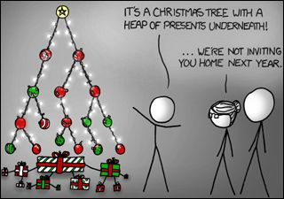

## Types of Data Structures in JavaScript  

### 1. String  
A sequence of characters used to represent text. Strings are immutable and can be manipulated using various built-in methods.  
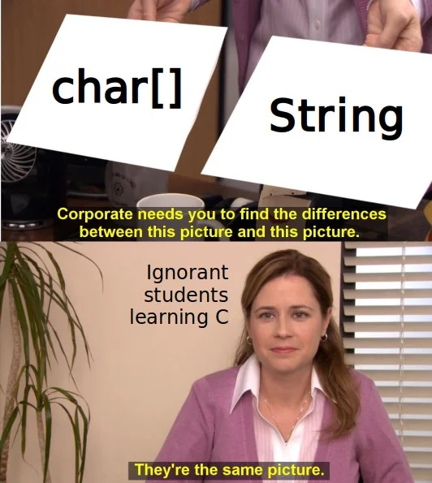

### 2. Array  
An ordered collection of elements that can store multiple values of any data type. Arrays allow indexed access and provide several methods for adding, removing, or manipulating elements.  

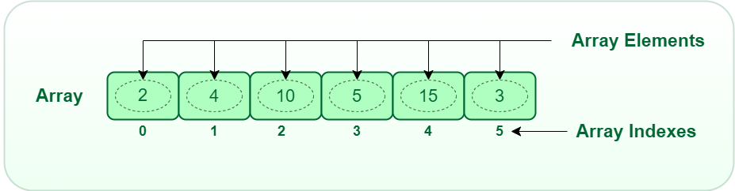

### 3. Object  
A collection of key-value pairs, where each key is a string or symbol, and the value can be any type. Objects are used to store structured data.  


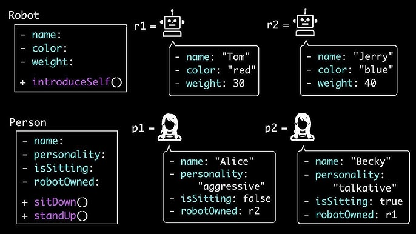

### 4. Stack  
A linear data structure that follows the Last In, First Out (LIFO) principle. Elements are added and removed from the same end, referred to as the "top" of the stack.  

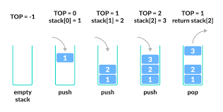

### 5. Queue  
A linear data structure that follows the First In, First Out (FIFO) principle. Elements are added at one end (rear) and removed from the other end (front).  

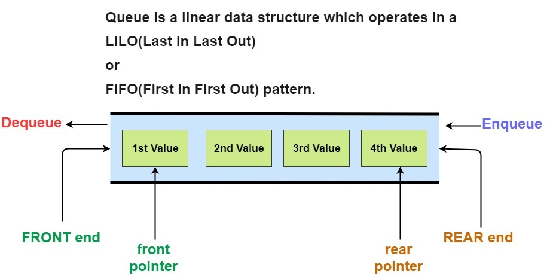

### 6. Linked List
A linked list is a fundamental data structure in computer science. It mainly allows efficient insertion and deletion operations compared to arrays. Like arrays, it is also used to implement other data structures like stack, queue and deque.
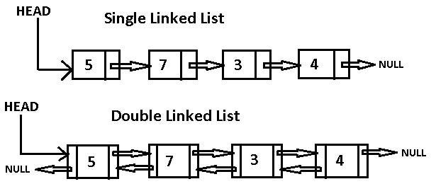

### 7. Trees  
A hierarchical data structure consisting of nodes. Each node has a value and references to child nodes. Common types include binary trees, binary search trees, and AVL trees.  
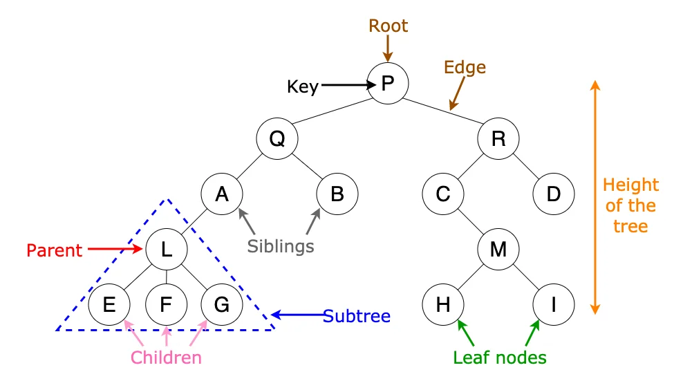

### 8. Graph  
A non-linear data structure consisting of nodes (vertices) connected by edges. Graphs can be directed or undirected and are used to model relationships.  
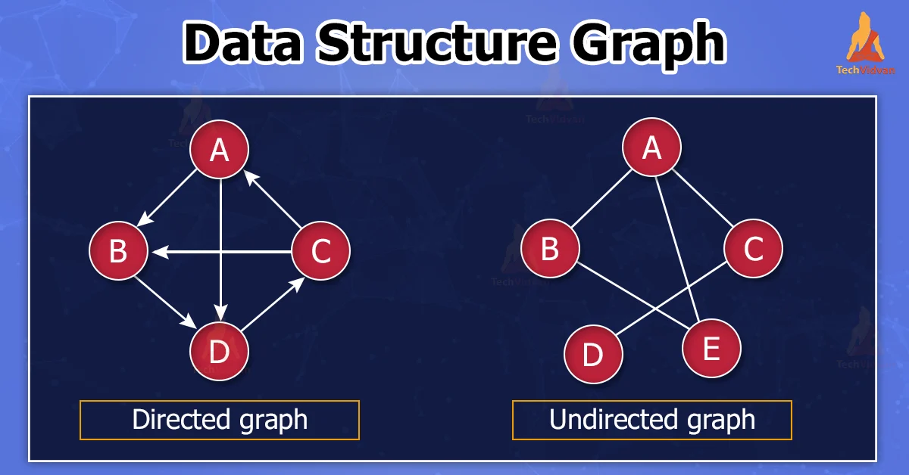

### 9. Heap  
A specialized tree-based data structure that satisfies the heap property. In a max heap, parent nodes are greater than or equal to their children; in a min heap, parent nodes are smaller.  

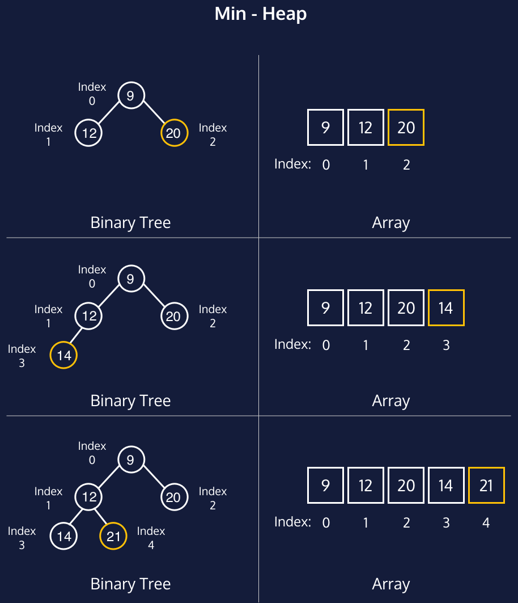
-------
# FlowChart


- A flowchart is a type of diagram that represents a workflow or process. A flowchart can also be defined as a diagrammatic representation of an algorithm, a step-by-step approach to solving a task.


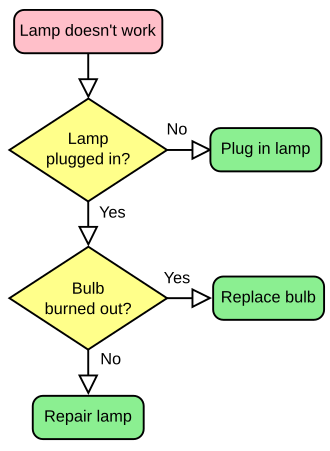

### Symbols

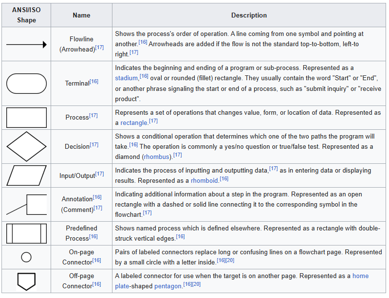
-------

# Algorithms

- An algorithm is a set of instructions that are followed to solve a problem or perform a task.

- An algorithm is a set of commands that must be followed for a computer to perform calculations or other problem-solving operations. According to its formal definition, an algorithm is a finite set of instructions carried out in a specific order to perform a particular task.


### Example:
- ## Selection Sort 

## Algorithm: Selection Sort  

**Purpose**: To sort an array by repeatedly finding the minimum (or maximum) element from the unsorted portion and placing it at the beginning.  

### Steps:  
1. Start with the first element in the array.  
2. Find the smallest element in the unsorted portion of the array.  
3. Swap the smallest element with the first element of the unsorted portion.  
4. Move the boundary of the sorted portion one step to the right.  
5. Repeat steps 2–4 until the entire array is sorted.  

### Pseudocode:  
```plaintext
SelectionSort(arr):  
    n = length of arr  
    for i = 0 to n-1 do  
        // Assume the current index has the minimum value  
        minIndex = i  
        
        // Find the index of the smallest element in the unsorted portion  
        for j = i+1 to n-1 do  
            if arr[j] < arr[minIndex] then  
                minIndex = j  
            end if  
        end for  
        
        // Swap the smallest element with the first unsorted element  
        if minIndex ≠ i then  
            swap(arr[i], arr[minIndex])  
        end if  
    end for  
End SelectionSort  
```

## Time Complexity  

### What is Time Complexity?  
**Time Complexity** measures the amount of time an algorithm takes to complete as a function of the input size. It helps evaluate the efficiency of an algorithm.  

### Types of Time Complexity  

1. **Constant Time - O(1)**  
   The algorithm takes the same amount of time regardless of input size.  

```js
// Function to get the first element of an array
function getFirstElement(arr) {
    return arr[0]; // Accessing the first element takes constant time
}

// Example usage
const numbers = [10, 20, 30, 40, 50];
console.log(getFirstElement(numbers)); // Output: 10

```

2. **Logarithmic Time - O(log n)**  
   The algorithm reduces the problem size with each step, typically by half.  

```js

// Function to perform binary search
function binarySearch(arr, target) {
    let left = 0;
    let right = arr.length - 1;

    while (left <= right) {
        let mid = Math.floor((left + right) / 2); // Find the middle index

        if (arr[mid] === target) {
            return `Target ${target} found at index ${mid}`;
        }

        if (arr[mid] < target) {
            left = mid + 1; // Search the right half
        } else {
            right = mid - 1; // Search the left half
        }
    }

    return `Target ${target} not found`;
}

// Example usage
const sortedArray = [1, 3, 5, 7, 9, 11, 13, 15];
const target = 7;

console.log(binarySearch(sortedArray, target));
```

3. **Linear Time - O(n)**  
   The algorithm's execution time grows directly proportional to the input size.  
```js

function printArrayElements(arr) {
    for (let i = 0; i < arr.length; i++) { // Iterates through each element of the array
        console.log(arr[i]); // Prints the current element
    }
}

// Example usage:
const numbers = [1, 2, 3, 4, 5];
printArrayElements(numbers);
```

4. **Linearithmic Time - O(n log n)**  
   The algorithm performs a linear number of operations, each taking logarithmic time.  

```js

    function mergeSort(arr) {
    if (arr.length <= 1) {
        return arr; // Base case: arrays with 0 or 1 element are already sorted
    }

    // Split the array into two halves
    const mid = Math.floor(arr.length / 2);
    const left = arr.slice(0, mid);
    const right = arr.slice(mid);

    // Recursively split and merge
    return merge(mergeSort(left), mergeSort(right));
}

function merge(left, right) {
    const result = [];
    let i = 0, j = 0;

    // Merge the two arrays by comparing their elements
    while (i < left.length && j < right.length) {
        if (left[i] < right[j]) {
            result.push(left[i]);
            i++;
        } else {
            result.push(right[j]);
            j++;
        }
    }

    // Add remaining elements from both arrays
    return result.concat(left.slice(i)).concat(right.slice(j));
}

// Example usage
const arr = [5, 3, 8, 4, 2, 7, 6, 1];
console.log("Original Array:", arr);
console.log("Sorted Array:", mergeSort(arr));


```

5. **Quadratic Time - O(n²)**  
   The algorithm’s execution time grows proportionally to the square of the input size.  

```js

    function printPairs(arr) {
    for (let i = 0; i < arr.length; i++) {
        for (let j = 0; j < arr.length; j++) {
            console.log(`Pair: (${arr[i]}, ${arr[j]})`);
        }
    }
}

// Example usage
const array = [1, 2, 3];
printPairs(array);

```

6. **Cubic Time - O(n³)**  
   The execution time increases with the cube of the input size, often seen in nested loops.  

```js

    function cubicTimeExample(arr) {
    let n = arr.length;

    // Triple nested loop - O(n³)
    for (let i = 0; i < n; i++) {
        for (let j = 0; j < n; j++) {
            for (let k = 0; k < n; k++) {
                console.log(`i: ${i}, j: ${j}, k: ${k}`);
            }
        }
    }
}

const arr = [1, 2, 3];
cubicTimeExample(arr);

```

7. **Exponential Time - O(2ⁿ)**  
   The algorithm's time doubles with each additional input size.  

```js

// Function to calculate Fibonacci number using recursion (Exponential Time Complexity)
function fibonacci(n) {
    // Base cases
    if (n <= 1) {
        return n;
    }
    // Recursive calls to calculate the nth Fibonacci number
    return fibonacci(n - 1) + fibonacci(n - 2);
}

// Testing the Fibonacci function
let n = 10;
console.log(`Fibonacci of ${n} is:`, fibonacci(n));
```

8. **Factorial Time - O(n!)**  
   The algorithm’s execution grows at a factorial rate, typically in problems involving permutations.  

```js

// Function to generate all permutations of an array
function generatePermutations(arr) {
    if (arr.length === 0) return [];  // Base case: empty array has no permutations
    if (arr.length === 1) return [arr];  // Base case: one element array has only one permutation

    let result = [];
    
    // Loop through the array, fix one element and permute the rest
    for (let i = 0; i < arr.length; i++) {
        let current = arr[i];
        let remaining = arr.slice(0, i).concat(arr.slice(i + 1));  // Remove the current element
        
        // Recursive call to permute the remaining array
        let permutations = generatePermutations(remaining);
        
        // Add the current element to each permutation of the remaining array
        for (let perm of permutations) {
            result.push([current, ...perm]);
        }
    }
    
    return result;
}

// Test the function
let arr = [1, 2, 3];
let permutations = generatePermutations(arr);

console.log(`All permutations of [${arr}]:`);
console.log(permutations);
console.log(`Total permutations: ${permutations.length}`);
```

### Importance of Time Complexity  
Understanding time complexity helps choose the most efficient algorithm for a given problem and optimize code performance.  


# Wrost Case Time Complexity


### What is Worst Case Time Complexity?  
**Worst case time complexity** represents the maximum amount of time an algorithm will take to complete, given the worst possible input size or configuration. It is used to assess the algorithm's efficiency in the least favorable scenario.

### Example: Worst Case for Linear Search in JavaScript

Linear Search is an algorithm that looks for a target value in an array by checking each element in sequence.

In the worst case, if the target value is not present in the array, or is the last element, the algorithm must check every element, resulting in a time complexity of **O(n)**.

### JavaScript Code Example:

```javascript
// Function to perform linear search
function linearSearch(arr, target) {
    for (let i = 0; i < arr.length; i++) {
        if (arr[i] === target) {
            return i;  // Return index if target is found
        }
    }
    return -1;  // Return -1 if target is not found
}

// Test case
let arr = [5, 12, 9, 7, 20];
let target = 7;
let result = linearSearch(arr, target);

if (result !== -1) {
    console.log(`Target found at index: ${result}`);
} else {
    console.log('Target not found');
}
```

- Worst Case for Linear Search: The worst-case time complexity is O(n) when the target value is at the end of the array, or not found at all.
- Time Complexity: In the worst case, the algorithm performs n comparisons (where n is the length of the array).


# Best Case Time Complexity

### What is Best Case Time Complexity?  
**Best case time complexity** represents the minimum amount of time an algorithm will take to complete, given the best possible input configuration. It is used to assess the algorithm's efficiency in the most favorable scenario.

### Example: Best Case for Linear Search in JavaScript

Linear Search is an algorithm that looks for a target value in an array by checking each element sequentially.

In the best case, if the target value is found at the first position in the array, the algorithm will only need one comparison, resulting in a time complexity of **O(1)**.

### JavaScript Code Example:

```javascript
// Function to perform linear search
function linearSearch(arr, target) {
    for (let i = 0; i < arr.length; i++) {
        if (arr[i] === target) {
            return i;  // Return index if target is found
        }
    }
    return -1;  // Return -1 if target is not found
}

// Test case
let arr = [7, 12, 9, 5, 20];  // Target is at the first position
let target = 7;
let result = linearSearch(arr, target);

if (result !== -1) {
    console.log(`Target found at index: ${result}`);
} else {
    console.log('Target not found');
}
```

- Best Case for Linear Search: The best-case time complexity is O(1) when the target value is found at the first position in the array.
- Time Complexity: In the best case, the algorithm performs only one comparison (where the target is at index 0).

# Average Case Time Complexity  

### What is Average Case Time Complexity?  
**Average case time complexity** represents the expected amount of time an algorithm will take to complete, assuming a typical or random input distribution. It is calculated by considering all possible inputs and averaging the results.

### Example: Average Case for Linear Search in JavaScript

Linear Search is an algorithm that checks each element of an array sequentially to find a target value.

In the average case, the target value is expected to be found somewhere in the middle of the array, requiring approximately half of the total number of comparisons.

### JavaScript Code Example:

```javascript
// Function to perform linear search
function linearSearch(arr, target) {
    for (let i = 0; i < arr.length; i++) {
        if (arr[i] === target) {
            return i;  // Return index if target is found
        }
    }
    return -1;  // Return -1 if target is not found
}

// Test case
let arr = [5, 12, 9, 7, 20];  // Random target position
let target = 9;
let result = linearSearch(arr, target);

if (result !== -1) {
    console.log(`Target found at index: ${result}`);
} else {
    console.log('Target not found');
}

```

- Average Case for Linear Search: The average case occurs when the target value is somewhere in the middle of the array. On average, the algorithm will check half of the elements, which results in O(n/2) comparisons. However, constants are ignored, so the time complexity is simplified to O(n).
- Time Complexity: In the average case, the algorithm performs approximately half the number of comparisons as the size of the array.
-------
# Interview Question

### 1. What is a Data Structure?  
**Answer**: A data structure is a way of organizing, storing, and manipulating data to perform operations efficiently. Examples include arrays, stacks, queues, and trees.  

### 2. What is the difference between a Stack and a Queue?  
**Answer**:  
- **Stack**: Follows Last In, First Out (LIFO) principle.  
- **Queue**: Follows First In, First Out (FIFO) principle.  

### 3. What is an Algorithm?  
**Answer**: An algorithm is a step-by-step procedure or formula for solving a problem. It provides a logical sequence of actions to achieve a specific task.  

### 4. What is a Flowchart, and why is it used?  
**Answer**: A flowchart is a graphical representation of a process or algorithm using symbols like rectangles, diamonds, and arrows. It helps visualize and understand the logic clearly.  

### 5. Explain the concept of Recursion with an example.  
**Answer**: Recursion is a method where a function calls itself to solve a smaller instance of the problem.  
**Example**: Calculating the factorial of a number, `factorial(n) = n * factorial(n-1)` until `n = 1`.  

### 6. What is the difference between Linear and Non-Linear Data Structures?  
**Answer**:  
- **Linear**: Data elements are arranged in a sequential manner (e.g., arrays, linked lists).  
- **Non-Linear**: Data elements are arranged hierarchically (e.g., trees, graphs).  

### 7. What is the purpose of sorting algorithms?  
**Answer**: Sorting algorithms arrange elements in a specific order (ascending or descending) to improve search efficiency and data organization. Examples include Bubble Sort, Quick Sort, and Merge Sort.  

### 8. What are the key components of a Tree Data Structure?  
**Answer**:  
- **Root**: The topmost node.  
- **Parent**: A node with children.  
- **Child**: Nodes connected below a parent.  
- **Leaf**: A node with no children.  

### 9. What is the difference between Breadth-First Search (BFS) and Depth-First Search (DFS)?  
**Answer**:  
- **BFS**: Explores all nodes at the current depth before moving to the next depth level.  
- **DFS**: Explores as far down a branch as possible before backtracking.  

### 10. What are the advantages of using flowcharts?  
**Answer**: Flowcharts help in:  
- Simplifying complex processes.  
- Debugging and improving algorithms.  
- Communicating logic clearly across teams.  

### 11. What is the difference between a **linked list** and an **array**?  
**Answer**:  
- **Array**: Fixed size, contiguous memory allocation, fast access by index.  
- **Linked List**: Dynamic size, non-contiguous memory, slower access due to pointer traversal.  

### 12. Explain **Binary Search** and its time complexity.  
**Answer**: Binary search is an algorithm that finds an element in a sorted array by repeatedly dividing the search interval in half.  
- **Time Complexity**: O(log n).  

### 13. What is the **difference between a stack and a queue**?  
**Answer**:  
- **Stack**: Follows Last In, First Out (LIFO) principle.  
- **Queue**: Follows First In, First Out (FIFO) principle.  

### 14. Describe the **Quick Sort** algorithm and its time complexity.  
**Answer**: Quick Sort is a divide-and-conquer algorithm that partitions the array into two sub-arrays, recursively sorting them.  
- **Best/Worst/Average Time Complexity**: O(n log n) / O(n²) / O(n log n).  

### 15. What are the advantages of **using hash tables** in data storage?  
**Answer**: Hash tables provide efficient data retrieval with average constant time complexity O(1) for search, insert, and delete operations, using keys for indexing data. They are ideal for scenarios involving fast lookups.  


```krishna

---krishna
```
