# Datatypes

- A data type is an attribute associated with a piece of data that tells a computer system how to interpret its value.

### Types of Datatypes

- Primitive Datatypes
- Non - Primitive Datatypes
- Dynamic DataType


### Primitive Data Types

- These are the types built into the interpreter, and their meanings are predefined.

- Examples: `number`, `boolean`, `string`, `null`, `BigInt`, `Symbol`, `undefined`

### Non-Primitive Data Types

- These are types derived from primitive data types.

- Examples: `array`, `object`, `map`, `set`


### typeof() function

- The `typeof` operator in JavaScript is used to check the type of a variable.

```js

    var a = 20;
    var b ="Krishna";

    console.log(a,typeof(a))// 20,number
    console.log(b,typeof(b)) // "Krishna" string

```
# Primitive Data Types
### Number DataType


-The `number` type in JavaScript is used for evaluation and calculations. It includes numeric characters (0-9) and can be represented without quotes as actual numbers.


```js

        var a = 23;
        var otp = 123456;

        console.log(a)//23
        console.log(otp) // 123456

        //types
        console.log(typeof(a)) // number
        console.log(typeof(otp))// number

```

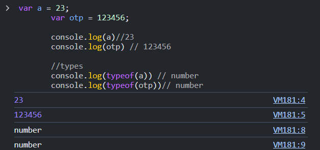


### String DataType

- A `string` is a collection of alphabetic or alphanumeric characters, wrapped between single quotes (`'`) or double quotes (`"`).

- The difference between a `string` and a `number` is that a `string` cannot be used for arithmetic operations like addition or subtraction. However, it can be concatenated with other strings.


```js
    var  fname= "Krishna" ;
    var  lname= '😎' ;

    console.log(fname) // Krishna
    console.log(typeof(fname)) // string
        console.log(lname) // 😎
    console.log(typeof(lname)) // string


```


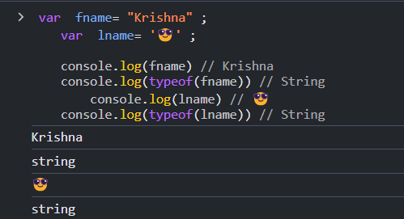

### Boolean DataType

- The `boolean` data type in JavaScript is used when a result is required based on `true` or `false` values.


```js

    const a = true;
    const b = false;

    console.log(a)//true
    console.log(typeof(a))//boolean
   
     console.log(b)//false
    console.log(typeof(b))//boolean

```

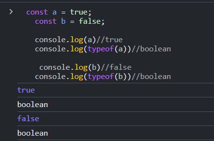

### null DataType

- The `null` data type in JavaScript is used to explicitly assign a variable with a `null` value. 

- Previously, we learned that a variable without an initial value is `undefined`. If we want to explicitly set a variable to have no value, we use the `null` data type.

- the type of `null` variable is `object`. 


```js

        var a = null;

        console.log(a) // null
        console.log(typeof(a)) // object

```


> is Null or undefined are same ?

- 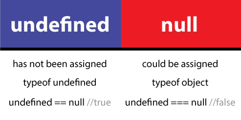
- 


### Symbol DataType

-  The `Symbol` data type in JavaScript is a unique and immutable data type. 

- It is often used to create unique property keys for objects, ensuring that they do not conflict with other property keys. 

- Each `Symbol` value is unique, even if two symbols are created with the same description. For example:  

```js
  const symbol1 = Symbol('example');
  const symbol2 = Symbol('example');
  console.log(symbol1 === symbol2); // Output: false
  console.log(symbol1); //Symbol(example)
  console.log(typeof(symbol1));//symbol
  console.log(symbol2); //Symbol(example)
  console.log(typeof(symbol2)); //symbol
```

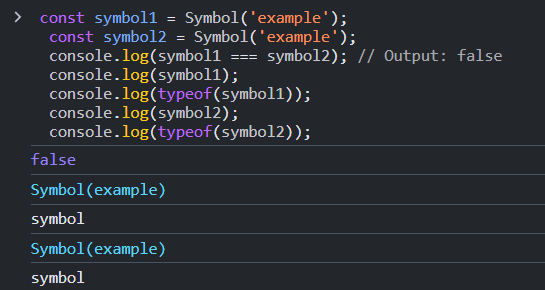


```js

// Create or access a symbol from the global symbol registry
const globalSym = Symbol.for('globalSymbol');

// Retrieve the global symbol by key
const sameGlobalSym = Symbol.for('globalSymbol');

console.log(globalSym === sameGlobalSym); // Output: true (same symbol)
```
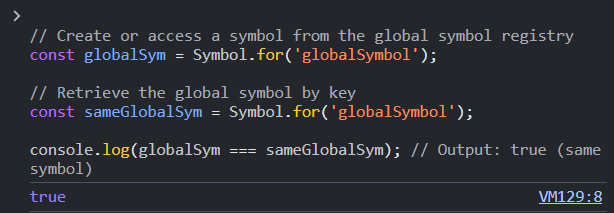


### undefined Datatype

- The `undefined` data type in JavaScript represents a variable that has been declared but not assigned a value. 

- When a variable is declared without an initial value, its default value is `undefined`. For example:  
```js
  let x;
  console.log(x); // Output: undefined
```

```js
function example() {}
console.log(example()); // Output: undefined
```

### BigInt DataType


- The `BigInt` type in JavaScript is used for evaluation and calculations involving very large integers. It is similar to the `number` type but supports a much larger range of values.

- After the `number` data type, `BigInt` is the second numeric data type in JavaScript.

- The difference between `number` and `BigInt` is that `BigInt` cannot contain decimal (floating-point) values, whereas `number` can.

- Another key difference is that `BigInt` supports hexadecimal and octal representations, whereas `number` does not.


-  simple

```js

    var a = 34567n
    var b = 0x45895892
    console.log(a) //34567n    
    console.log(b) //1166629010n    
    console.log(typeof(a)) //bigint    
    console.log(typeof(b)) //bigint    

```

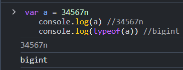


-  BigInt Constructor

```js

    var a = BigInt(34)
      console.log(a) //34n    
    console.log(typeof(a)) //bigint  
    

```

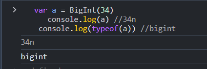


# Non - Primitive Data Type

### Array Datypes 

- An `array` in JavaScript is a collection of elements that can hold multiple values in a single variable. 
- The Type of array in JavaScript is `object`.

- Arrays are typically used to store elements of the same type (homogeneous), but JavaScript allows arrays to contain mixed data types as well.

- Each element in an array is assigned an index, which always starts from `0` and ends at `length - 1`. For example:

```js
  const numbers = [10, 20, 30, 40];
  console.log(typeof(numbers)); // Output: 'object'
  console.log(numbers[0]); // Output: 10
  console.log(numbers[numbers.length - 1]); // Output: 40
```
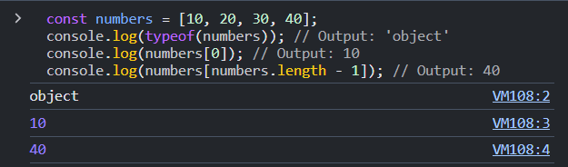


### Objects

- An `object` in JavaScript is a type of collection that stores data in the form of key-value pairs. 

- Keys are strings (or symbols), and values can be any valid JavaScript data type, including numbers, strings, arrays, functions, or even other objects. For example:  
```javascript
  const person = {
    name: "John",
    age: 30,
    isEmployed: true
  };
  console.log(person)
  console.log(person['age'])
  console.log(typeof(person))
```

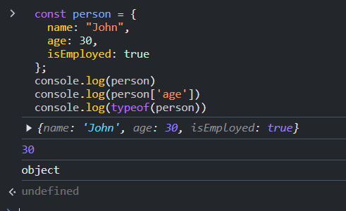

### Set Datatype 

- The `Set` data type in JavaScript is a user-defined data structure that stores a collection of unique items. 

- It automatically removes duplicate values and ensures that each item is stored only once. For example:  
  ```javascript
  const set = new Set([1, 2, 2, 3]);
  console.log(set); // Output: Set(3) {1, 2, 3}

### Map Datatype 

- The `Map` data type in JavaScript is similar to objects, as it stores data in the form of key-value pairs. However, unlike objects, the properties of a `Map` cannot be accessed directly using dot notation or bracket notation.

- Key differences between `Map` and `Object`:
  1. **Key Types**: In a `Map`, keys can be of any data type (e.g., objects, functions, numbers), while in an `Object`, keys are always converted to strings or symbols.
  2. **Iteration**: A `Map` maintains the order of its elements and can be iterated directly, whereas an `Object` does not guarantee key order.
  3. **Size Property**: `Map` has a built-in `size` property to get the count of key-value pairs, while for `Object`, you must manually calculate the size using `Object.keys(obj).length`.

- Example:
  ```javascript
  const map = new Map();

  // Adding key-value pairs
  map.set("name", "Alice");
  map.set(42, "The Answer");
  map.set(true, "Boolean Key");

  console.log(map)

  // Accessing values
  console.log(map.get("name")); // Output: Alice
  console.log(map.get(42));     // Output: The Answer
  console.log(map.get(true));   // Output: Boolean Key


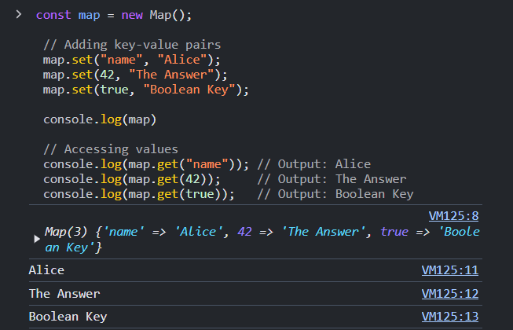

# Dynamic DataType

- - In JavaScript, the type of a variable can change dynamically during runtime, as JavaScript is a dynamically-typed language.

```js
var x;
console.log(x); // Output: undefined

x = 23;
console.log(x); // Output: number

x = "krishna";
console.log(x); // Output: string
```


| **Data Type**    | **Description**                                                                                       | **Example**                                  | **Type Check**          |
|------------------|-------------------------------------------------------------------------------------------------------|----------------------------------------------|-------------------------|
| **Primitive**    | Built-in types with predefined meanings.                                                              | `number`, `boolean`, `string`, `null`, `BigInt`, `Symbol`, `undefined` | `typeof(variable)`      |
| **Number**       | Represents numeric values used for evaluation and calculations.                                       | `23`, `123456`                               | `typeof(23)` // number  |
| **String**       | Collection of characters (alphabetic or alphanumeric), wrapped in quotes.                             | `"Krishna"`, `'😎'`                          | `typeof("Krishna")` // string |
| **Boolean**      | Represents `true` or `false` values.                                                                   | `true`, `false`                             | `typeof(true)` // boolean|
| **Null**         | Represents an explicit assignment of no value.                                                        | `null`                                       | `typeof(null)` // object |
| **Symbol**       | A unique and immutable data type used to create unique property keys.                                 | `Symbol('example')`                         | `typeof(Symbol())` // symbol |
| **Undefined**    | Represents a variable that has been declared but not assigned a value.                               | `let x; console.log(x)`                     | `typeof(x)` // undefined |
| **BigInt**       | Used for large integers and calculations, supports values beyond the `Number` range.                   | `34567n`, `BigInt(34)`                      | `typeof(34567n)` // bigint |
| **Array**        | Collection of elements, typically indexed from 0 and allows mixed data types.                         | `[1, 2, 3]`, `['a', 'b', 'c']`              | `typeof([1, 2])` // object |
| **Object**       | Collection of key-value pairs, can hold various data types as values.                                 | `{name: "John", age: 30}`                   | `typeof({})` // object  |
| **Set**          | Stores unique values, eliminating duplicates.                                                         | `new Set([1, 2, 2, 3])`                      | `typeof(new Set())` // object |
| **Map**          | Stores key-value pairs with keys of any data type and maintains insertion order.                      | `new Map([["name", "Alice"], [42, "Answer"]])`| `typeof(new Map())` // object |


# Interview Questions


## 1. What are Datatypes in JavaScript?

- A data type is an attribute associated with a piece of data that tells a computer system how to interpret its value.


## 2. what is the difference between `number` and `bigint`?

- `number`: Can represent both integer and floating-point numbers. It has a limited range, with values between `-2^53 + 1` and `2^53 - 1` (approximately `-9,007,199,254,740,992` to `9,007,199,254,740,991)`. Represented normally `(e.g., 23, -3.5, etc.)`.

- `BigInt`: Used for very large integers that exceed the range of the `number` type. It can represent arbitrarily large integers, limited only by the available memory.Represented with a suffix `n` `(e.g., 123n, 456789012345678901234567890n)`.


## 3. What is the difference between Primitive and Non primitive Datatypes in JavaScript ?

- `Primitive Data Types`: These are basic data types that are directly assigned to variables and hold their actual values. They are immutable.
- `Non-Primitive Data Types`: These are more complex types that store references to their values, rather than the actual value itself. They are mutable.

```js

// Primitive Data Types
let a = 10;      // number
let b = "Hello"; // string
let c = true;    // boolean

// Non-Primitive Data Types
let obj = { name: "Alice", age: 25 }; // object
let arr = [1, 2, 3];                  // array
```

- `Primitive`: Immutable, direct value assignment, examples include numbers, strings, and booleans.
- `Non-Primitive`: Mutable, reference-based, examples include objects, arrays, and functions.

## 4. What are Symbol Datatype in JavaScript ?

- `Symbol` is a `primitive`, `unique`, and `immutable data type` that is mainly used for creating unique property keys in `objects`.
- It is commonly used to avoid property name collisions and can be used for defining private properties.

```js

// Creating a Symbol
const sym1 = Symbol('description');
const sym2 = Symbol('description');

// Checking uniqueness
console.log(sym1 === sym2); // Output: false (they are unique)

```

## 5. What is the main difference between `Array` and `Object` in JavaScript?


- `Arrays` are best when you need an ordered list of elements, whereas `Objects` are best for unordered collections of key-value pairs, where you need to access data by a named property.

```js

// Array
const arr = [1, 2, 3, 4];
console.log(arr[0]); // Output: 1
arr.push(5);          // Adds 5 to the end of the array
console.log(arr);     // Output: [1, 2, 3, 4, 5]

// Object
const person = {
  name: "John",
  age: 30,
  occupation: "Developer"
};
console.log(person.name); // Output: John
person.country = "USA";   // Adding a new property to the object
console.log(person);      // Output: { name: "John", age: 30, occupation: "Developer", country: "USA" }

```


1. **What is the output of the following code?**
    ```js
    let a = 10;
    let b = "Hello";
    console.log(a + b);
    ```
   
2. **What will be logged to the console when you run the following code?**
    ```js
    let x = 5;
    let y = 10;
    console.log(x == y);
    ```
   
3. **What is the result of the following code?**
    ```js
    let a;
    console.log(a);
    ```
    What is the value of `a`?

4. **What is the difference between the following two statements?**
    ```js
    let a = null;
    let b;
    console.log(a);
    console.log(b);
    ```
   
5. **What is the output of the following code?**
    ```js
    let num = 12345;
    let bigNum = 12345n;
    console.log(typeof(num));
    console.log(typeof(bigNum));
    ```

6. **What will be the result of this code?**
    ```js
    let arr = [1, 2, 3, 4];
    console.log(arr[2]);
    ```
    What is the output when accessing the third element?

7. **What is the output of the following code?**
    ```js
    let person = {name: "John", age: 30};
    console.log(person.name);
    console.log(person["age"]);
    ```

8. **What will be logged in the console when you run the following?**
    ```js
    let mySet = new Set([1, 1, 2, 3, 3]);
    console.log(mySet);
    ```

9. **What is the output of the following code?**
    ```js
    let map = new Map();
    map.set("a", "apple");
    map.set("b", "banana");
    console.log(map.get("a"));
    console.log(map.get("b"));
    ```

10. **What does the following code log to the console?**
    ```js
    let str = "JavaScript";
    console.log(typeof(str));
    console.log(str.length);
    ```
    What is the type of `str` and its length?

--------


```krishna

  जब हुआ तेरा पता नहीं चला,
पहले थे undefined, अब जाकर तेरे दिल में मेरा नाम का खाता खुला।
कोड लिखूं ऐसा, जिसमें typeof मेरा चेक करे,
interpret भी कहे,ki ऐसा बंदा दुबारा न मिले।

--- krishna

```