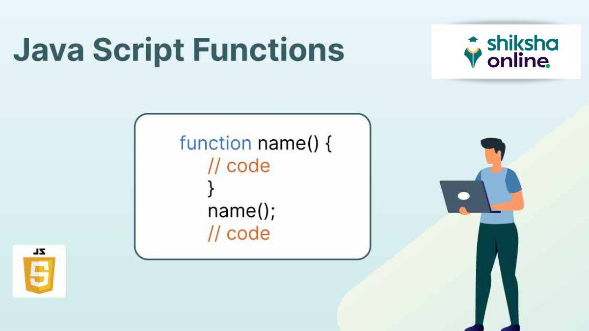
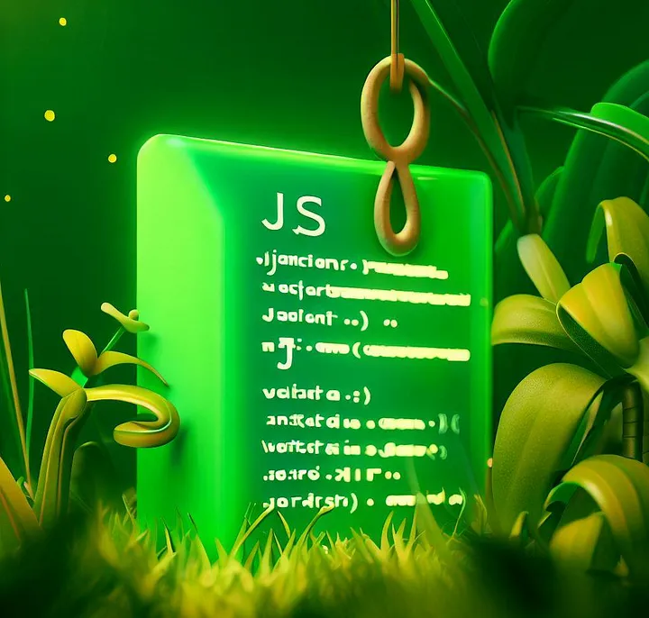

# Functions in JavaScript 

-A JavaScript function is a block of reusable code designed to perform a particular task, enhancing code efficiency and organization. Functions are invoked or called to execute their defined operations and can accept parameters and return values, allowing for flexible and dynamic programming.


## JavaScript Function Syntax

- A JavaScript function is defined with the function keyword, followed by a name, followed by `parentheses ()`.

- Function names can contain letters, digits, underscores, and dollar signs (same rules as variables).

- The parentheses may include parameter names separated by commas:
`(parameter1, parameter2, ...)`

- The code to be executed, by the function, is placed inside curly brackets: `{}`

```js
function name(parameter1, parameter2, parameter3) {
  // code to be executed
}

```

## Types of Functions
- ### Predefined Functions
- ### User Defined Functions 
- ### Anonymous Functions
- ### Immediately invoked function expression (IIFE)
- ### Generator function



## Predefined Functions
## User Defined Functions

- User Defined functions in JavaScript are defined using the function keyword and can be named or anonymous. They have their own this context, which varies depending on how they're called, and they also have access to the arguments object for handling passed parameters.


## Anonymous Functions
## IIFE Functions
## Generator function


# Interview Questions
# Practice Questions