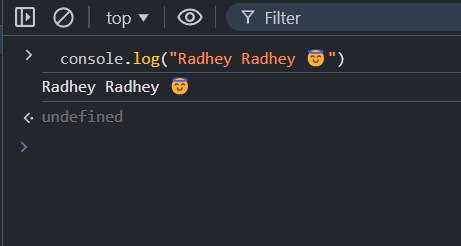
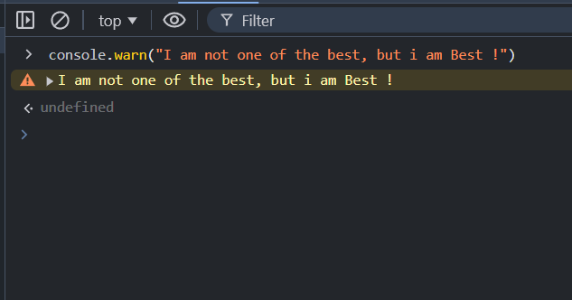
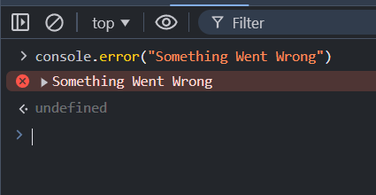
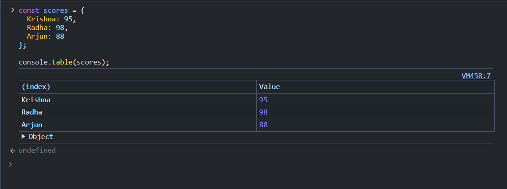
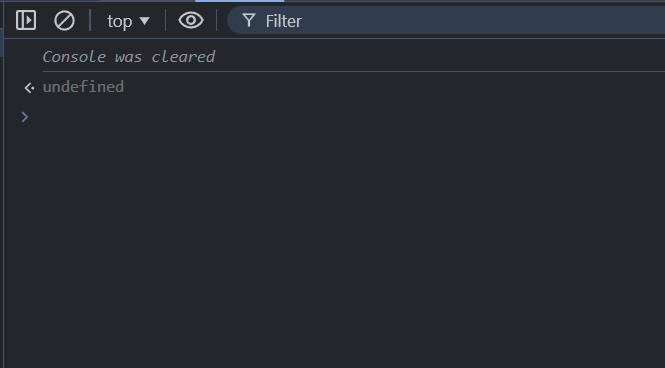
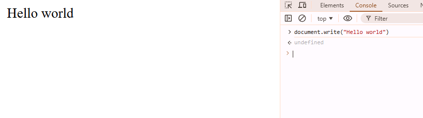

# Hello World in JavaScript

- To Print any Statement in JavaScript we use `console` interface.

- All console statements are seen on the Console tab of the browser.

# Print logged Statement

- To print any logged Statement we use `log` method which is available `console` interface.

### Syntax
```js

        console.log("<logged Statement>")

```

### Example

```js
    console.log("Radhey Radhey 😇")

```

#### Output



# Print Any Warning Statement

- To print any warning Statement we use `warn` method which is available `console` interface.

### Syntax
```js

        console.warn("<logged Statement>")

```

### Example

```js
    console.warn("I am not one of the best, but i am Best !")

```

#### Output



# Print Any Error Statement

- To print any warning Statement we use `error` method which is available `console` interface.

### Syntax
```js

        console.error("<logged Statement>")

```

### Example

```js
    console.error("Something Went Wrong")

```

#### Output



# Print Any logged Statement with styling

- To style any message on console we use %c, and  css properties in double quotes
- let try

### Syntax
```js

        console.log("%c <logged Statement>","<css>")

```

### Example

```js
    console.log("%c Krishna","background-color:red;")

```

#### Output


# Print Any large data with table or pretty form


Suppose we have some data like collection of data 

```js

const scores = {
  Krishna: 95,
  Radha: 98,
  Arjun: 88
};
```
- to print this data like a tabular form we use `console.table()` method 

### Syntax
```js

        console.log("<data>") // array or objects

```

### Example

```js
    console.log(data)

```

#### Output




#### Clean the Console

- to clear the console we use `clear()` method which is avilable in `console` interface.

```js

    console.clear()
```

#### Output




# Print on Document 

### Syntax
```js

        document.write("<data>") 

```

### Example

```js
    document.write("Hello World")

```

#### Output




## Interview Questions

### 1. Difference Between `log`,`warn` and `error` in Console Interface.

`console.log()`: Used for general, informational messages. It’s neutral and shows up in normal text.
`console.warn()`: Used for warnings, indicating potential issues. It appears in yellow text with a warning icon.
`console.error()`: Used for errors, indicating something went wrong. It appears in red text with an error icon.


### 2. What is the use of `document.write()` method in JavaScript.
 
The document.write() method in JavaScript is used to directly write text or HTML content into the web page during the page's initial loading. It can insert content dynamically into the document.

Note: It is generally not recommended to use document.write() after the page has loaded, as it can overwrite the entire document content or cause unexpected behavior. It's mainly useful for quick demonstrations or simple scripts.


### 3. How to print collection data in table form in console.
 
To print collection data (like an array or an object) in a table format in the browser's console, you can use console.table(). This method displays the data in a structured, tabular format, making it easier to read and analyze.

- Example 1: Printing an Array

```js
const fruits = ['Apple', 'Banana', 'Cherry', 'Date'];
console.table(fruits);
```
- Example 2: Printing an Array of Objects

```js
const people = [
  { name: 'John', age: 25, job: 'Engineer' },
  { name: 'Jane', age: 30, job: 'Doctor' },
  { name: 'Bob', age: 22, job: 'Artist' }
];
console.table(people);
```

- Example 3: Printing an Object

```js
const person = { name: 'John', age: 25, job: 'Engineer' };
console.table(person);
```

## How to Add Css in Console when print any Statement .

- To add CSS styles when printing a statement in the console, you can use console.log() with the %c directive followed by the CSS styles as a string.

```js
console.log('%cThis is a styled message', 'color: blue; font-size: 20px; font-weight: bold;');


```

# Practice Questions:

1. Write a JS Program to print Hello World .
2. write a program to print an collection in tabular form.
3. Write a JS program to print name with add Css Properties.


---------------------

```krishna

       देखकर तुझे प्यार का इज़हार करने का दिल किया,
    लेकिन पहली मुलाकात थी न, इसलिए सिर्फ console.log() किया।

```