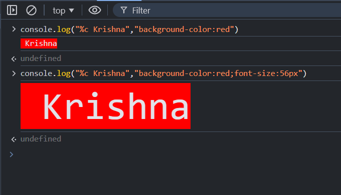

# Hello World in JavaScript

- To Print any Statement in JavaScript we use `console` interface.


# Print logged Statement

- To print any logged Statement we use `log` method which is available `console` interface.

### Syntax
```js

        console.log("<logged Statement>")

```

### Example

```js
    console.log("Radhey Radhey 😇")

```

#### Output


# Print Any Warning Statement

- To print any warning Statement we use `warn` method which is available `console` interface.

### Syntax
```js

        console.warn("<logged Statement>")

```

### Example

```js
    console.warn("I am not one of the best, but i am Best !")

```

#### Output


# Print Any Error Statement

- To print any warning Statement we use `error` method which is available `console` interface.

### Syntax
```js

        console.error("<logged Statement>")

```

### Example

```js
    console.error("Something Went Wrong")

```

#### Output


# Print Any logged Statement with styling

- To style any message on console we use %c, and  css properties in double quotes
- let try

### Syntax
```js

        console.log("%c <logged Statement>","<css>")

```

### Example

```js
    console.log("%c Krishna","background-color:red;")

```

#### Output



# Print Any large data with table or pretty form


Suppose we have some data like collection of data 

```js

const scores = {
  Krishna: 95,
  Radha: 98,
  Arjun: 88
};
```
- to print this data like a tabular form we use `console.table()` method 

### Syntax
```js

        console.log("<data>") // array or objects

```

### Example

```js
    console.log(data)

```

#### Output


#### Clean the Console

- to clear the console we use `clear()` method which is avilable in `console` interface.

```js

    console.clear()
```

#### Output

