# Loops 

In JavaScript, **loops** are also known as **iterative statements**. These loops allow us to perform a task repeatedly until a specified condition is met.
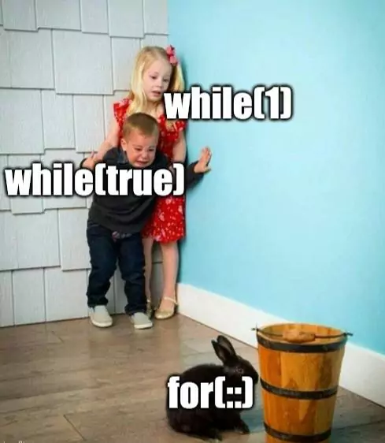
## Why Use Loops?

Loops are used when you want to perform the same task multiple times without writing the same code over and over again. This can save time, reduce errors, and make your code cleaner.

## Benefits of Using Loops

- **Efficiency**: Loops allow you to perform repetitive tasks more efficiently.
- **Clarity**: Using loops helps make your code more readable and maintainable.
- **Reduced Errors**: With loops, you don't need to repeat the same block of code multiple times, which reduces the chance of errors.

## Types of Loops in JavaScript

There are several types of loops in JavaScript, each serving different purposes:
1. ### Do while Loop
2. ### While Loop
3. ### For Loop
4. ### For in Loop
5. ### For of Loop 
5. ### For Each Loop 


## Do...While Loop

The **do...while** loop is also known as an **exit-controlled loop**. Unlike other loops, it guarantees that the code inside the loop will execute **at least once**, regardless of the condition. After the first execution, it will continue executing as long as the condition remains `true`.

#### How it Works:
1. **First**, the block of code inside the loop is executed.
2. **Then**, the condition is checked. If the condition evaluates to `true`, the loop will repeat. If it's `false`, the loop will stop.

This makes the **do...while** loop useful when you want to ensure that a task is performed at least once, even if the condition is initially false.

#### Example:

```javascript
let i = 0;
do {
    console.log(i); // Executes at least once
    i++;
} while (i < 5);

```

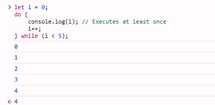

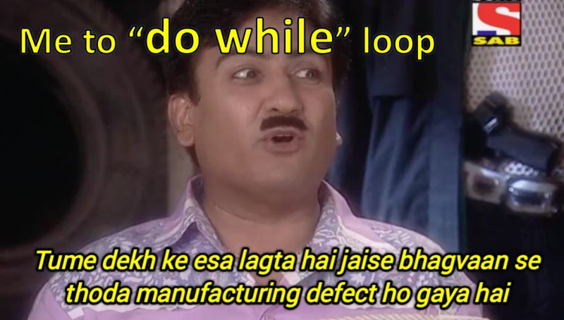
## While Loop

- The **while loop** is an **entry-controlled loop**. This means that the condition is checked **before** the loop is executed. If the condition is `true`, the code inside the loop will run. If the condition is `false` initially, the loop will not execute at all.

#### How it Works:
1. **First**, the condition is evaluated.
2. If the condition evaluates to `true`, the code inside the loop is executed.
3. After the code block executes, the condition is checked again. If it is still `true`, the loop continues. If the condition is `false`, the loop stops.


#### Example:

```javascript
let i = 0;
while (i < 5) {
    console.log(i); // Executes as long as the condition is true
    i++;
}
```
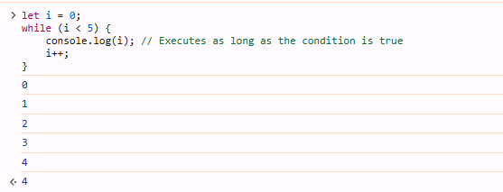

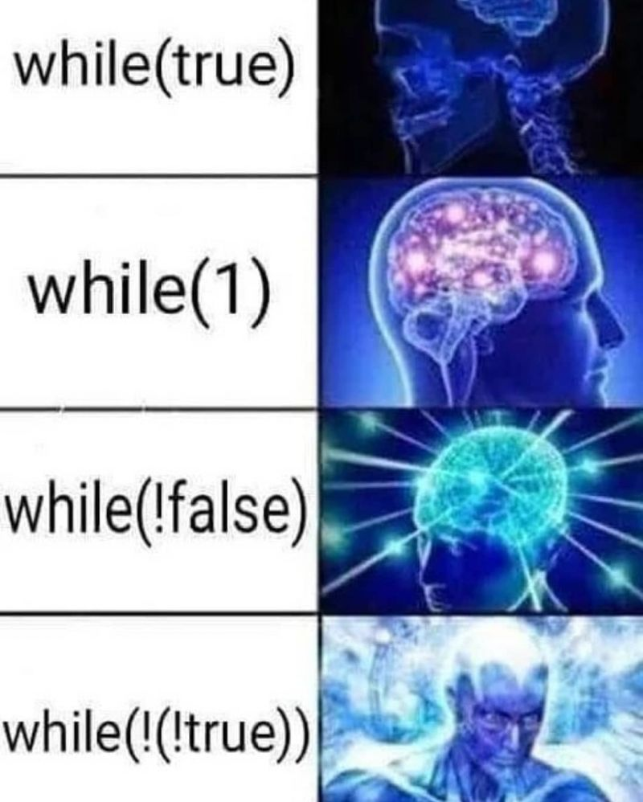
## For loop 


- The **for loop** is a shorthand version of the **while loop** that combines the initialization, condition check, and counter update into a single line. This makes it more concise and easier to read when you know how many times you want to repeat a task.

- A **for loop** contains **three main parts**:

1. **Initialization**: This is where you define and initialize the counter variable.
2. **Condition**: The loop will continue executing as long as this condition evaluates to `true`.
3. **Counter Update**: This is where you update the counter (usually increment or decrement) after each iteration.

These three parts are separated by **semicolons** (`;`).

```js
for (initialization; condition; counter) {
    // Code to be executed
}
```


```js

for (let i = 0; i < 5; i++) {
    console.log(i); // This will print numbers from 0 to 4
}
```
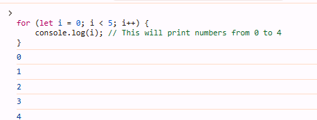

### Summary:

- **For Loop**: A more compact, shorthand version of the `while` loop. It’s perfect when you know the number of iterations in advance.
- It combines initialization, condition, and counter update into a single statement, separated by semicolons.

This explanation provides a more detailed and accurate description of the `for` loop, highlighting its syntax and when to use it.

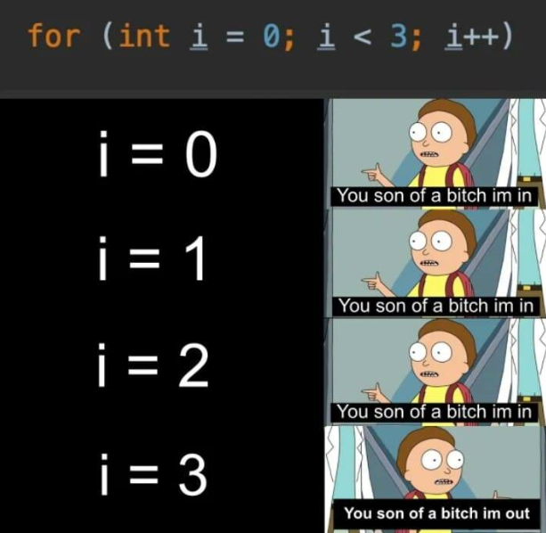
## For in Loop


- The **for...in loop** is used to iterate over the **keys or properties** of an object or the **indices** of an array in JavaScript. It is especially useful when you need to loop through all items in an object or an array. However, the **for...in loop** is typically more commonly used for iterating over **object properties**, while for arrays, you might prefer a **for loop** or **for...of loop** (as it is specifically designed for array elements).

#### How it Works:
- When used with **objects**, the `for...in` loop iterates over the **keys** (or property names).
- When used with **arrays**, the loop iterates over the **indices** (numeric keys of the array).


#### Syntax:

```javascript
for (let key in object) {
    // Code to be executed
}
```

```js

    const person = {
    name: "Alice",
    age: 25,
    city: "New York"
};

for (let key in person) {
    console.log(key + ": " + person[key]);
}

```

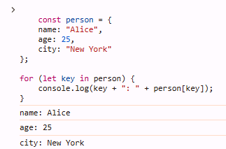

```js
const numbers = [10, 20, 30, 40];

for (let index in numbers) {
    console.log(index + ": " + numbers[index]);
}
```

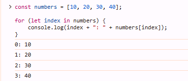


### Summary:

- The **for...in loop** is used for **iterating over the keys** of an object or the **indices** of an array.
- It is more commonly used with objects, while for arrays, the **for...of loop** or a regular **for loop** might be better for iterating over values directly.

This explanation provides a more detailed description of the `for...in` loop and clarifies when and how it should be used, especially in the context of objects and arrays.

## For Of Loop

- The **for...of loop** is used to **iterate over the values** of **iterable objects** in JavaScript, such as **arrays**, **strings**, **maps**, **sets**, and more. Unlike the `for...in` loop, which iterates over the **keys or indices**, the `for...of` loop gives you access to the **actual values** in the collection.

#### How it Works:
- The **`for...of` loop** works on **iterables** like **arrays**, **strings**, **maps**, **sets**, etc.
- It allows you to iterate directly over the values in the collection, making it more intuitive when working with arrays or other iterable objects.

#### Syntax:

```javascript
for (let value of iterable) {
    // Code to be executed
}
```


```js
const fruits = ["apple", "banana", "cherry"];

for (let fruit of fruits) {
    console.log(fruit);
}

```

```js

const greeting = "Hello";

for (let letter of greeting) {
    console.log(letter);
}
```

### Comparison with `for...in`
`for...in` iterates over keys (or indices for arrays), whereas `for...of` iterates over values.
For arrays, `for...of` is preferred over `for...in` since it directly accesses the values of the array, not the indices.


### Summary:

- The **`for...of` loop** is ideal for iterating over **values** of iterable objects, such as arrays, strings, sets, and maps.
- It is simpler and more intuitive than **`for...in`** when you need to work with the actual values, not just the keys or indices.

This explanation now provides a clearer understanding of the **`for...of` loop**, emphasizing its ability to iterate over the **values** of iterable collections and making it easier for students to understand when and how to use it.


## For Each Loop 

- 
The **`forEach`** method is a predefined method in JavaScript that is used to **iterate over each item** in an **array**. It is a more modern and readable way to loop through an array compared to traditional loops like `for` or `for...in`. The `forEach` method does not return a new array; instead, it executes a given function on each element in the array.

#### Syntax:

```javascript
array.forEach(function(currentValue, index, array) {
    // Code to be executed
});
```

`currentValue`: The current element being processed in the array.
`index (optional)`: The index of the current element being processed in the array.
`array (optional)`: The array that forEach is being called on.

```js

const fruits = ["apple", "banana", "cherry"];

fruits.forEach(function(fruit) {
    console.log(fruit);
});
```

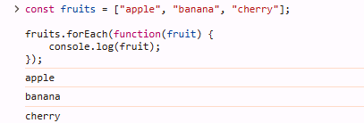

```js
const numbers = [10, 20, 30];

numbers.forEach(function(number, index) {
    console.log("Index " + index + ": " + number);
});
```

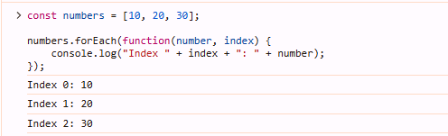

### Recap of JavaScript Loops

| Loop Type        | Syntax                                                                                  | Use Case                                                                 | Iterates Over                                   | Return Value / Behavior                        | Notes                                                                                 |
|------------------|-----------------------------------------------------------------------------------------|---------------------------------------------------------------------------|------------------------------------------------|------------------------------------------------|---------------------------------------------------------------------------------------|
| **for**          | `for (initialization; condition; counter) { /* code */ }`                              | Used when the number of iterations is known in advance.                    | Array indices, numbers, or a range of values   | Returns `undefined`. Can break or continue.    | Ideal for scenarios where you know exactly how many times to loop.                   |
| **for...in**     | `for (let key in object) { /* code */ }`                                                | Iterates over the **keys** (properties) of an object or array indices.    | Object properties or array indices (not values) | Returns `undefined`. Can break or continue.    | Avoid using with arrays for value iteration; use with objects or keys.                |
| **for...of**     | `for (let value of iterable) { /* code */ }`                                            | Iterates over the **values** of an iterable object (e.g., arrays, strings) | Array values, string characters, set values    | Returns `undefined`. Cannot break or continue.  | Ideal for iterating over values in iterable objects like arrays or strings.           |
| **forEach**      | `array.forEach(function(element, index) { /* code */ });`                               | Executes a function for each element in an array.                          | Array values (not keys or indices)             | Returns `undefined`. Cannot break or continue.  | Does not return a new array, used for side-effects. Cannot break the loop.           |
| **while**        | `while (condition) { /* code */ }`                                                     | Executes as long as the condition is true.                                | Values in an array or general conditions      | Returns `undefined`. Can break or continue.    | Ideal when the number of iterations is not known in advance but depends on a condition.|
| **do...while**   | `do { /* code */ } while (condition);`                                                  | Executes at least once, then repeats if the condition is true.            | Values or conditions                           | Returns `undefined`. Can break or continue.    | Guarantees at least one execution, even if the condition is false initially.         |

# Interview Questions

## 1. What is the difference between a `for` loop and a `for...in` loop in JavaScript?

### `for` loop:
- A traditional loop used for iterating over a range of values.
- Typically used when you know the number of iterations in advance.
- Can loop through arrays or other iterable objects using an index.

```javascript
for (let i = 0; i < array.length; i++) {
  console.log(array[i]);
}
```
### `for...in` loop:
- Used to iterate over the keys or properties of an object (including arrays).
- Not ideal for arrays where you need index-based iteration, as it enumerates keys, not values.
```js
let person = { name: "Alice", age: 25 };
for (let key in person) {
  console.log(key, person[key]);
}

```


## 2. Can you explain the behavior of the `for...of` loop? How does it differ from `for...in`?

### `for...of` loop:
- The `for...of` loop is used to iterate over **iterable objects** (such as arrays, strings, maps, sets, etc.).
- It directly accesses the **values** of the iterable, not the keys or indices.

```javascript
let array = [1, 2, 3];
for (let value of array) {
  console.log(value);
}
// Output: 1, 2, 3
```

### Difference between for...in and for...of:
- `for...in`: Iterates over the keys or property names of an object (or array, but may not be ideal for arrays). It can loop through non-numeric keys as well.
- `for...of`: Iterates over the values of an iterable object, like arrays, strings, and other collections.
 
## 3. You have an array of numbers. Write a JavaScript function that finds the first number greater than 10 using a loop. 

```javascript
function findFirstGreaterThanTen(arr) {
  for (let i = 0; i < arr.length; i++) {
    if (arr[i] > 10) {
      return arr[i];  // Return the first number greater than 10
    }
  }
  return null;  // Return null if no number is greater than 10
}

// Example usage:
const numbers = [3, 5, 8, 12, 7, 14];
console.log(findFirstGreaterThanTen(numbers));  // Output: 12
```


## 4. How can you use a loop to solve this problem: Find all the prime numbers from 1 to N?

```javascript
function findPrimesUpToN(N) {
  let primes = [];

  for (let num = 2; num <= N; num++) {
    let isPrime = true;
    
    // Check if num is divisible by any number from 2 to sqrt(num)
    for (let i = 2; i <= Math.sqrt(num); i++) {
      if (num % i === 0) {
        isPrime = false;
        break;
      }
    }
    
    // If isPrime is still true, then num is prime
    if (isPrime) {
      primes.push(num);
    }
  }

  return primes;
}

// Example usage:
const N = 20;
console.log(findPrimesUpToN(N));  // Output: [2, 3, 5, 7, 11, 13, 17, 19]
```

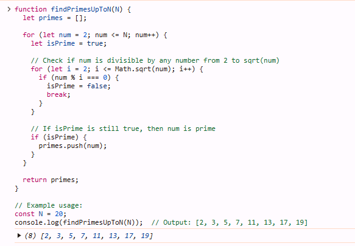


# Practice Question

1. **Sum of All Numbers in an Array**  
   Write a function that takes an array of numbers and returns the sum of all the numbers.

2. **Count Occurrences of a Number**  
   Write a function that counts how many times a specific number appears in an array.

3. **Find the Largest Number in an Array**  
   Write a function that finds and returns the largest number in an array of numbers.

4. **Reverse an Array**  
   Write a function that takes an array and returns a new array with the elements in reverse order.

5. **Find the Factorial of a Number**  
   Write a function that calculates the factorial of a given number using a loop.

6. **Fibonacci Sequence**  
   Write a function that returns the first N numbers of the Fibonacci sequence.

7. **Print Multiplication Table**  
   Write a function that prints the multiplication table of a given number from 1 to 10.

8. **Sum of All Even Numbers from 1 to N**  
   Write a function that sums all even numbers from 1 to a given number N.

9. **Count Even and Odd Numbers in an Array**  
   Write a function that counts how many even and odd numbers are in an array.

10. **Find Prime Numbers Up to N**  
    Write a function that finds all prime numbers between 1 and a given number N.

11. **Find All Divisors of a Number**  
    Write a function that returns all divisors of a given number N.

12. **Check if a Number is Prime**  
    Write a function that checks whether a given number is prime.

13. **Sum of Digits of a Number**  
    Write a function that calculates the sum of the digits of a given number.

14. **Print Pattern of Stars**  
    Write a function that prints a triangle pattern of stars for a given number N.

15. **Find the GCD of Two Numbers**  
    Write a function that finds the greatest common divisor (GCD) of two numbers using a loop.

16. **Find the Smallest Number in an Array**  
    Write a function that finds and returns the smallest number in an array of numbers.

17. **Print a Reverse Countdown**  
    Write a function that prints a countdown from a given number N to 1.

18. **Check for Armstrong Number**  
    Write a function that checks if a given number is an Armstrong number.

19. **Find All Perfect Numbers Between 1 and N**  
    Write a function that finds all perfect numbers between 1 and a given number N.

20. **Find Common Elements Between Two Arrays**  
    Write a function that finds and returns the common elements between two arrays.


-------
