# Operators in JavaScript

- In JavaScript, operators are used to perform mathematical operations like addition, subtraction, multiplication, and division between two numbers.
- Operators are also used to compare values and perform conditional tasks.
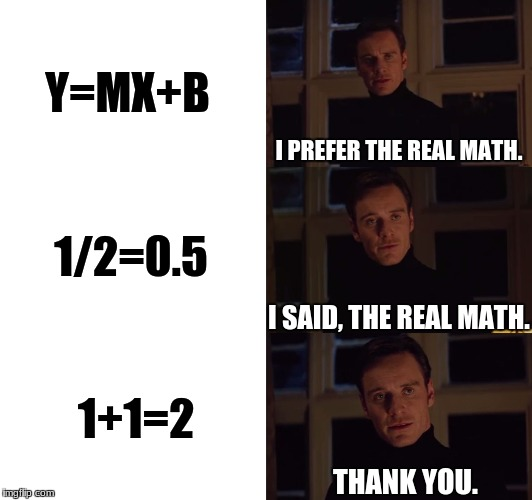
## Types of Operators

- ### Assignment Operator
- ### Arithmetic Operators
- ### Arithmetic Assignment Operators
- ### Comparison Operators
- ### Bitwise Operators
- ### Postfix and Prefix Operators
- ### Membership Operator
- ### Logical Operators
- ### Ternary Operator
- ### instanceOf Operator

## `Assignment` Operator

- In JavaScript, the assignment operator `=` is used to assign a value to a variable.

```js
    var a = 10
    var b = "krishna"

    console.log(a)
    console.log(b)
```
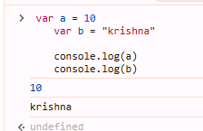
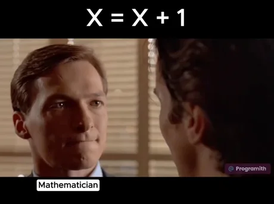
## `Arithmetic` Operators 

- In JavaScript, the operators used for `addition`, `subtraction`, `multiplication`, and other arithmetic operations are called arithmetic operators.


- `Addition (+)` operator
```js
//plus
    var a =10
    var b =20

    console.log(a+b)//30
```
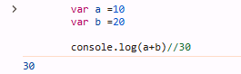
```js
// concatenation
    var a ="10"
    var b =20
    var c ="30a"

    console.log(a+b)//1020
    console.log(b+c)//2030a
```
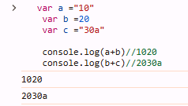
- `Subtraction (+)` operator
    ```js
    //minus
        var a =40
        var b =20

        console.log(a-b)//20
    ```
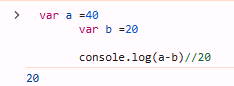
```js
// bug
    var a ="10"
    var b =20
    var c = "30"
    var d = "30sdsa"

    console.log(b-a)//10
    console.log(c-b)//10
    console.log(d-b)//NaN
```

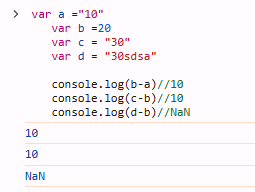


- `Multiply (*)` operator (astric)
    ```js
    //multiply
        var a =4
        var b =2
        var c = "2"
        var d = "2a"

        console.log(a*b)//8
        console.log(c*b)//4
        console.log(d*b)//NaN
    ```
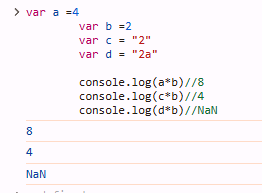
 


- `Divide (/)` operator (slash)
    ```js
    //divide
        var a =4
        var b =2
        var c = "2"
        var d = "2a"

        console.log(a/b)//2
        console.log(c/b)//1
        console.log(d/b)//NaN
    ```
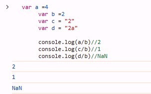
 


- `Modulus (%)` operator (remainder)
    ```js
    //remainder
        var a =4
        var b =2
        var c = "2"
        var d = "2a"

        console.log(a%b)//0
        console.log(c%b)//0
        console.log(d%b)//NaN
    ```
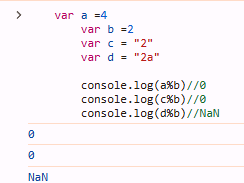


- `Exponent (**)` operator (power)
    ```js
    //remainder
        var a =4
        var b =2
        var c = "2"
        var d = "2a"

        console.log(a**b)//16-> 4 ki power 2
        console.log(c**b)// 4-> 2 ki power 2
        console.log(d**b)//NaN
    ```

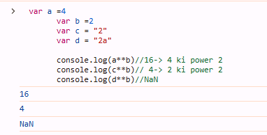

## `Arithmetic Assignment` Operators

- Arithmetic assignment operators are used to first perform mathematical operations and then reassign the result to the same variable.

```js

        var a = 10 

        console.log(a) // 10

        a += 10 
        // which means => a= a+10 
        // so, : a = 10 -> a= 10+10 then, 20 

        console.log(a); //20

```

```js
         a -= 2 
        // which means => a= a-2 
        // so, : a = 20 -> a= 20-2 then, 18 

        console.log(a); //18

```


```js
         a *= 2 
        // which means => a= a*2 
        // so, : a = 18 -> a= 18*2 then, 36

        console.log(a); //36

```


```js
         a /= 2 
        // which means => a= a/2 
        // so, : a = 36 -> a= 36/2 then, 18

        console.log(a); //18

```


```js
         a %= 2 
        // which means => a= a%2 
        // so, : a = 18 -> a= 18%2 then, 0

        console.log(a); //0

```
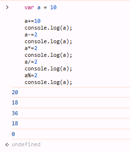


```js
        var a = 4
         a **= 2 
        // which means => a= a**2 
        // so, : a = 4 -> a= 4**2 then, 16

        console.log(a); //16

```

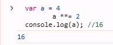

## `Comparison` Operators

-In JavaScript, comparison operators are used to check if a number is greater than, less than, equal to, or not equal to another number, and they return a result of `true` or `false`.

### Operators are :
 - grater than `>`
 - less than `<`
 - less than equal `<=`
 - grater than equal `>=`
 - not equal `!=`
 - equal equal `==` # check value is equal
 - tripal equal `===` # check value is equal with their datatype


| Operator           | Example        | Use Case                                             | Drawback                                                   |
|--------------------|----------------|------------------------------------------------------|------------------------------------------------------------|
| **Greater Than (`>`)** | `5 > 3`         | Checks if the left operand is greater than the right operand. | May give incorrect results with non-numeric values (e.g., strings). |
| **Less Than (`<`)** | `3 < 5`         | Checks if the left operand is less than the right operand. | Can be confusing with non-numeric values.                   |
| **Less Than or Equal (`<=`)** | `3 <= 5`        | Checks if the left operand is less than or equal to the right operand. | May give unexpected results when comparing different data types. |
| **Greater Than or Equal (`>=`)** | `5 >= 5`        | Checks if the left operand is greater than or equal to the right operand. | Results might be unexpected when used with non-numeric data types. |
| **Not Equal (`!=`)** | `5 != 3`        | Checks if the left operand is not equal to the right operand. | Performs type coercion, which can lead to unexpected results (e.g., `5 != "5"` is false). |
| **Equal (`==`)** | `5 == 5`        | Checks if the left operand is equal to the right operand, ignoring data type. | Can cause bugs due to type coercion (e.g., `5 == "5"` is true). |
| **Strict Equal (`===`)** | `5 === 5`       | Checks if the left operand is equal to the right operand, including the data type. | Requires careful attention to both value and type, which may be verbose in some cases. |

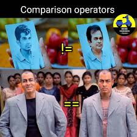
## Bitwise Operators

- In JavaScript, bitwise operators are used for binary calculations, such as addition, multiplication, or XOR operations. In simple terms, they work on binary bits.

- Operators are :
    - `|` (or) // +
    - `&` (and) // *
    - `^` (xor) // 1,1=0 , 0 1=1
    - `<<` (left shift) 
    - `>>` (right shift)

| Operator            | Example       | Use Case                                                  | Drawback                                                   |
|---------------------|---------------|-----------------------------------------------------------|------------------------------------------------------------|
| **OR (`|`)**         | `5 | 3`        | Performs a bitwise OR operation. Sets each bit to 1 if one of the bits is 1. | Can be confusing when working with non-binary data or high-level operations. |
| **AND (`&`)**        | `5 & 3`        | Performs a bitwise AND operation. Sets each bit to 1 only if both bits are 1. | Not useful in higher-level logical conditions, only for bit-level manipulation. |
| **XOR (`^`)**        | `5 ^ 3`        | Performs a bitwise XOR operation. Sets each bit to 1 if the corresponding bits are different. | Can be tricky to use in complex conditions where you need to track bits. |
| **Left Shift (`<<`)**| `5 << 1`       | Shifts the bits of the number to the left by a specified number of positions, effectively multiplying by powers of 2. | Can cause loss of data when shifting bits too far left. |
| **Right Shift (`>>`)**| `5 >> 1`      | Shifts the bits of the number to the right by a specified number of positions, effectively dividing by powers of 2. | May introduce unexpected results with negative numbers due to sign extension. |

## Postfix and Prefix Operators

- The postfix (post-increment and post-decrement) and prefix (pre-increment and pre-decrement) operators are used to perform shorthand +1 and -1 operations in JavaScript.

- Operators are: 
    - pre increment (++a)
    - pre decrement (--a)
    - post increment (a++)
    - post decrement (a--)


| Operator             | Example       | Use Case                                               | Drawback                                                 |
|----------------------|---------------|--------------------------------------------------------|----------------------------------------------------------|
| **Pre-increment (`++a`)** | `++a`          | Increments the value of `a` by 1 before using it in an expression. | Can be less intuitive for beginners compared to post-increment. |
| **Pre-decrement (`--a`)** | `--a`          | Decrements the value of `a` by 1 before using it in an expression. | May cause confusion when used in complex expressions.   |
| **Post-increment (`a++`)** | `a++`          | Increments the value of `a` by 1 after using it in an expression. | May lead to unexpected results if the incremented value is used in the same statement. |
| **Post-decrement (`a--`)** | `a--`          | Decrements the value of `a` by 1 after using it in an expression. | Can cause logical errors if not carefully used in complex expressions. |
## Membership Operator
- In JavaScript, Membership operator are used to determine the relationship between values or variables.

- Operators are:
    - in 

```js

        const arr = [1,2,3,4,5]
        console.log(3 in arr) // true
        console.log(6 in arr) // false

```

## Logical Operators
- In JavaScript, logical operators are used to check multiple conditions in a single statement.

- Operators are:
    - double OR (`||`)
    - double AND (`&&`)
    - NOT (`!`)

| Operator              | Example        | Use Case                                                | Drawback                                                   |
|-----------------------|----------------|---------------------------------------------------------|------------------------------------------------------------|
| **Double OR (`||`)**   | `true || false` | Evaluates to `true` if at least one condition is true. Used for logical OR between multiple conditions. | Can be confusing when dealing with non-boolean values, as it performs type coercion. |
| **Double AND (`&&`)**  | `true && false` | Evaluates to `true` only if all conditions are true. Used for logical AND between multiple conditions. | Can result in unexpected behavior when used with falsy values, which might not always behave as expected. |
| **NOT (`!`)**          | `!true`         | Reverses the boolean value. Useful for negating a condition. | May be unclear if used on complex expressions without parentheses, especially for beginners. |

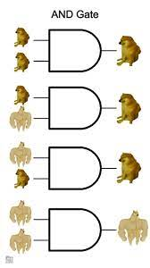
## Ternary Operator
- Ternary operators in JavaScript are used to determine the result based on a condition being true or false.

```js
            //syntax:

             condition?true statement: false statement;
```
```js
            //example:
    var a= 10
    var b= 20
             a>b?console.log("a is big"): console.log("b is big");
```

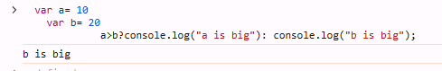

## instanceOf Operator
- The instanceof operator is generally used to check the `instance (object)` of a variable.


```js
        // Example 1: Checking if a variable is an instance of a specific object type
        let person = { name: "John", age: 30 };

        console.log(person instanceof Object);  // true, because person is an instance of Object

        // Example 2: Checking if an array is an instance of Array
        let numbers = [1, 2, 3];

        console.log(numbers instanceof Array);  // true, because numbers is an instance of Array

        // Example 3: Using instanceof with a custom class
        class Car {
        constructor(make, model) {
        this.make = make;
        this.model = model;
        }
        }

        let myCar = new Car('Toyota', 'Corolla');

        console.log(myCar instanceof Car);  // true, because myCar is an instance of Car

```

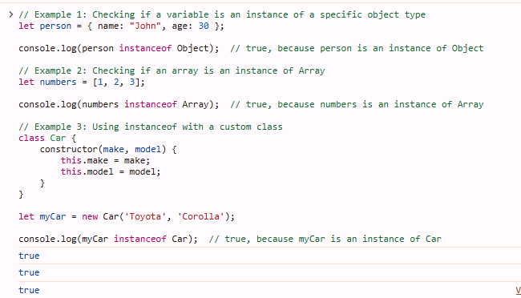

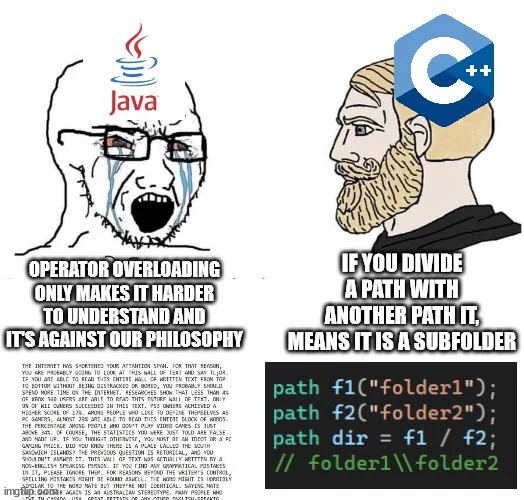

### Interview Questions

### 1. **What is an assignment operator in JavaScript?**
**Answer:**  
The assignment operator (`=`) is used to assign a value to a variable. For example:
```javascript
let x = 5;
```
Here, `x` is assigned the value `5`.


Here are 10 interview questions with human-readable answers based on the JavaScript operators you've mentioned. These are provided in markdown format:

markdown
Copy code
### 1. **What is an assignment operator in JavaScript?**

**Answer:**  
The assignment operator (`=`) is used to assign a value to a variable. For example:
```javascript
let x = 5;
```
Here, x is assigned the value 5.

### 2. What are arithmetic operators in JavaScript?

Arithmetic operators are used to perform mathematical operations between numeric values. The most common arithmetic operators are:

- `Addition (+)`: Adds two numbers.
- `Subtraction (-)`: Subtracts one number from another.
- `Multiplication (*)`: Multiplies two numbers.
- `Division (/)`: Divides one number by another.
- `Modulus (%)`: Returns the remainder of a division.
- `Exponentiation (**)`: Raises the base to the power of the exponent.

### 3.What are arithmetic assignment operators in JavaScript?

Arithmetic assignment operators allow you to perform an arithmetic operation and assign the result to a variable in a shorthand way. The common operators are:

- Addition assignment (+=)
- Subtraction assignment (-=)
- Multiplication assignment (*=)
- Division assignment (/=)
- Modulus assignment (%=)


### 4.What are comparison operators in JavaScript?

Comparison operators are used to compare two values and return a boolean value (true or false). Common comparison operators include:

`Equal (==)`: Checks if two values are equal (without considering data type).
`Strict Equal (===)`: Checks if two values are equal and of the same type.
`Not Equal (!=)`: Checks if two values are not equal.
`Greater Than (>)`: Checks if one value is greater than another.
`Less Than (<)`: Checks if one value is less than another.
`Greater Than or Equal (>=)`: Checks if one value is greater than or equal to another.
`Less Than or Equal (<=)`: Checks if one value is less than or equal to another.

## 5. What are bitwise operators in JavaScript?

Bitwise operators perform operations on binary numbers at the bit level. Common bitwise operators include:

- AND (&)
- OR (|)
- XOR (^)
- Left Shift (<<)
- Right Shift (>>) 

## 6. What is the difference between postfix and prefix operators in JavaScript?

- Postfix operators: The operation is performed after the value is used. Example: a++ increments a after using its current value.
- Prefix operators: The operation is performed before the value is used. Example: ++a increments a before using its new value.


## 7. What is a Membership operator in JavaScript?

Membership operators are used to check the value is exist in collection. Common Membership operators are:

- in


## 8. What are logical operators in JavaScript?

- Logical operators are used to combine multiple conditions and return a boolean value. Common logical operators include:

- AND `(&&)`: Returns true if both conditions are true.
- OR `(||)`: Returns true if at least one condition is true.
- NOT `(!)`: Reverses the boolean value of the condition.


## 9.What is the ternary operator in JavaScript?
- The ternary operator is a shorthand for an if-else statement. It takes three operands: a condition, the result if true, and the result if false.

## 10. What does the instanceof operator do in JavaScript?

- The instanceof operator checks whether an object is an instance of a specific class or constructor function. It returns true if the object is an instance, otherwise false.

```js
class Person {}
let john = new Person();
console.log(john instanceof Person);  // true
```

# Practice Questions
1. **What does the assignment operator (`=`) do in JavaScript?**
2. **What are the differences between the `==` and `===` operators in JavaScript?**
3. **What will be the output of the following expression: `5 + '3'`?**
4. **What does the `instanceof` operator check in JavaScript?**
5. **How does the post-increment operator (`a++`) work compared to the pre-increment operator (`++a`)?**
6. **What is the result of the expression `5 > 3 && 2 < 4`?**
7. **What will `true && false || true` evaluate to in JavaScript?**
8. **What will be the result of the expression `5 | 3`?**
9. **How do bitwise AND (`&`) and bitwise OR (`|`) operators differ in JavaScript?**
10. **What is the difference between the `++a` and `a++` operators in terms of evaluation order?**
11. **Explain the use of the ternary operator in JavaScript.**
12. **What is the output of the following expression: `5 != '5'`? Why?**
13. **How do arithmetic assignment operators like `+=` or `-=` work in JavaScript?**
14. **What does the left shift operator (`<<`) do in JavaScript?**
15. **Explain how logical AND (`&&`) and logical OR (`||`) operators work with falsy values in JavaScript.**

----

```krishna
अकेला बहुत हूँ, काश आज तुम मेरे साथ होती,
दिल को जरूरत है तुम्हारे साथ की,
अगर तुम साथ होती, तो शायद बात अलग होती।
        
```