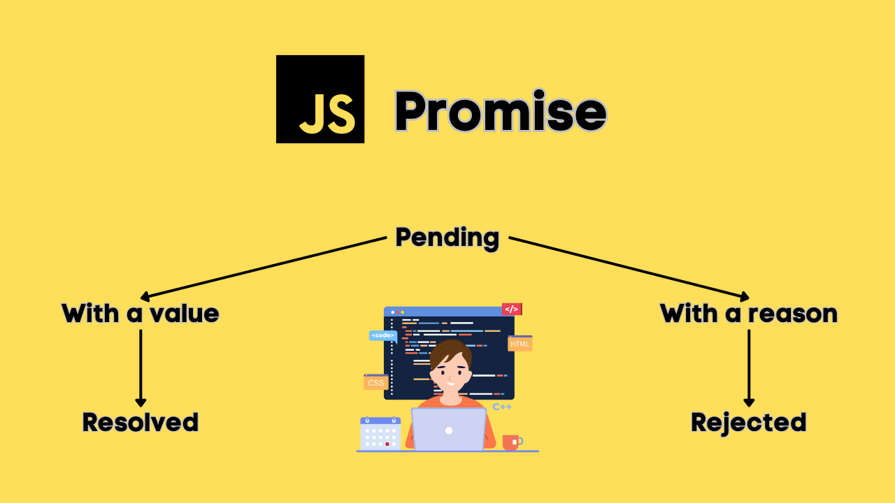
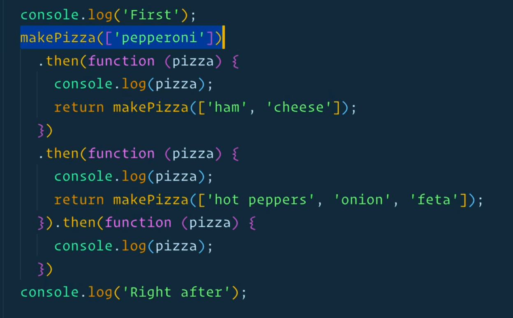

# Promises 

Promises in JavaScript are used to handle asynchronous operations. A promise represents a value that may be available now, or in the future, or never. Promises help avoid callback hell and make the code easier to read and maintain.


---

## **Concept of Promises**
A **Promise** is an object representing the eventual completion or failure of an asynchronous operation. It has three states:

1. **Pending**: The initial state, neither fulfilled nor rejected.
2. **Fulfilled**: The operation completed successfully.
3. **Rejected**: The operation failed.

Once a promise is settled (either fulfilled or rejected), it cannot be changed.


### Syntax
```javascript
let promise = new Promise((resolve, reject) => {
    // Asynchronous code
    if (/* condition */) {
        resolve('Success');  // Fulfilled
    } else {
        reject('Error');     // Rejected
    }
});
```
- `resolve`: Function to call when the operation succeeds.
- `reject`: Function to call when the operation fails.

---
## **Using Promises**
We use `.then()`, `.catch()`, and `.finally()` to handle promises.

1. **then()**: Executes when the promise is fulfilled.
2. **catch()**: Executes when the promise is rejected.
3. **finally()**: Executes regardless of fulfillment or rejection.

### Example:
```javascript
let fetchData = new Promise((resolve, reject) => {
    let success = true; // Simulating success or failure

    setTimeout(() => {
        if (success) {
            resolve('Data fetched successfully');
        } else {
            reject('Error fetching data');
        }
    }, 2000);
});

fetchData
    .then((message) => {
        console.log('Success:', message);
    })
    .catch((error) => {
        console.error('Error:', error);
    })
    .finally(() => {
        console.log('Operation completed');
    });
```

### Output:
- If `success = true`: 
  ```
  Success: Data fetched successfully
  Operation completed
  ```
- If `success = false`:
  ```
  Error: Error fetching data
  Operation completed
  ```

---
## **Chaining Promises**
Promise chaining allows you to execute multiple asynchronous operations in sequence.

### Example:
```javascript
let step1 = () => {
    return new Promise((resolve) => {
        setTimeout(() => resolve('Step 1 Complete'), 1000);
    });
};

let step2 = (prevMessage) => {
    return new Promise((resolve) => {
        setTimeout(() => resolve(prevMessage + ' -> Step 2 Complete'), 1000);
    });
};

let step3 = (prevMessage) => {
    return new Promise((resolve) => {
        setTimeout(() => resolve(prevMessage + ' -> Step 3 Complete'), 1000);
    });
};

step1()
    .then(step2)
    .then(step3)
    .then((finalMessage) => {
        console.log(finalMessage);
    });
```
### Output:
```
Step 1 Complete -> Step 2 Complete -> Step 3 Complete
```

---
## **Interview Questions on Promises**

1. **What are Promises in JavaScript? Explain their states.**
   - Promises are objects that represent the eventual completion (fulfilled) or failure (rejected) of an asynchronous operation. They have three states:
     - Pending: Initial state, operation not yet completed.
     - Fulfilled: Operation completed successfully.
     - Rejected: Operation failed.

2. **How does `.then()`, `.catch()` and `.finally()` work?**
   - `.then()`: Handles the resolved (fulfilled) state of a promise.
   - `.catch()`: Handles the rejected state of a promise.
   - `.finally()`: Executes regardless of promise resolution or rejection.

3. **What is Promise chaining? Provide an example.**
   - Promise chaining is the process of executing multiple asynchronous operations sequentially by returning a promise from each `.then()`.
   - Example:
     ```javascript
     new Promise((resolve) => resolve('Step 1'))
         .then((message) => {
             console.log(message);
             return 'Step 2';
         })
         .then((message) => console.log(message));
     ```

4. **How are Promises better than callbacks?**
   - Promises avoid **callback hell**, which occurs when multiple nested callbacks are hard to read and maintain.
   - Promises provide better error handling using `.catch()`.

5. **What is the difference between `Promise.all()` and `Promise.race()`?**
   - `Promise.all()`: Waits for all promises to resolve. If any promise rejects, it immediately rejects.
   - `Promise.race()`: Resolves or rejects as soon as the first promise settles (resolves or rejects).

6. **Explain the concept of `async/await` with Promises.**
   - `async/await` is syntax sugar for promises, making asynchronous code look synchronous.
   - Example:
     ```javascript
     async function fetchData() {
         try {
             let result = await new Promise((resolve) => {
                 setTimeout(() => resolve('Data fetched'), 1000);
             });
             console.log(result);
         } catch (error) {
             console.error(error);
         }
     }
     fetchData();
     ```

7. **What happens if a promise is neither resolved nor rejected?**
   - The promise remains in a `pending` state indefinitely.

8. **How do you handle errors in a chain of promises?**
   - Use `.catch()` to handle errors at any point in the chain. Errors propagate through the chain until caught.
   - Example:
     ```javascript
     step1()
         .then(step2)
         .then(step3)
         .catch((error) => console.error('Error:', error));
     ```

---
## **Practice Questions**

1. Write a promise that resolves after 2 seconds with the message "Hello, World!" and log the message using `.then()`.

2. Create a promise that randomly rejects or resolves after 1 second. Handle both the success and failure cases.

3. Chain two promises where the first promise resolves with "Step 1 Complete", and the second promise adds "-> Step 2 Complete".

4. Write a function `loadData` that simulates fetching data with a delay and returns a promise. Use `.catch()` to handle any errors.

5. Use `Promise.all()` to wait for three promises to resolve:
   - Promise 1 resolves in 1 second
   - Promise 2 resolves in 2 seconds
   - Promise 3 resolves in 3 seconds
   Log "All promises resolved" after completion.

6. Write an `async/await` function to perform the same task as Question 5.

7. Create a promise-based program to simulate a coin toss. If heads, resolve with "Heads"; if tails, reject with "Tails".

8. Write a program that demonstrates the use of `Promise.race()` where two promises resolve at different times.

---
## **Conclusion**
Promises are a powerful feature in JavaScript for handling asynchronous operations. By using `.then()`, `.catch()`, and `async/await`, you can write clean and readable asynchronous code while avoiding callback hell.

------

```krishna

```