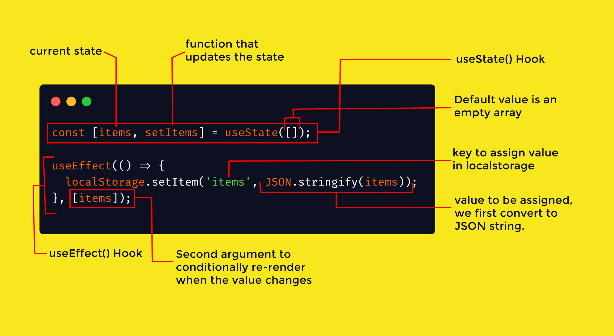
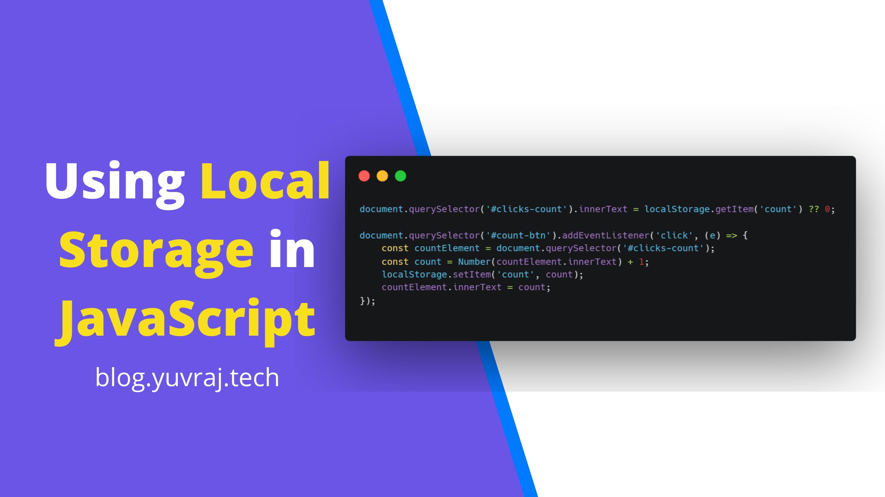
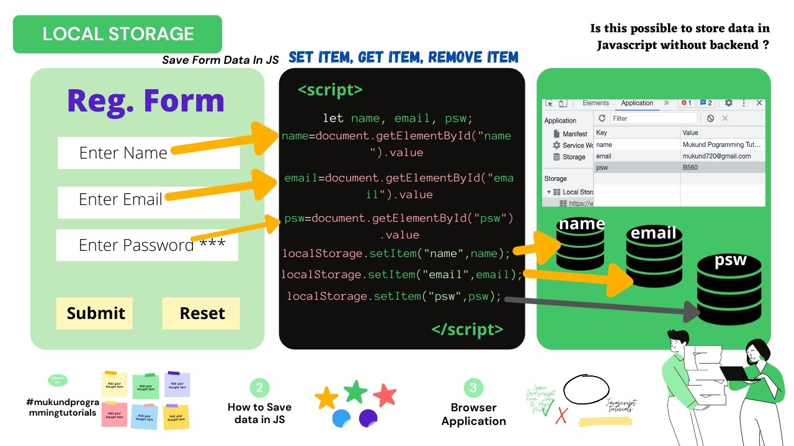

# Understanding Storage in JavaScript

 
---

## What is Storage in JavaScript?

Storage in JavaScript refers to methods for saving data directly in a user's browser. This data is maintained either temporarily or persistently and is available for use even if the page is reloaded. 

It allows web applications to save key-value pairs for different purposes, such as user preferences, session data, or temporary caching.

---



## Types of Storage in JavaScript

### 1. **Local Storage**
Local storage provides persistent storage of key-value pairs. The data remains stored even after the browser is closed and reopened.

- **Capacity**: Up to 5MB.
- **Lifetime**: Data persists indefinitely unless manually cleared.

### 2. **Session Storage**
Session storage is similar to local storage but stores data only for the duration of the browser session.

- **Capacity**: Up to 5MB.
- **Lifetime**: Data is cleared when the browser tab or window is closed.

### 3. **Cookies**
Cookies are used to store small amounts of data that can be sent to the server with every HTTP request.

- **Capacity**: Limited to 4KB.
- **Lifetime**: Can be set explicitly using an expiration date.


---

## Why is Storage Used?

- **Improves User Experience**: By saving user preferences and session data, applications can provide a personalized experience.
- **Minimizes Server Requests**: Storing data locally reduces the need to fetch data from the server repeatedly.
- **Offline Access**: Enables web applications to function offline by caching essential data.

---

## Examples

### Local Storage Example
```javascript
// Save data to local storage
localStorage.setItem("username", "JohnDoe");

// Retrieve data from local storage
const username = localStorage.getItem("username");
console.log(username); // Outputs: JohnDoe

// Remove data from local storage
localStorage.removeItem("username");
```

### Session Storage Example
```javascript
// Save data to session storage
sessionStorage.setItem("isLoggedIn", "true");

// Retrieve data from session storage
const isLoggedIn = sessionStorage.getItem("isLoggedIn");
console.log(isLoggedIn); // Outputs: true

// Clear session storage
sessionStorage.clear();
```

### Cookie Example
```javascript
// Set a cookie
document.cookie = "theme=dark; expires=Fri, 31 Dec 2024 23:59:59 GMT";

// Retrieve cookies
console.log(document.cookie); // Outputs: theme=dark
```

---

## Usage in Different Ways

### 1. Storing User Preferences
```javascript
localStorage.setItem("theme", "dark");
const theme = localStorage.getItem("theme");
console.log(`The selected theme is ${theme}`); // Outputs: The selected theme is dark
```

### 2. Session-Specific Data
```javascript
sessionStorage.setItem("cart", JSON.stringify(["item1", "item2"]));
const cart = JSON.parse(sessionStorage.getItem("cart"));
console.log(cart); // Outputs: ["item1", "item2"]
```

### 3. Storing Authentication Tokens
```javascript
localStorage.setItem("authToken", "abc123");
const token = localStorage.getItem("authToken");
console.log(`Your token is ${token}`);
```


---

## 1. **What are the main differences between Local Storage and Session Storage?**

### Answer
| Feature               | Local Storage                          | Session Storage                        |
|-----------------------|----------------------------------------|----------------------------------------|
| **Lifetime**          | Persists indefinitely                  | Cleared when the session ends          |
| **Scope**             | Shared across all tabs and windows    | Specific to a single tab               |
| **Capacity**          | Up to 5MB                             | Up to 5MB                              |

### Example
#### Local Storage
```javascript
localStorage.setItem("name", "John");
console.log(localStorage.getItem("name")); // Outputs: John
```

#### Session Storage
```javascript
sessionStorage.setItem("name", "Jane");
console.log(sessionStorage.getItem("name")); // Outputs: Jane
```

---

## 2. **What are cookies, and how are they different from Local and Session Storage?**

### Answer
- Cookies store small data (max 4KB) that is sent to the server with every HTTP request.
- Unlike Local and Session Storage, cookies can have an expiration date and are accessible by the server.

### Example
```javascript
document.cookie = "user=John; expires=Fri, 31 Dec 2024 23:59:59 GMT";
console.log(document.cookie); // Outputs: user=John
```

---

## 3. **How can you set an expiration date for a cookie in JavaScript?**

### Answer
Use the `expires` attribute when setting a cookie.

### Example
```javascript
const expireDate = new Date();
expireDate.setDate(expireDate.getDate() + 7); // Cookie valid for 7 days

document.cookie = `token=abc123; expires=${expireDate.toUTCString()}`;
console.log(document.cookie); // Outputs: token=abc123
```

---

## 4. **What are the advantages of using Local Storage for client-side data management?**

### Answer
1. **Persistent Storage**: Data remains even after the browser is closed.
2. **Simple API**: Methods like `setItem`, `getItem`, and `removeItem` make it easy to use.
3. **No Server Overhead**: Stored data is not sent to the server with HTTP requests.
4. **Capacity**: Larger storage size compared to cookies.

### Example
```javascript
localStorage.setItem("theme", "dark");
console.log(localStorage.getItem("theme")); // Outputs: dark
```

---

## 5. **Can Local Storage and Session Storage be accessed by the server? Why or why not?**

### Answer
No, Local and Session Storage are client-side storage mechanisms and cannot be accessed directly by the server. They are designed for storing data in the browser only.

### Example
```javascript
// Client-side only
token = "abc123";
localStorage.setItem("authToken", token);
// The server won't receive this data automatically.
```

---
# Practice Questions

1. Write a script to save and retrieve user preferences using Local Storage.
2. Create a shopping cart system that saves items using Session Storage.
3. Write code to demonstrate how cookies can be set and retrieved.
4. Implement a function to clear all data from Local Storage.
5. Write code to check if a specific key exists in Local Storage.
6. Create an authentication flow using Local Storage to store a token.
7. Demonstrate how to update a cookie's value.
8. Write code to display the number of items stored in Session Storage.
9. Create a utility function to remove expired cookies.
10. Write code to distinguish between data stored in Local Storage and Session Storage.

---
 

```krishna

        Sun kar aacha lga ...

        Sun kar accha lga ki tmne hamko bhi 2 second ke liye yaad kiya.....

        Socha tha mohabbat hai Syd tum bhi smj paaoge...

        Ye nhi jana tha tum bhi mera majak banaoge...

        Mna pyaar ek tarfa ye kh kar mn ko apna bhahla fusla lete...

        Is ishq ko bhi khi kisi gufa me chupa dete hai...
        Utha kar swaal meri soch pr tmne mujhe begana kar dala.... Yr.....
        Ese agar....phle....
        Pta hota ese to kabhi apne aap ko samne hi nhi aane dete..

---krishna
```

