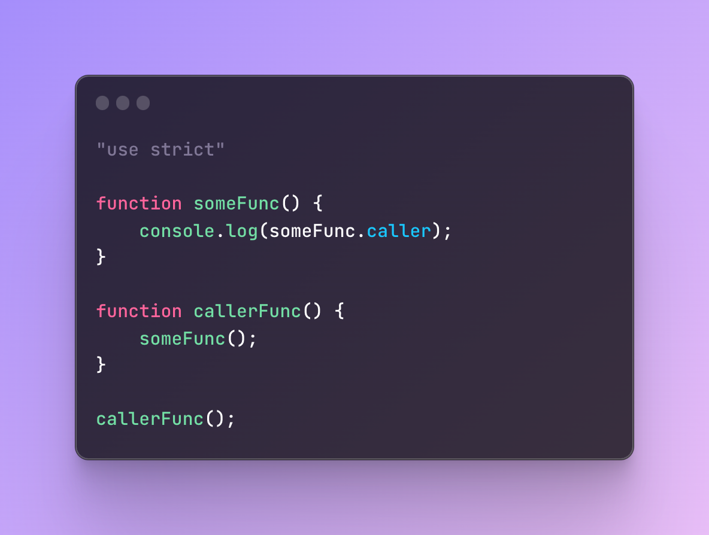
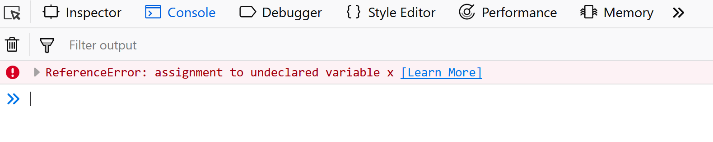

# What is Strict Mode?

**Strict Mode** is a way to opt into a restricted variant of JavaScript. It helps developers write cleaner and safer code by eliminating some silent errors and enforcing stricter parsing and error handling.

To enable Strict Mode, you use the `"use strict";` directive at the beginning of a script or a function.

---

## Why Use Strict Mode?

Strict Mode is beneficial for several reasons:

1. **Error Prevention**: It catches common programming mistakes, such as assigning values to undeclared variables.
2. **Improved Debugging**: It makes debugging easier by throwing errors for problematic code.
3. **Security Enhancements**: It prevents the use of certain dangerous features, like `with` statements.
4. **Future-Proofing**: It paves the way for future JavaScript versions by disallowing deprecated or reserved features.

---

## Example

### Without Strict Mode

```javascript
x = 10; // No error, even though 'x' is undeclared
console.log(x); // Outputs: 10
```

### With Strict Mode

```javascript
"use strict";

x = 10; // Throws an error: ReferenceError: x is not defined
console.log(x);
```

---

## Usage in Different Ways

### 1. Enabling Strict Mode Globally

```javascript
"use strict";

function example() {
  let a = 10;
  console.log(a);
}
example();
```

### 2. Enabling Strict Mode in a Function

```javascript
function strictExample() {
  "use strict";
  let b = 20;
  console.log(b);
}
strictExample();
```

### 3. Combining Strict Mode with Modules

Modules in JavaScript automatically operate in Strict Mode, so you don't need to add `"use strict";` manually.

```javascript
export function moduleExample() {
  let c = 30;
  console.log(c);
}
```

---

## 5 Interview Questions

1. **What is Strict Mode in JavaScript, and how do you enable it?**
2. **What are the advantages of using Strict Mode?**
3. **List some errors caught by Strict Mode that are ignored otherwise.**
4. **Can you use Strict Mode selectively within a JavaScript file? How?**
5. **What happens if you enable Strict Mode in older browsers?**

---

## 10 Practice Questions

1. Write a script that demonstrates how to enable Strict Mode globally.
2. Show how Strict Mode prevents the use of undeclared variables.
3. Explain how Strict Mode changes the behavior of `this` in functions.
4. Write a function using Strict Mode and demonstrate a TypeError when assigning to a read-only property.
5. Create an example showing the use of Strict Mode in ES6 modules.
6. Demonstrate how Strict Mode handles duplicate parameter names in functions.
7. Write a program where Strict Mode helps identify a common coding mistake.
8. Explain the differences in variable declaration between Strict Mode and non-Strict Mode.
9. Write a script where Strict Mode throws an error for deleting an undeletable property.
10. Show an example where Strict Mode is used to improve the code's security.

---

```krishna
Chahta to me bhi bhut hu... Ki ho , jisse sari baate share kr sku.... ,
.. vo bhi apni baate share kre...
 Mahfooz smje apne aap ko mere sath... Or sath nibha ske...

Ishq ho bhi jaye to parva nhi...
Hote hote.. ishq hua.. to isse pyara koi nhi....

Chaht abhi dil me chupa ke betha hu... Baya me ye kr sku itna sahas lekar me abhi Betha hu nhi....
---krishna
```