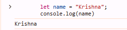
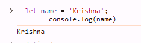
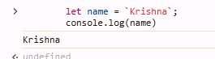
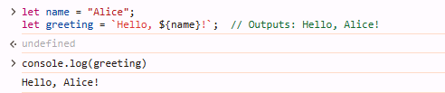
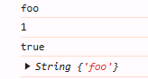
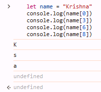

# Strings
- `String` are set of characters.
- `String` are useful for holding data that can be represented in text form.
- The `String` object is used to represent and manipulate a sequence of characters.

### Creating strings
- Strings can be created as double or single quotes , from string literals, or as objects, using the `String()` constructor.

## String With Double quotes

- In JavaScript, strings can  be created using double quotes `("")`

```js
        let name = "Krishna";
        console.log(name)
```




## String With Single quotes

- In JavaScript, strings can  be created using single quotes `('')`

```js
        let name = 'Krishna';
        console.log(name)
```




## String With String literals 

- Template literals are enclosed by backticks (`)
 rather than regular quotes. You can insert variables into strings using the `${}` syntax.

```js
        let name = `Krishna`;
        console.log(name)
```



### Benefits

- In JavaScript, template literals are used to add variables directly into strings.


```js

let name = "Alice";
let greeting = `Hello, ${name}!`;  // Outputs: Hello, Alice!
console.log(greeting)
```




## String With String constructor  

```js
const strPrim = "foo"; // A literal is a string primitive
const strPrim2 = String(1); // Coerced into the string primitive "1"
const strPrim3 = String(true); // Coerced into the string primitive "true"
const strObj = new String(strPrim); // String with new returns a string wrapper object.

console.log( strPrim); 
console.log( strPrim2); 
console.log( strPrim3); 
console.log( strObj);

console.log(typeof strPrim); // "string"
console.log(typeof strPrim2); // "string"
console.log(typeof strPrim3); // "string"
console.log(typeof strObj); // "object"
```


## Access String with Index

- We already know that a string is a set of characters, and we can access each character using its index.

```js

    let name = "Krishna"
    console.log(name[0])
    console.log(name[3])
    console.log(name[6])
    console.log(name[8])
    console.log(name[-2])

```



## Instance methods

### `String.prototype.at()` method

- Returns the character at the specified index. Accepts negative integers, which count back from the last string character.

```js
   let name = "Krishna"
console.log(name.at(2)); //i
console.log(name.at(-2)); //n

```

### `String.prototype.charAt()`

Returns the character at the specified index.

```js
 let name = "Krishna"
console.log(name.charAt(2)); //i
// index not be negative
```

### `String.prototype.charCodeAt()`

- Returns a number that is the UTF-16 code unit value at the given index.
```js

const name1= 'A'
const name2= 'a'
console.log(name1.charCodeAt(0));//65
console.log(name2.charCodeAt(0));//97

```


### `String.prototype.concat()`

- Combines the text of two (or more) strings and returns a new string.
```js

const name1= 'Krishna'
const name2= ' Sir'
console.log(name1.concat(name2))//Krishna Sir
console.log(name1+name2)//Krishna Sir
console.log(`${name1}${name2}`)//Krishna Sir

```


### `String.prototype.endsWith()`

- Determines whether a string ends with the characters of the string searchString.
```js

const str1= 'i am a good boy' 

console.log(str1.endsWith("boy"))//true
console.log(str1.endsWith("girl"))//false

```

### `String.prototype.startsWith()`

- Determines whether a string starts with the characters of the string searchString.
```js

const str1= 'i am a good boy' 

console.log(str1.startsWith("i"))//true
console.log(str1.startsWith("am"))//false

```


### `String.prototype.includes()`

- Determines whether the calling string contains searchString.
```js

const str1= 'i am a good boy' 

console.log(str1.startsWith("i"))//true
console.log(str1.startsWith("am"))//false

```

### `String.prototype.indexOf()`

- Returns the index within this string of the first occurrence of searchValue, or -1 if not found.
```js

const str1= 'i am a good boy' 

console.log(str1.indexOf("i"))//0
console.log(str1.indexOf("am"))//2

```

### `String.prototype.lastIndexOf()`

- Returns the index within this string of the last occurrence of searchValue, or -1 if not found.
```js

const str1= 'i am a good boy' 

console.log(str1.lastIndexOf("good"))//7
console.log(str1.lastIndexOf("am"))//2

```


### `String.prototype.padStart()`

- Pads the current string from the start with a given string and returns a new string of the length targetLength.
```js

const str1= 'i am a good boy' 

console.log(str1.padStart(50,'0')) //00000000000000000000000000000000000i am a good boy

```


### `String.prototype.padEnd()`

- Pads the current string from the end with a given string and returns a new string of the length targetLength.
```js

const str1= 'i am a good boy' 

console.log(str1.padEnd(50,'0')) //i am a good boy00000000000000000000000000000000000

// length of return string is 50

```


### `String.prototype.repeat()`

- Returns a string consisting of the elements of the object repeated count times.
- Returns a String value that is made from count copies appended together. If count is 0, the empty string is returned.
```js

const str1= 'i am a good boy' 

console.log(str1.repeat(2));
//i am a good boyi am a good boy

```


### `String.prototype.replace()`

- Replaces text in a string, using a regular expression or search string
```js

const str1= 'i am a good boy' 

console.log(str1.replace('i','Hello'));
//Hello am a good boy

```


### `String.prototype.replaceAll()`

- Used to replace all occurrences of searchFor using replaceWith. searchFor may be a string or Regular Expression, and replaceWith may be a string or function.
```js

const str1= 'i am a good boy' 

console.log(str1.replaceAll('a','Hello'));
//i Hellom Hello good boy

```

### `String.prototype.search()`

- Search for a match between a regular expression regexp and the calling string.
- Finds the first substring match in a regular expression search.
```js

const str1= 'i am a good boy' 

console.log(str1.search('good'));
//7

```


### `String.prototype.slice()`

- Extracts a section of a string and returns a new string.
```js

const str1= 'i am a good boy' 

console.log(str1.slice(2));//am a good boy
console.log(str1.slice(2,5));//am
 

```


### `String.prototype.split()`

- Returns an array of strings populated by splitting the calling string at occurrences of the substring sep.
```js

const str1= 'i am a good boy' 

console.log(str1.split(' '));//[ 'i', 'am', 'a', 'good', 'boy' ]
 

```


### `String.prototype.substr()`

- Returns a portion of the string, starting at the specified index and extending for a given number of characters afterwards.
```js

const str1= 'i am a good boy' 

console.log(str1.substr(2,7));//am a go
console.log(str1.substr(2)); //am a good boy
```

### `String.prototype.substring()`

- Returns a new string containing characters of the calling string from (or between) the specified index (or indices).
```js

const str1= 'i am a good boy' 

console.log(str1.substring(2,5));//am
console.log(str1.substring(2));//am a good boy
```


### `String.prototype.toLocaleLowerCase()`

- The characters within a string are converted to lowercase while respecting the current locale.
```js

const str1= 'i am a good boy' 

console.log(str1.toLocaleLowerCase());//i am a good boy
```


### `String.prototype.toLowerCase()`

- Returns the calling string value converted to lowercase.
```js

const str1= 'i am a good boy' 

console.log(str1.toLowerCase());//i am a good boy
```

### `String.prototype.toUpperCase()`

- Returns the calling string value converted to lowercase.
```js

const str1= 'i am a good boy' 

console.log(str1.toUpperCase());//I AM A GOOD BOY
```

### `String.prototype.toString()`

- Returns a string representing the specified object. Overrides the Object.prototype.toString() method.
```js

const arr = [1, 2, 3];

arr.toString(); // "1,2,3"
```
### Check String length 
- using length property we can check how many character in their.

```js
    const str = "Krishna"
    console.log(str.length)//7
```

## String Escaping 

- String escaping is a core concept when using single quotes and double quotes in JavaScript.


### Single Quotes 
```js
// invalid string
    const str1 = 'can't wait' 
    // valid string
    const str1 = 'can\'t wait'
```

 ### Double Quotes 
```js
// invalid string
    const str1 = "can"t wait" 
    // valid string
    const str1 = "can\"t wait"
```

 ### String Literals  
```js
// invalid string
    const str1 = `can`t wait` 
    // valid string
    const str1 = `can\`t wait`; 
```


# Interview Questions

### 1. **What are the different ways to create a string in JavaScript?**

In JavaScript, strings can be created using:

- **String literals**: Using single quotes (`'`), double quotes (`"`), or backticks (`` ` ``).
  ```javascript
  let str1 = 'Hello';
  let str2 = "World";
  let str3 = `Hello, World!`;
   ```
- String constructor: Using the String object.
```js
let str4 = new String('Hello');
```

### 2. What is the difference between == and === in JavaScript when comparing strings?
- `==` (loose equality) compares values and performs type coercion if necessary.
```js
'5' == 5  // true
```
- `===` (strict equality) compares both value and type, without type coercion.
```js
'5' === 5  // false
```

### 3. How do you check if a string contains a certain substring in JavaScript?

- You can use the includes() method to check if a string contains a substring.
```js
let str = 'Hello, World!';
console.log(str.includes('World'));  // true
```
- Alternatively, indexOf() can also be used, but includes() is preferred for readability.
```js
str.indexOf('World') !== -1;  // true
```

### 4.What is the difference between slice() and substring() in JavaScript?
- `slice()`: Extracts a section of a string between two indices. It can accept negative values, counting from the end of the string.
```js
let str = 'Hello World';
console.log(str.slice(0, 5));  // 'Hello'
console.log(str.slice(-5));    // 'World'
```
- `substring()`: Similar to `slice()`, but negative values are treated as 0. It does not support negative indexing.
```js
console.log(str.substring(0, 5));  // 'Hello'
```

### 5.5. How can you convert a string to an array of characters in JavaScript?
- You can use the split() method to convert a string into an array of individual characters.

```js
let str = 'Hello';
let arr = str.split('');
console.log(arr);  // ['H', 'e', 'l', 'l', 'o']
```
- Alternatively, using the spread operator:
```js
let arr = [...str];
console.log(arr);  // ['H', 'e', 'l', 'l', 'o']
```

# Practice Questions

### 1. **How can you reverse a string in JavaScript?**

Write a function to reverse a given string without using the built-in reverse method.

### 2. **How do you find the length of a string in JavaScript?**

What method would you use to find the length of a string, and what does it return?

### 3. **How do you check if a string starts with a specific substring in JavaScript?**

Use a built-in method to check if a string starts with the substring `"Hello"`.

### 4. **How can you replace all occurrences of a character in a string in JavaScript?**

Write a code snippet that replaces all occurrences of the character `"a"` with `"x"` in a string.

### 5. **How do you convert a string to lowercase in JavaScript?**

Write a function that converts a given string to lowercase.

### 6. **How can you get a part of a string in JavaScript using `substring` or `slice`?**

Given the string `"JavaScript"`, write code to extract the substring `"Script"` using both `substring()` and `slice()`.

### 7. **How can you concatenate two strings in JavaScript?**

Write code to concatenate the strings `"Hello"` and `"World"` into `"Hello World"`.

### 8. **How do you remove whitespace from both ends of a string in JavaScript?**

Write a function to remove leading and trailing spaces from a string.

### 9. **How can you check if a string contains only alphabetic characters in JavaScript?**

Write a function that returns `true` if a string contains only alphabetic characters, and `false` otherwise.

### 10. **How do you find the index of the first occurrence of a substring in a string in JavaScript?**

Given the string `"The quick brown fox"`, write code to find the index of the first occurrence of the word `"brown"`.

### 11. **How do you count the number of occurrences of a substring in a string in JavaScript?**

Write a function that counts how many times a substring appears in a string. For example, count the number of occurrences of `"is"` in the string `"This is a simple test, is it not?"`.

### 12. **How do you extract a substring from a string based on a regular expression pattern in JavaScript?**

Write code that extracts all digits from a string using a regular expression. For example, extract the digits from `"abc123def456"`.

### 13. **How can you remove duplicate characters from a string in JavaScript?**

Write a function that removes all duplicate characters from a given string while preserving the original order of the characters. For example, given `"aabccde"`, the result should be `"abcde"`.

### 14. **How do you check if two strings are anagrams in JavaScript?**

Write a function that checks if two strings are anagrams of each other. Anagrams are words that contain the same characters in any order, e.g., `"listen"` and `"silent"`.

### 15. **How do you replace all non-alphanumeric characters in a string with a hyphen in JavaScript?**

Write a function that replaces all characters in a string that are not letters or numbers with a hyphen (`-`). For example, convert `"Hello! How are you?"` into `"Hello-How-are-you-"`.

-----

```krishna

---krishna
```