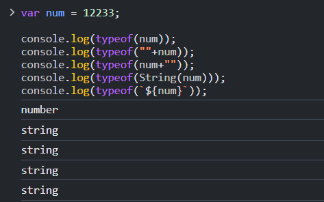
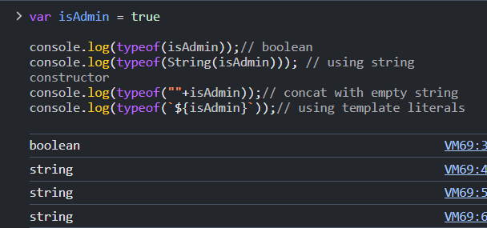
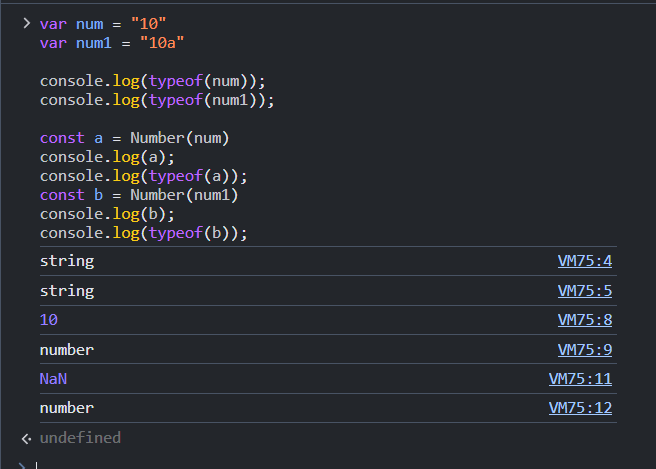
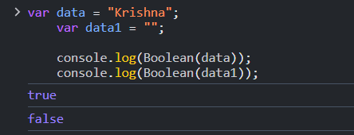
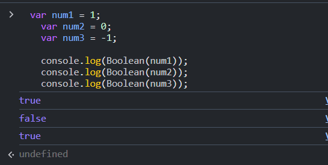
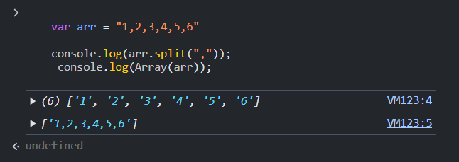
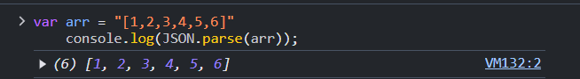
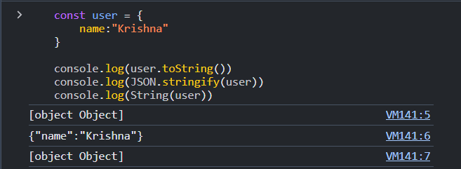
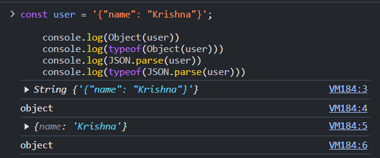

# Type Casting in JavaScript 

Type casting refers to converting one data type into another.


## Types of Type Casting 

1. **Implicit Type Casting**  
2. **Explicit Type Casting**

---

## 1. Implicit Type Casting 

Implicit type casting, also known as type coercion, happens automatically when JavaScript converts one data type into another.


### Examples:  
- **Number to String**  
- **Float to Decimal**  
- **Boolean to String**

---

## 2. Explicit Type Casting 

Explicit type casting is when we intentionally convert one data type into another using specific methods or functions.


### Examples:  
- **String to Number**  
- **Array to String**  
- **Object to String**
---


## Number to String Conversion

```js
        
var num = 12233;

console.log(typeof(num)); // number
console.log(typeof(""+num)); // concat with empty string
console.log(typeof(num+"")); // concat with empty string
console.log(typeof(String(num))); // using string constructor
console.log(typeof(`${num}`)); // using template literals


```



## Boolean to String Conversion


```js
        
var isAdmin = true

console.log(typeof(isAdmin));// boolean
console.log(typeof(String(isAdmin))); // using string constructor
console.log(typeof(""+isAdmin));// concat with empty string
console.log(typeof(`${isAdmin}`));// using template literals


```



## String to Number

```js
    var num = "10"
var num1 = "10a"

console.log(typeof(num));
console.log(typeof(num1));

const a = Number(num)
console.log(a); // 10
console.log(typeof(a));
const b = Number(num1)
console.log(b);// NaN 
console.log(typeof(b));

```




## String to Boolean

```js
  var data = "Krishna";
    var data1 = "";

    console.log(Boolean(data));
    console.log(Boolean(data1));

```



## Number to Boolean

```js
  var num1 = 1;
    var num2 = 0;
    var num3 = -1;

    console.log(Boolean(num1));
    console.log(Boolean(num2));
    console.log(Boolean(num3));

```



## Array To String

```js

       var arr = [10,20,30,40]

    console.log(typeof(arr));

    console.log(typeof(arr.toString()));
    console.log(typeof(JSON.stringify(arr)));
    console.log(typeof(String(arr)));

```

## String To Array

```js


    var arr = "1,2,3,4,5,6"

    console.log(arr.split(","));
     console.log(Array(arr));


```


```js
        
    var arr = "[1,2,3,4,5,6]"
    console.log(JSON.parse(arr));

```



## Object To String 

```js

    const user = {
        name:"Krishna"
    }

    console.log(user.toString())
    console.log(JSON.stringify(user))
    console.log(String(user))

```




## String To Object

```js

    const user = '{"name": "Krishna"}';

    console.log(Object(user))
    console.log(typeof(Object(user)))
    console.log(JSON.parse(user))
    console.log(typeof(JSON.parse(user)))


```




# Interview Question 

## 1. What is Type Casting in JavaScript ?

- Type casting in JavaScript refers to converting a value from one data type to another, either explicitly (manually) or implicitly (automatically by JavaScript).


    - Explicit Type Casting:
    ```js
    let num = "123";
    let convertedNum = Number(num); // Converts string to number
    ```
    - Implicit Type Casting
    ```js
            let result = "5" * 2; // JavaScript automatically converts "5" to a number
            console.log(result); // Output: 10 
    ```

## 2. What is Major Difference Between Implicit and Explicit Type Casting ?

- The major difference between Implicit and Explicit Type Casting in JavaScript is:

1. Implicit Type Casting (Type Coercion):
    - Done automatically by JavaScript.
    - The interpreter decides the type conversion based on context.
    - Can sometimes lead to unexpected results.

    ```js
    let result = "5" + 2; // "52" (number 2 is coerced into a string)
    let product = "5" * 2; // 10 (string "5" is coerced into a number)
    ```

2. Explicit Type Casting:
    - Done manually by the programmer.
    - Gives full control over type conversion.
    - More predictable and intentional.

    ```js
            let str = "123";
            let num = Number(str); // Manually converts string to number
            console.log(num); // Output: 123
    ```


## 3. How to Convert Number to String ?

- In JavaScript, you can convert a number to a string using the following methods:

### 1. Using `toString()` Method:
```js
let num = 123;
let str = num.toString(); // Converts number to string
console.log(str); // "123"

```


### 2.  Using `String()` Function:
```js
let num = 123;
let str = String(num); // Converts number to string
console.log(str); // "123"

```


### 3.  Using `Template` Literals:
```js
let num = 123;
let str = `${num}`; // Converts number to string
console.log(str); // "123"

```


### 4.  Using `String` Concatenation:
```js
let num = 123;
let str = num + ""; // Converts number to string
console.log(str); // "123"

```

## 4. How to Convert String To Array in JavaScript ?

-  Convert String to Array in JavaScript

1. **Using `split()` Method**:
   - Splits a string into an array based on a delimiter.
   ```javascript
   let str = "apple,banana,orange";
   let arr = str.split(","); // Splits by comma
   console.log(arr); // ["apple", "banana", "orange"]


## 5. How to Convert String to Object in JavaScript ?

- Convert String to Object in JavaScript

1. **Using `JSON.parse()`**:
   - Converts a JSON-formatted string into a JavaScript object.
   ```javascript
   let jsonString = '{"name": "John", "age": 30}';
   let obj = JSON.parse(jsonString);
   console.log(obj); // { name: "John", age: 30 }


# Practice Questions

1. **Number to String Conversion**
   - Convert the number `2024` into a string using three different methods. Verify the result with `typeof`.

2. **Boolean to Number**
   - Convert the boolean values `true` and `false` into numbers using explicit type casting. Print the results.

3. **String to Boolean**
   - Test the following strings and check their boolean equivalents:  
     ```js
     let str1 = "Hello";
     let str2 = "";
     let str3 = "false";
     ```

4. **Array to String**
   - Convert the array `[5, 10, 15, 20]` into a string. Try using both `toString()` and `JSON.stringify()` methods. Compare the results.

5. **String to Array**
   - Split the string `"apple,banana,orange"` into an array using the `split()` method. Print the array and its length.

---


6. **String to Number Conversion**
   - Convert the following strings into numbers using `Number()` and `parseInt()`. Note any differences in results:
     ```js
     let str1 = "123";
     let str2 = "123abc";
     let str3 = "abc123";
     ```

7. **Object to String**
   - Convert the following object into a string using `JSON.stringify()` and compare it with `toString()`:
     ```js
     let person = { name: "Krishna", age: 25 };
     ```

8. **Number to Boolean**
   - Test the boolean equivalents of the numbers `0`, `1`, `-10`, and `100` using `Boolean()`.

---

9. **String to Object**
   - Parse the following JSON string into an object and access its properties:
     ```js
     let jsonString = '{"name": "Krishna", "age": 25, "isAdmin": true}';
     ```

10. **Complex Type Conversions**
    - Write a function that accepts a mixed data type (string, number, or boolean) and converts it to:
      - A string
      - A number
      - A boolean
    - Test the function with the inputs `"42"`, `true`, `null`, `0`, and `"hello"`.


-------

