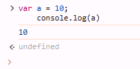

# Variables 

- Variables are like containers where we store data.
- We can store different types of data in variables, such as numbers, decimal values, boolean values, etc.
- Variables are reusable.

- In JavaScript, variables are declared using reserved keywords such as `let`, `var`, or `const`.


#### Syntax

```bash
keyword variable_name = value;
```
## **Remember**
-The variable is always on the left, and the value is always on the right.
-Values are always assigned to the variable on the left.
-Values are assigned using the `=` assignment operator.

#### Example

```js

    var a = 10;
    console.log(a) // the value of a is 10

```
#### Output



## Difference Between `var` `let` or `const` Keyword. 

- `var`: When a variable is defined with the var keyword, its scope is global (or function-scoped if declared inside a function). This means it is accessible throughout the entire program or function.


- `let`: When a variable is defined using the let keyword, its scope is block-level. This means it is only accessible within the block (such as a loop or if statement) in which it is defined.
- let variable can be reassigned.


- `const`: When a variable is defined with the const keyword, its scope is also block-level, similar to let. However, the key difference is that a const variable cannot be reassigned once it is initialized, making it a constant value within its scope.


### Rules for Creating a Variable

- Variable names should be meaningful and easy to read.
- A variable name should not start with a number.
- A variable name cannot contain spaces.
- Variables should not include special symbols, such as @, $, or &.
- To define a variable with multiple words, use an underscore (_) between the words (e.g., user_name).
- Variable names should only contain letters (a-z, A-Z) and, in some cases, numbers (but not at the beginning).

```js
// examples

    
    var 122="Krishna !";// ❌ 
    var a$%="Krishna !";// ❌
    var $%v="Krishna !";// ❌
    var $% v="Krishna !";// ❌
    var user name="Krishna !";// ❌
    var user_name="Krishna !";// ✅
    var name="Krishna !";// ✅
    var name0="Krishna !";// ✅

```

## Scope of let,var and const keyword

| **Keyword** | **Scope**         | **Description**                                                                                                                                 |
|-------------|-------------------|-------------------------------------------------------------------------------------------------------------------------------------------------|
| `let`       | Block scope       | The variable is scoped to the block, statement, or expression in which it is used, making it more predictable and safer in modern JavaScript.   |
| `const`     | Block scope       | Like `let`, but the value assigned to a `const` variable cannot be reassigned after initialization, providing immutability within the block scope. |
| `var`       | Global/Function scope | The variable is scoped globally or to the function in which it is defined. It can be accessed outside the block, which can lead to unexpected behavior. |


## What is Block Scope

- A block scope refers to a specific area where variables or statements are defined, and they cannot be accessed outside of this boundary.

- In JavaScript, blocks are created using curly braces `{}`.

#### Example 
```js
    {
        let a = 10;
    }
    console.log(a); // ReferenceError: a is not defined
```

```js
    {
        var a = 10;
    }
    console.log(a); //10
```

## What is the means of Reassigned.

 ### With Var

```js
var a = 10;
console.log(a) //10
a=34;
console.log(a) //34

```
- with block

```js
{
    var a = 10;
console.log(a)//10
}
a=23;
    console.log(a)//23
```


 ### With let

```js
let a = 10;
console.log(a) //10
a=34;
console.log(a) //34

```
- with block

```js
{
    let a = 10;
console.log(a)//10
}
a=23;
    console.log(a)//23
```
- with nested block

```js
{
    let a = 10;
console.log(a)//10
}
a=23;
    console.log(a)//23
    {
         a= 344;
         console.log(a); //344
         
    }
```


 ### With const

```js
const  a = 10;
console.log(a) //10
a=34; //❌ assignment to const variable not possible 
console.log(a) //Error:

```
- with block

```js
{
    const a = 10;
console.log(a)//10
}
a=23;//❌ assignment to const variable not possible 
    console.log(a)//Error
```

# Interview Questions

## 1. What are Variables in JavaScript ?

- Variables are like containers where we can store different types of values.
- These values can include numbers, decimals, boolean values, and collections (such as arrays and objects).

    - ## `Example`:
    

 
## 2. Difference Between `let` , `var` or `const` keywords in JavaScript ?

- The `var` keyword is used to define a variable as global. We can access the variable before it is initialized, and it can be accessed outside the block.
- The `let` keyword is used to define a variable within block boundaries. We cannot access the variable before it is initialized, and it cannot be accessed outside the block.
- The `const` keyword is similar to the let keyword, with the difference being that it cannot be reassigned after it is initialized.

## 3. What do we get when we define a variable without assigning a value?

- ### With Var

```js
    console.log(a) // undefined
    var a;
    console.log(a) // undefined
```


- ### With let

```js
    console.log(a) // ❌ can not access before initialize
    let a;
    console.log(a) // undefined
```

- ### With const

```js
    console.log(a) // ❌ can not access before initialize
    const a; //❌ SyntaxError: Missing initializer in const declaration
    console.log(a) // Error
```

## 4. What rules do we follow to define a variable?.


- Variable names should be meaningful and easy to read.
- A variable name should not start with a number.
- A variable name cannot contain spaces.
- Variables should not include special symbols, such as @, $, or &.
- To define a variable with multiple words, use an underscore (_) between the words (e.g., user_name).
- Variable names should only contain letters (a-z, A-Z) and, in some cases, numbers (but not at the beginning).


## 5. What is the difference between global scope and block scope in JavaScript ?

- ### `Global Scope`:
    - In global scope, variables and functions can be accessed both inside and outside the boundaries, before and after initialization.

- ### `Block Scope`:
    - In block scope, variables and functions can only be accessed inside the block boundaries.

# Practice Question

1. What is the difference between variables declared with var, let, and const in JavaScript?
2. Can you access a variable declared with let outside of its block scope? Explain why or why not.
3. What happens if you try to reassign a value to a constant variable declared with const?
4. What is the output when you access a variable declared with var before it is initialized?
5. How does block scope differ from global scope when declaring a variable with let?
6. Can a variable declared with var be accessed before it is initialized? What is the behavior of let and const in this case?
7. If you declare a variable inside a function, can it be accessed outside of that function? Why or why not?
8. What will happen if you declare the same variable twice with let or const in the same block scope?
9. Is it possible to redeclare a variable declared with var within the same scope? How does this differ from let and const?
10. How does hoisting work with var, let, and const? What is the behavior before initialization?


--------------

```krishna
    
   रख लो मुझे अपने दिल में, बस ये एक एहसान कर लेना,
बाकी, जब मिल जाए वक्त तो मुझे console.log() कर देना।
    
```