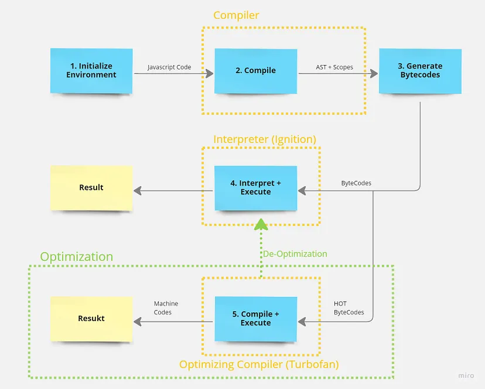
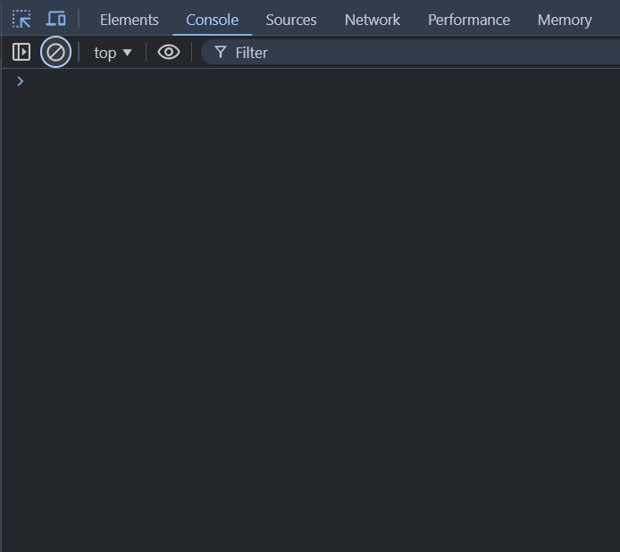
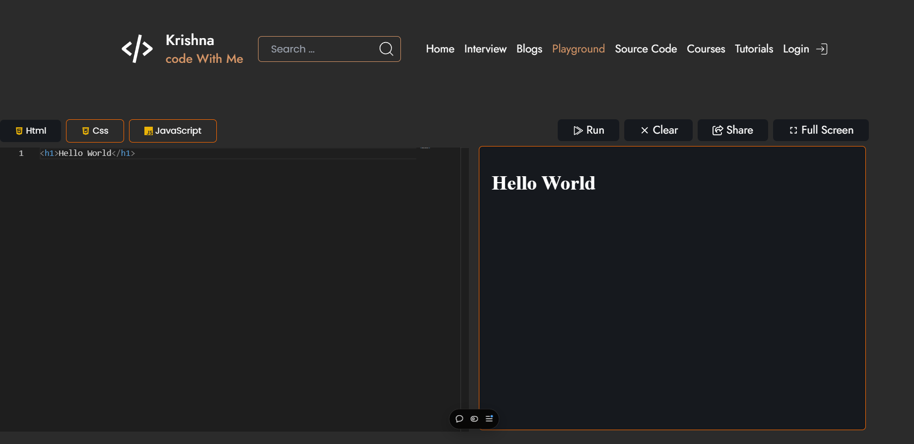

# What is JavaScript ?

- JavaScript is a lightweight, interpreted programming language primarily used to create dynamic and interactive features on websites. It allows developers to implement complex functionality on web pages, such as content updates, animations, form validation, and more. JavaScript runs in the browser, making web pages responsive and interactive without needing to reload.

### Purpose for Inventing JavaScript ?

>- `Early Web Limitations:`

In the early days of the web, HTML was the only language available for creating web pages. HTML was a static language, meaning it could only display content. There was no way to create interactive elements or respond to user actions.

>- `The Need for Interactivity:`

As the web evolved, there was a growing demand for more dynamic and interactive experiences. Developers wanted to create web pages that could respond to user input, update content without reloading the page, and provide a more engaging user experience.

>- `Netscape's Solution:`

In 1995, Netscape Communications, the company behind the popular Netscape Navigator browser, decided to address this need. They hired Brendan Eich to develop a scripting language that could be embedded in HTML pages.

>- `Birth of JavaScript:`

Brendan Eich created JavaScript in just 10 days. Initially called Mocha, then LiveScript, it was finally named JavaScript. JavaScript allowed developers to add dynamic content, handle user events, and manipulate the HTML elements on a web page.

---
## Who is the Developer Of JavaScript 


---

# Real-World Examples of JavaScript:
> ### `Interactive Forms:`
When you fill out a form on a website, and it shows an error message like "Email is invalid" without submitting the form, JavaScript is responsible for this real-time validation.

> ### `E-Commerce Websites`
On platforms like Amazon or Flipkart:
Product filters update without reloading the page.
Cart totals update dynamically as you add or remove products.
Image zoom and carousel effects are implemented using JavaScript.

> ### `Social Media Platforms`
On Facebook, Instagram, or Twitter:
Live notifications (e.g., new message or like) are powered by JavaScript.
Infinite scrolling, where new posts load as you scroll down, uses JavaScript.

> ### `Interactive Maps`
Services like Google Maps use JavaScript for features like dragging the map, zooming in/out, and displaying markers.

> ### `Real-Time Communication`
Applications like WhatsApp Web or Slack use JavaScript to enable real-time messaging via WebSockets.
Video Streaming Services

> ### Platforms like YouTube or Netflix:`
JavaScript handles video playback controls (play, pause, volume).
Adaptive streaming features are also implemented with JavaScript.
Online Games


### How JavaScript Work in Our Websites ?


JavaScript works in our websites by interacting with the Document Object Model (DOM), the structure of the web page, and responding to user events (like clicks, scrolls, and key presses). It is executed by the browser's JavaScript engine to perform tasks such as modifying HTML, CSS, and making requests to servers.




### Famous Browser Engines for compiling Javascript ?


- V8 from `Google` is the most used JavaScript engine. 
- SpiderMonkey is developed by Mozilla for use in `Firefox` and its forks. 
- JavaScriptCore is `Apple's` engine for its Safari browser. 
- Chakra is the engine of the `Internet Explorer` browser.


### Where We Write JavaScript ?

- #### Browser Console 



- #### With Visual Studio Code


- ### online Compilers like `codewithkrishna.vercel.app`
[visit CodeWithKrishna](https://codewithkrishna.vercel.app/playground)


### Hello World in JavaScript ?


Step 1: create a html file with `.html` extension.

Step 2: add `<script></script>` tag after `<body>` tag .

Step 3: between Opening and Closing Script tag write 

```js
    console.log("Hello Krishna !")
```

# or


```js
    document.write("Hello Krishna !")
```

# Conclusion

JavaScript is a foundational technology in modern web development, enabling the creation of dynamic, interactive, and user-friendly web applications. Developed by Brendan Eich in 1995, JavaScript has evolved into a versatile language that powers both the client and server sides of applications, thanks to environments like Node.js.

## Key takeaways about JavaScript:


- It is lightweight, interpreted, and dynamically typed.
- It is essential for front-end web development and is increasingly used for back-end development.
- JavaScript's ability to manipulate the DOM and handle asynchronous operations makes it a cornerstone of interactive web design.

By understanding JavaScript's history, features, and applications, beginners can lay a strong foundation for mastering this powerful programming language.


-----


# Interview Question (Most Asked Questions)

1. ####  What is JavaScript, and how is it different from Java?


- `JavaScript`: A lightweight, interpreted programming language primarily used for web development to add interactivity to web pages.
- `Java`: A general-purpose, compiled, object-oriented programming language used for standalone applications.
- `Differences`:
    - JavaScript is interpreted; Java is compiled.
    - JavaScript runs in the browser (or Node.js); Java runs on the Java Virtual Machine (JVM).
    - JavaScript is loosely typed; Java is strongly typed.


2. ####  Who created JavaScript, and when was it introduced?


- Created by: Brendan Eich at Netscape.
- Introduced in: 1995.
- Initially named Mocha, it was later renamed LiveScript and finally JavaScript to capitalize on Java's popularity.


3. ####  What are the main uses of JavaScript in web development?


- Adding interactivity (e.g., form validation, animations).
- Dynamically updating content without refreshing the page (e.g., AJAX).
- Building web and mobile applications (e.g., using frameworks like React, Angular).
- Server-side development with Node.js.


4. ####  What are the key features of JavaScript?


- Lightweight and interpreted.
- Supports event-driven and asynchronous programming.
- Cross-platform and runs in all major browsers.
- Dynamically typed language.
- Provides APIs for DOM manipulation, networking, and more.


<!--  -->