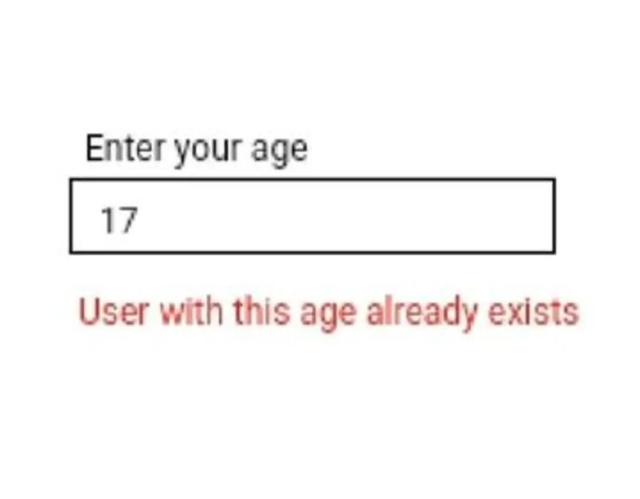

# User Input

- to take in JavaScript we use `prompt()` function.
- it return user data into string. 
- in javascript we can convert string into different type by using typecasting.

# Note:
- it only work with document (html) , not in node js (terminal).


### Syntax:
```js

prompt("<message>","<default value>")

// return string

```

### String Input:
```js

var input = prompt("Enter Your Name")
console.log(input)
```


### To get Number From User:
```js

var age = parseInt(prompt("Enter Your Age: "))
console.log(age)
```

# Interview Question

### 1. What is the purpose of the prompt() function in JavaScript?
-  The prompt() function is used to display a dialog box that prompts the user for input. It returns the user's input as a string or null if the user cancels the input.

### 2.Can you describe the syntax of the `prompt()` method?

- The syntax is `prompt(message, defaultValue)`, where:
- `message` is the text displayed in the dialog box.
`defaultValue` is an optional default input value.


### 3. What is returned when the prompt() dialog is closed?

- A string containing the user's input if the user provides a response.
- `null` if the user presses "Cancel" or closes the dialog.


# Practice Question

## 1. Write a script that asks the user for their favorite food using prompt() and displays an alert with their response.
## 2.Write a program that uses prompt() to ask the user for their hometown. If the user does not enter anything, display "Unknown" as the response in an alert.
## 3.Write a program that asks for the user's name. If the user presses "Cancel," display an alert saying "You canceled the input."
## 4.Create a program that prompts the user for a number. If the user enters a non-numeric value, prompt them again until a valid number is entered.
## 5.Use prompt() to ask the user for two numbers and an operation (add, subtract, multiply, divide). Perform the operation and display the result in an alert.

## 6.Ask the user, "Do you want to continue?" If the user types "yes," display "Great!" If they type "no," display "Goodbye!" For any other input, display "Invalid input."

-------------

```krishna

--krishna
```