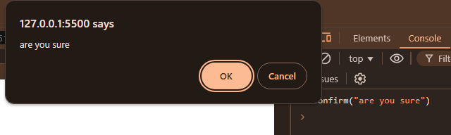

# Window  

- in javascript different type of window apis are available for different purpose.
- window apis are  work only  with html.
- The window object is the global object in a browser environment, representing the browser window or tab. It serves as the root object for all JavaScript code running in a browser and provides properties, methods, and events to interact with the browser's window, document, and other browser features.

# Key Features of the window Object:
- `Global Scope`: The window object is automatically available in the global scope and acts as the global context for all JavaScript code.
- `Browser Window Control`: You can manipulate the browser window's size, `position`, and content using various methods.
- `Global Object`: All global variables and functions in JavaScript are properties of the window object. For example, `alert()`, `setTimeout()`, and `location` are all methods and properties of window.


## Alert function
- the `alert()` function in javascript is used to show a alert box with some message.
- it return `void`.

```js
     window.alert("Hi this is me! ");   
     alert("Hi this is me! ");   

```


## Confirm Box 
- the confirm box window api is used to take confirmation from the user. it return boolean values. 
- it takes a message as in argument, and return boolean value. 
- if user click on cancel then it return `true`, else it return `false`.
```js
window.confirm("Are you sure ?")
confirm("Are you sure ?")
```




```js
var result = confirm("Are you sure ?")

console.log(result?"success":"failed")
```


## Window Print API
- this window print api is used to print the page.

```js

    window.print()

    print()
```


## Location API

- window location api allow user to change the url by another url. 

### Change current Page URL
```js
        // index.html
        window.location.href="https://codewithkrishna.vercel.app"

```


- ### Get current Page URL

```js
        window.location.href
```


------

## Open a New Child Window 

- this window api allow user to open a child window, in your website, it generally used in banking websites for user login and registration.


In this image, the SBI website has a child window where the user can forget information.

To implement this feature in JavaScript, we use the `window.open()` API.

- The `window.open()` method takes the `url` as an argument. By default, it opens the URL in the new window with a refresh mode.
- However, we can customize this behavior by specifying the `width` and `height` of the window, so it opens as a child window instead.

```js
// syntax : window.open(url,target,options)
 window.open("https://codewithkrishna.vercel.app", "_blank", "width=200,height=100");
```


## window.prompt()
- Displays a prompt dialog box with a message and an input field. It returns the value entered by the user or null if the user clicks "Cancel".

```js
let userInput = window.prompt("Please enter your name:");
console.log("User's name is: " + userInput);

```
## window.setTimeout()
- Calls a function or evaluates an expression after a specified number of milliseconds.

```js
window.setTimeout(function() {
    alert("This message appears after 3 seconds");
}, 3000); // 3000 milliseconds = 3 seconds
```

## window.setInterval()

-  Repeatedly calls a function or evaluates an expression at specified intervals (in milliseconds).

```js
window.setInterval(function() {
    alert("This message appears after 3 seconds and it continue");
}, 3000); // 3000 milliseconds = 3 seconds
```
# window.location.reload
- to reload/refresh the page

```js
window.location.reload()
```

## window.history
- Provides access to the browser's history. You can use it to move through the browsing history, such as going back or forward.


```js
// Go back to the previous page
window.history.back();

// Go forward in the history
window.history.forward();
```

## window.innerWidth and window.innerHeight

- These properties return the interior width and height of the browser window in pixels.
```js
let width = window.innerWidth;
let height = window.innerHeight;
console.log(`Width: ${width}, Height: ${height}`);
```

## window.resizeTo()
- Resizes the window to the specified width and height.
```js

// Resize the window to 800px by 600px
window.resizeTo(800, 600);
```
## window.scrollTo()
- Scrolls the window to the specified coordinates.

```js
// Scroll to the top left of the page
window.scrollTo(0, 0);

// Scroll to 500px down the page
window.scrollTo(0, 500);
```
## window.addEventListener()
- Registers an event listener on the window object to listen for events like `resize`, `scroll`, `click`, etc.

```js
window.addEventListener("resize", function() {
    console.log("Window was resized");
});
```
# Conclusion:
The `window` object is central to client-side JavaScript programming and allows you to control various aspects of the browser `window`, such as `alerts`, `navigation`, `window` size, and events. It also serves as the global object, meaning that all global variables and functions are properties of `window`. Understanding the `window` object and its functions is fundamental to building interactive web pages.

# Interview Question

## 1.What is the window object in JavaScript?

- The window object is the global object in a browser environment that represents the browser window or tab. It provides methods, properties, and events to interact with the browser's window, document, and other web-related features.

##  2.Explain the difference between `window.alert()`, `window.confirm()`, and `window.prompt()`.

- `window.alert()` displays a simple message with an "OK" button.
- `window.confirm()` displays a message with "OK" and "Cancel" buttons and returns true for "OK" and false for "Cancel".
- `window.prompt()` displays a message with an input field, allowing the user to enter a value, and returns the input or null if the user clicks "Cancel".

## 3. How does the `window.open()` method work and what are its parameters?

- `window.open()` opens a new browser window or tab with the specified URL. It can accept three parameters:
    - `URL`: The URL to open.
    - `target`: Specifies where to open the URL (_blank, _self, etc.).
    - `features`: A string specifying the window's features (e.g., width, height).

```js
window.open("https://example.com", "_blank", "width=400,height=300"); 
```

## 4. What does `window.setTimeout()` do and how is it different from `window.setInterval()`?

- `window.setTimeout()` executes a function or expression after a specified delay (in milliseconds) once.
- `window.setInterval()` executes a function or expression repeatedly at specified intervals (in milliseconds).

```js
window.setTimeout(() => console.log("Executed after 2 seconds"), 2000);
window.setInterval(() => console.log("Executed every 2 seconds"), 2000);
```

## 5. How can you use the window.location object to redirect a user to a new page?

- You can set the window.location.href property to the desired URL to navigate to a new page. 

```js
window.location.href = "https://www.example.com";
```

## 6.Explain the purpose of window.history and how to use it for navigation.
- `window.history` allows access to the browser’s session history. You can use `window.history.back()` to go back to the previous page and `window.history.forward()` to go forward in the history.

```js
window.history.back();   // Go back to the previous page
window.history.forward(); // Go forward in the history
```

## 7.What is the difference between window.innerWidth and window.outerWidth?
- `window.innerWidth` returns the width of the browser's viewport (the content area).
- `window.outerWidth` returns the total width of the browser window, including toolbars, borders, and scrollbars.

## 8.How do you resize a browser window using JavaScript?
- You can use `window.resizeTo()` to resize the browser window to a specified width and height.

```js
window.resizeTo(800, 600); // Resizes the window to 800px by 600px
```

## 9.What is the purpose of window.scrollTo() and how do you use it?
- `window.scrollTo()` allows you to scroll the window to a specific set of coordinates (x, y).

```js
window.scrollTo(0, 200); // Scrolls to 200px down the page
```

## 10. What is an event listener, and how can you use window.addEventListener()?
- An event listener listens for specific events (like `resize`, `scroll`, etc.) and triggers a callback function when the event occurs. `window.addEventListener()` is used to add an event listener to the window object.

```js
window.addEventListener("resize", () => {
  console.log("Window resized!");
});
```

# Practice Questions

##### 1. **What does the `window` object represent in a web browser environment?**
   
##### 2. **How would you use the `window.alert()` method in JavaScript? Provide an example.**

##### 3. **What is the difference between `window.confirm()` and `window.prompt()`? Provide an example for each.**

##### 4. **How would you open a new browser window with the URL `https://www.example.com` and set its width to 500px and height to 400px?**

##### 5. **What does `window.setTimeout()` do, and how would you use it to execute a function after 3 seconds?**

##### 6. **What is the difference between `window.setTimeout()` and `window.setInterval()`? Provide an example for each.**

##### 7. **How would you redirect the user to a new URL using `window.location`? Provide an example.**

##### 8. **What does `window.location.reload()` do? How would you use it to reload the current page?**

##### 9. **How can you navigate the browser history using `window.history`? Write code to navigate to the previous page.**

##### 10. **Explain the difference between `window.innerWidth` and `window.outerWidth`. How are they useful in responsive design?**

##### 11. **How would you resize the current browser window to a width of 600px and height of 400px?**

##### 12. **How can you scroll the window to a specific position (e.g., 500px down the page) using JavaScript?**

##### 13. **How can you add an event listener for the `resize` event on the window object?**

##### 14. **Write a function that opens a new tab with the URL `https://www.example.com`, and then closes the tab after 5 seconds.**

##### 15. **What happens if you call `window.open()` with the same URL and target (`_blank`) multiple times?**

##### 16. **How do you check the current height and width of the browser’s viewport using JavaScript?**

##### 17. **How would you use `window.scrollTo()` to scroll the page to the top (x=0, y=0)?**

##### 18. **What does `window.scrollBy()` do, and how is it different from `window.scrollTo()`? Provide an example.**

##### 19. **What is the `window.performance` object, and how can you use it to measure page load times?**

##### 20. **Write a function that repeatedly changes the background color of the page every 1 second using `window.setInterval()`.**


```krishna

हम्म...
तो एक शख़्स बोला मुझसे,
उसकी हंसी सयानी सी है, आँखें फूल जैसी,
दिल में हरियाली है, और बातें उससे भी ज्यादा निराली हैं।

मिलेगी जब तुमको, हँसकर वो बोलेगी,
हमसफ़र का तो पता नहीं, पर दोस्ती से शुरुआत कर लेगी।
 --krishna
```